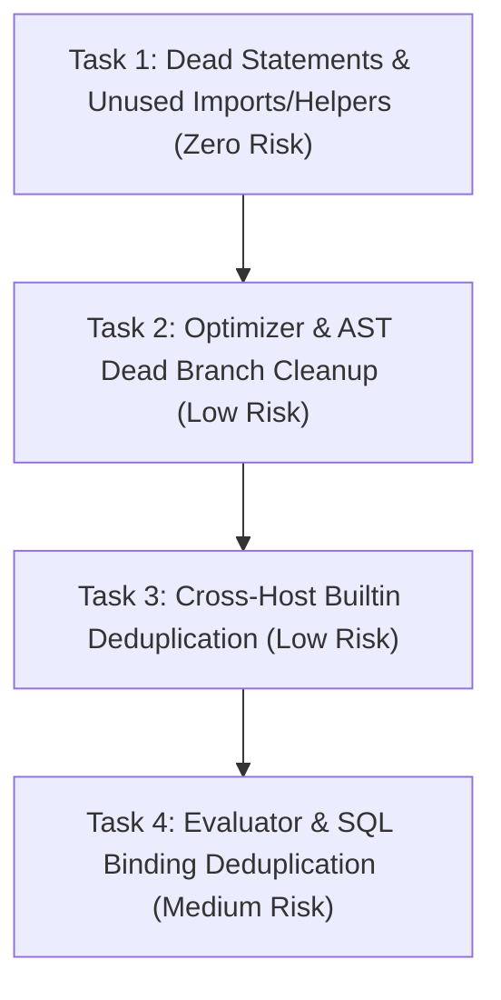

# SEL Multi-Host Code Review: Duplicated, Dead, and Unused Code Analysis

> **Goal Evaluation Summary**: Comprehensive review of all 5 production SEL hosts (`js/`, `php/`, `python/`, `cpp/`, `lisp/`) and cross-cutting generator tools. All findings have been cataloged with exact file paths, line references, code snippets, and categorized into **Dead Code**, **Unused Code**, and **Duplicated Code**, concluding with an actionable task roadmap.

---

## 1. Executive Summary & Cross-Host Taxonomy

SEL's core architecture requires byte-identical evaluation and strict error parity across 5 distinct languages: **JavaScript** (ESM), **PHP** (8.2+), **Python** (3.11+), **C++** (C++23), and **Common Lisp** (SBCL).

Because algorithms were ported faithfully from reference implementations (initially JS/PHP) to subsequent hosts, several logic anomalies, redundant fallbacks, and impossible conditions were cloned across multiple or all five hosts.

| Category | Description | Primary Hotspots |
| :--- | :--- | :--- |
| **Dead Code** | Unreachable statements, impossible condition branches, unreachable after return/throw | `optimizer` (`optimize_tree`, `exceeds_depth`), `math_plan` (BigInt check in JS), `value` (`this;` in JS) |
| **Unused Code** | Uncalled private helpers, unused `use` / `import` statements, obsolete deprecated cache fields | `php/` (`callNode`, `elements`), `js/src/value.mjs` (`RecordShape.aliasCache`, utf8 imports), `python/bin/` (`_sel_probe`) |
| **Duplicated Code** | Identical branching bodies, redundant superset checks (`is_null` before `NONE && size == 0`), duplicate SQL binding resolution | `is_vacuous()`, `first_collection_item()`, `do_sort()`, `do_top()`, `PATH`, `??` vs `???`, `Binding.column` vs `Binding.raw` |

---

## 2. Cross-Cutting Patterns (Affecting 4 or 5 Hosts)

### Pattern 1: Redundant `is_null` check in `is_vacuous()`
* **Affected Hosts**: **ALL 5** (`js/`, `php/`, `python/`, `cpp/`, `lisp/`)
* **Severity**: Low (Harmless Redundancy)
* **Explanation**:
  In all hosts, `is_null()` is defined as:
  `kind == NONE && size() == 0 && !is_list`
  Immediately in `is_vacuous()`, the implementation tests:
  ```text
  if (is_null()) return true;
  if (kind == NONE && size() == 0) return true;
  ```
  Because `kind == NONE && size() == 0` is a strict superset of `is_null()` (it matches regardless of whether `is_list` is true or false), the initial `is_null()` branch is completely redundant.
* **Exact Locations**:
  - `js/src/value.mjs:130-132`
  - `php/src/Value.php:440-442`
  - `python/sel/value.py:208-211`
  - `cpp/sel.cpp:1765-1766`
  - `lisp/src/value.lisp:214-215`

---

### Pattern 2: Redundant `is_null` check in `first_collection_item()`
* **Affected Hosts**: **ALL 5** (`js/`, `php/`, `python/`, `cpp/`, `lisp/`)
* **Severity**: Low
* **Explanation**:
  All hosts check:
  `if (value.is_null() || (value.kind == NONE && value.size() == 0)) return null/nullptr/nil;`
  Because `(value.kind == NONE && value.size() == 0)` evaluates to `true` whenever `value.is_null()` is true, the `value.is_null() ||` prefix is redundant.
* **Exact Locations**:
  - `js/src/builtins/structure.mjs:30`
  - `php/src/Builtins/Structure.php:33`
  - `python/sel/builtins/structure.py:25`
  - `cpp/sel.cpp:3806`
  - `lisp/src/builtins/structure.lisp:114`

---

### Pattern 3: Identical Duplicate Branches in `do_sort()` and `do_top()`
* **Affected Hosts**: **ALL 5** (`js/`, `php/`, `python/`, `cpp/`, `lisp/`)
* **Severity**: Medium (Copy-paste branching redundancy)
* **Explanation**:
  When parsing the 3-argument form of `SORT`/`SORT_BY` and `TOP`/`TOP_BY`:
  ```text
  else if (node(2).t === 'text') {
      binder = '_';
      body = node(1);
      direction = text(2).toUpperCase();
  } else if (is_symbol(1)) {
      binder = symbol(1);
      body = node(2);
      direction = 'ASC';
  } else {
      binder = '_';
      body = node(1);
      direction = text(2).toUpperCase();
  }
  ```
  The `else if (node(2).t === 'text')` branch and the final `else` fallback branch contain **100% identical logic**. The `else if` check is completely redundant and can be omitted.
* **Exact Locations**:
  - `js/src/builtins/aggregate.mjs:325-337` (`doSort`), `389-398` (`doTop`)
  - `php/src/Builtins/Core.php:260-271` (`doSort`), `Structure.php:1484-1493` (`doTop`)
  - `python/sel/builtins/aggregate.py:393-404` (`do_sort`), `458-466` (`do_top`)
  - `cpp/sel.cpp:5454-5470` (`do_sort`), `5547-5557` (`do_top`)
  - `lisp/src/builtins/aggregate.lisp:340-351` (`do-sort`), `451-462` (`do-top-sort`)

---

### Pattern 4: Redundant Duplicate Branch in Optimizer `sort_details()`
* **Affected Hosts**: **ALL 5** (`js/`, `php/`, `python/`, `cpp/`, `lisp/`)
* **Severity**: Low
* **Explanation**:
  When extracting sort details for `SORT_BY` / `TOP_BY`:
  ```text
  else if (sort_count === 3 && is_var(args[1])) {
      binder = args[1].name;
      key = args[2];
  } else if (args[1].t === 'var' && !args[1].grouped) { // or (count > 2 && ...)
      binder = args[1].name;
      key = args[2];
  }
  ```
  The first `else if` condition is a strict subset of the second `else if` condition and performs the exact same assignments.
* **Exact Locations**:
  - `js/src/optimizer.mjs:270-276`
  - `php/src/Optimizer.php:191-197`
  - `python/sel/optimizer.py:328-332`
  - `cpp/sel.cpp:7279-7285`
  - `lisp/src/optimizer.lisp:373-376`

---

### Pattern 5: Optimizer Dead `target` Checks on Non-Assign Nodes
* **Affected Hosts**: **3 Hosts** (`js/`, `php/`, `python/`)
* **Severity**: Medium (Dead Code)
* **Explanation**:
  In SEL ASTs, only `assign` nodes have a `target` property (representing `LHS = RHS`).
  1. In `optimize_tree`:
     ```text
     if (copy.t === 'assign') {
         copy.value = optimize_tree(copy.value, ...);
     } else if (copy.target) { // <--- UNREACHABLE!
         copy.target = optimize_tree(copy.target, ...);
         ...
     }
     ```
     Because any node with a `target` is an `assign` node, it was already handled by the `if`. The `else if (copy.target)` branch can never be reached.
  2. In `exceeds_depth`:
     `if (node.t !== 'assign' && node.target && exceedsDepth(node.target))`
     This condition is always false and never executes.
* **Exact Locations**:
  - `js/src/optimizer.mjs:512-515` (`optimizeTree`), `542` (`exceedsDepth`)
  - `php/src/Optimizer.php:56-57` (`exceedsDepth`), `159` (`optimizeTree`)
  - `python/sel/optimizer.py:579-582` (`optimize_tree`), `614-615` (`exceeds_depth`)

---

### Pattern 6: Redundant Lookups and Duplicate Fallbacks in Builtin `PATH`
* **Affected Hosts**: **ALL 5** (`js/`, `php/`, `python/`, `cpp/`, `lisp/`)
* **Severity**: Low
* **Explanation**:
  1. In `PATH(target, path_str, default?)`, after verifying `cur.has(seg)`, `cur.get(seg)` is immediately called and checked for null/undefined:
     `if (cur === undefined) { if (count > 2) return val(2); return null; }`
     In all implementations, `Value.has(key)` guarantees `Value.get(key)` returns an existing member, so `cur === undefined / null` is never true.
  2. The fallback expression returning `args.val(2)` or `null` is duplicated twice in the loop body.
* **Exact Locations**:
  - `js/src/builtins/null.mjs:49-58`
  - `php/src/Builtins/NullOps.php:70-80`
  - `python/sel/builtins/null.py:41-49`
  - `cpp/sel.cpp:6826-6834`
  - `lisp/src/builtins/null.lisp:55-64`

---

### Pattern 7: Evaluator Binary Null-Coalescing (`??` vs `???`) Code Duplication
* **Affected Hosts**: **ALL 5** (`js/`, `php/`, `python/`, `cpp/`, `lisp/`)
* **Severity**: Low (Boilerplate Duplication)
* **Explanation**:
  In `eval_binary`, the evaluation, exception handling (`E_NO_KEY`, `E_UNDEF_VAR`), and fallback resolution for `??` and `???` are identical, differing only in whether `is_null()` or `is_vacuous()` is called on the resolved left operand.
* **Exact Locations**:
  - `js/src/eval.mjs:308-334`
  - `php/src/Evaluator.php:263-291`
  - `python/sel/eval.py:360-380`
  - `cpp/sel.cpp:3289-3307`
  - `lisp/src/eval.lisp:374-395`

---

### Pattern 8: Duplicated Collation / Prefilter Logic in SQL Bindings
* **Affected Hosts**: **4 Hosts** (`js/`, `php/`, `python/`, `lisp/`)
* **Severity**: Low
* **Explanation**:
  In `Binding.column()` and `Binding.raw()`, the logic for parsing collation flags (`checkCollation`), verifying boolean flags (`exact`, `sargable`, `guard`), and resolving `split_sargable` / `prefilter` is duplicated verbatim between both factory methods.
* **Exact Locations**:
  - `js/src/sql/binding.mjs:56-66` and `86-96`
  - `php/src/Sql/Binding.php:76-90` and `109-122`
  - `python/sel/sql/binding.py:85-101` and `119-134`
  - `lisp/src/sql/binding.lisp:113-122` and `136-145`

---

## 3. Host-by-Host Detailed Inventory

### 3.1 JavaScript (`js/`)

#### Dead Code
1. [value.mjs:128, 138, 139, 140](file:///home/nathan/workspaces/nth/sel/js/src/value.mjs#L128)
   - **Issue**: Dead expression statements `this;` left inside methods `isNone()`, `isText()`, `isBin()`, and `isBool()`.
   - **Snippet**:
     ```javascript
     isNone() { this; return this.kind === NONE; }
     isText() { this; return this.kind === TEXT; }
     isBin()  { this; return this.kind === BIN; }
     isBool() { this; return this.kind === BOOL; }
     ```
2. [optimizer.mjs:512-515](file:///home/nathan/workspaces/nth/sel/js/src/optimizer.mjs#L512)
   - **Issue**: `else if (copy.target)` in `optimizeTree` is dead code; non-assign nodes never have `target`.
3. [optimizer.mjs:542](file:///home/nathan/workspaces/nth/sel/js/src/optimizer.mjs#L542)
   - **Issue**: `node.t !== 'assign' && node.target && exceedsDepth(node.target, nxt)` in `exceedsDepth` is always false.
4. [math_plan.mjs:106, 113](file:///home/nathan/workspaces/nth/sel/js/src/math_plan.mjs#L106)
   - **Issue**: `constR.digits === 1n || constR.digits === '1'`. In JS, `digits` is strictly native `BigInt` (1n), never a string `'1'`. The string equality check is dead.

#### Unused Code
1. [value.mjs:6, 621](file:///home/nathan/workspaces/nth/sel/js/src/value.mjs#L6)
   - **Issue**: Unused imports and re-exports: `decodeUtf8` and `toCodePoints` are imported on line 6 from `./utf8.mjs` and re-exported on line 621, but are not used in `value.mjs` and never imported from `value.mjs` anywhere in the repository.
2. [value.mjs:28-36](file:///home/nathan/workspaces/nth/sel/js/src/value.mjs#L28)
   - **Issue**: Obsolete deprecated cache `RecordShape.aliasCache` and `LEGACY_ALIAS_CACHES`. JSDoc states: `@deprecated always empty; removed in the next minor release`.

#### Duplicated Code
1. [value.mjs:130-132](file:///home/nathan/workspaces/nth/sel/js/src/value.mjs#L130): Redundant `this.isNull()` check in `isVacuous()`.
2. [value.mjs:434-444](file:///home/nathan/workspaces/nth/sel/js/src/value.mjs#L434): Redundant instantiation of `new Value(...)` across branches in `cloneAt()`.
3. [builtins/aggregate.mjs:325-337, 389-398](file:///home/nathan/workspaces/nth/sel/js/src/builtins/aggregate.mjs#L325): Identical branches in `doSort` and `doTop`.
4. [builtins/null.mjs:49-58](file:///home/nathan/workspaces/nth/sel/js/src/builtins/null.mjs#L49): Duplicate fallback return logic in `PATH`.
5. [eval.mjs:308-334](file:///home/nathan/workspaces/nth/sel/js/src/eval.mjs#L308): Duplicate try/catch block for `??` and `???`.
6. [sql/binding.mjs:56-66, 86-96](file:///home/nathan/workspaces/nth/sel/js/src/sql/binding.mjs#L56): Duplicate collation/prefilter logic in `column()` and `raw()`.

#### Documentation Defect
1. [sql/constants.mjs:42-51](file:///home/nathan/workspaces/nth/sel/js/src/sql/constants.mjs#L42)
   - **Issue**: Orphaned docblock explaining `isBinderName` accidentally pasted above `textLiteralResults` (line 52), while `isBinderName` is located at line 144.

---

### 3.2 PHP (`php/`)

#### Dead Code
1. [Optimizer.php:56-57](file:///home/nathan/workspaces/nth/sel/php/src/Optimizer.php#L56)
   - **Issue**: `($node['t'] ?? null) !== 'assign' && isset($node['target'])` in `exceedsDepth` is always false.
2. [Optimizer.php:159](file:///home/nathan/workspaces/nth/sel/php/src/Optimizer.php#L159)
   - **Issue**: Non-assign branch in `optimizeTree` loops `foreach (['target', 'value'] as $key)`, but non-assign nodes never have `target`.

#### Unused Code
1. [Builtins/Structure.php:12](file:///home/nathan/workspaces/nth/sel/php/src/Builtins/Structure.php#L12)
   - **Issue**: Unused import: `use Sel\Dec;` is never referenced in this file.
2. [Sql/Bindings.php:12](file:///home/nathan/workspaces/nth/sel/php/src/Sql/Bindings.php#L12)
   - **Issue**: Unused import: `use Sel\Value;` is never referenced in this file.
3. [bin/sqlt:20-21](file:///home/nathan/workspaces/nth/sel/php/bin/sqlt#L20)
   - **Issue**: Unused imports: `use Sel\Sql\Binding;` and `use Sel\Sql\Fragment;` are never referenced in `sqlt`.
4. [Optimizer.php:221-225](file:///home/nathan/workspaces/nth/sel/php/src/Optimizer.php#L221)
   - **Issue**: Uncalled private helper:
     ```php
     private static function callNode(string $name, array $args, ?array $pos = null): array
     ```
     Never invoked anywhere in `Optimizer.php` or the PHP codebase.
5. [Builtins/Core.php:341-347](file:///home/nathan/workspaces/nth/sel/php/src/Builtins/Core.php#L341)
   - **Issue**: Uncalled private helper:
     ```php
     private static function elements(Value $value): array
     ```
     Never invoked in `Core.php` (aggregate builtins use `Value::iterElements`).

#### Duplicated Code
1. [Value.php:440-442](file:///home/nathan/workspaces/nth/sel/php/src/Value.php#L440): Redundant `$this->isNull()` check in `isVacuous()`.
2. [Value.php:793-797](file:///home/nathan/workspaces/nth/sel/php/src/Value.php#L793): Redundant empty check in `copyAt()` returning identical object to subsequent empty foreach.
3. [Builtins/Core.php:260-271](file:///home/nathan/workspaces/nth/sel/php/src/Builtins/Core.php#L260): Identical branches in `doSort()`.
4. [Builtins/Structure.php:1484-1493](file:///home/nathan/workspaces/nth/sel/php/src/Builtins/Structure.php#L1484): Identical branches in `doTop()`.
5. [Builtins/NullOps.php:70-80](file:///home/nathan/workspaces/nth/sel/php/src/Builtins/NullOps.php#L70): Duplicate fallback return logic in `PATH`.
6. [Evaluator.php:263-291](file:///home/nathan/workspaces/nth/sel/php/src/Evaluator.php#L263): Identical try/catch logic for `??` and `???`.
7. [Sql/Binding.php:76-90, 109-122](file:///home/nathan/workspaces/nth/sel/php/src/Sql/Binding.php#L76): Duplicate collation/prefilter logic in `column()` and `raw()`.

#### Structural / Documentation Anomalies
1. [Sql/RelationalPlan.php:11-13](file:///home/nathan/workspaces/nth/sel/php/src/Sql/RelationalPlan.php#L11)
   - **Issue**: Redundant property aliasing: `JoinPlan` defines both `public string $kind = 'INNER';` and `public string $type = 'INNER';`.
2. [Sql/Constants.php:54-67](file:///home/nathan/workspaces/nth/sel/php/src/Sql/Constants.php#L54)
   - **Issue**: Misplaced docblock for `isBinderName` accidentally placed above `identityProjection` (line 68); actual `isBinderName` is at line 186.

---

### 3.3 Python (`python/`)

#### Dead Code
1. [sel/optimizer.py:579-582](file:///home/nathan/workspaces/nth/sel/python/sel/optimizer.py#L579)
   - **Issue**: `elif copy.target is not None:` in `optimize_tree` is dead code; non-assign nodes never have `target`.
2. [sel/optimizer.py:614-615](file:///home/nathan/workspaces/nth/sel/python/sel/optimizer.py#L614)
   - **Issue**: `if node.t != 'assign' and node.target is not None and exceeds_depth(node.target, nxt):` is dead code because non-assign nodes never have `target`.

#### Unused Code
1. [bin/api.py:24](file:///home/nathan/workspaces/nth/sel/python/bin/api.py#L24), [batch.py:18](file:///home/nathan/workspaces/nth/sel/python/bin/batch.py#L18), [check-decimal.py:20](file:///home/nathan/workspaces/nth/sel/python/bin/check-decimal.py#L20), [conformance.py:20](file:///home/nathan/workspaces/nth/sel/python/bin/conformance.py#L20), [sqlapi:17](file:///home/nathan/workspaces/nth/sel/python/bin/sqlapi#L17), [sqlfuzz:20](file:///home/nathan/workspaces/nth/sel/python/bin/sqlfuzz#L20), [sqlreplay:22](file:///home/nathan/workspaces/nth/sel/python/bin/sqlreplay#L22), [sqlt:45](file:///home/nathan/workspaces/nth/sel/python/bin/sqlt#L45)
   - **Issue**: Unused probe imports: `_sel_probe = ...` or `_probe = ...` imported as `sel`, never referenced.

#### Duplicated Code
1. [sel/value.py:208-211](file:///home/nathan/workspaces/nth/sel/python/sel/value.py#L208): Redundant `self.is_null()` check in `is_vacuous()`.
2. [sel/builtins/structure.py:25](file:///home/nathan/workspaces/nth/sel/python/sel/builtins/structure.py#L25): Redundant `value.is_null()` check in `first_collection_item()`.
3. [sel/builtins/aggregate.py:393-404, 458-466](file:///home/nathan/workspaces/nth/sel/python/sel/builtins/aggregate.py#L393): Identical branches in `do_sort()` and `do_top()`.
4. [sel/builtins/aggregate.py:441-444](file:///home/nathan/workspaces/nth/sel/python/sel/builtins/aggregate.py#L441): Redundant `value.is_null()` check followed by `value.kind == NONE and value.size() == 0` in `do_top()`.
5. [sel/builtins/null.py:41-49](file:///home/nathan/workspaces/nth/sel/python/sel/builtins/null.py#L41): Duplicate fallback returns and redundant `cur is None` in `_path()`.
6. [sel/optimizer.py:328-332](file:///home/nathan/workspaces/nth/sel/python/sel/optimizer.py#L328): Redundant `sort_count == 3` check in `sort_details()` with identical body to fallback.
7. [sel/eval.py:360-380](file:///home/nathan/workspaces/nth/sel/python/sel/eval.py#L360): Duplicated try/except block for `??` and `???`.
8. [sel/sql/binding.py:85-101, 119-134](file:///home/nathan/workspaces/nth/sel/python/sel/sql/binding.py#L85): Duplicated collation and prefilter handling in `column()` and `raw()`.

---

### 3.4 C++23 (`cpp/`)

#### Duplicated Code
1. [sel.cpp:1765-1766](file:///home/nathan/workspaces/nth/sel/cpp/sel.cpp#L1765)
   - **Issue**: Redundant `is_null()` check in `Value::is_vacuous()` before `p_->kind == Kind::None && size() == 0`.
2. [sel.cpp:3806](file:///home/nathan/workspaces/nth/sel/cpp/sel.cpp#L3806)
   - **Issue**: Redundant `value.is_null()` check in `first_collection_item()` before `value.kind() == Kind::None && value.size() == 0`.
3. [sel.cpp:5454-5470](file:///home/nathan/workspaces/nth/sel/cpp/sel.cpp#L5454)
   - **Issue**: Identical branches in `do_sort()`:
     ```cpp
     } else if (a.node(2).t == NT::Text) {
       binder = "_"; body = &a.node(1); ...
     } else if (a.is_symbol(1)) {
       ...
     } else {
       binder = "_"; body = &a.node(1); ... // IDENTICAL to NT::Text branch
     }
     ```
4. [sel.cpp:5547-5557](file:///home/nathan/workspaces/nth/sel/cpp/sel.cpp#L5547)
   - **Issue**: Identical branches in `do_top()`: `else if (a.node(2).t == NT::Text)` and `else` fallback are identical.
5. [sel.cpp:6826-6834](file:///home/nathan/workspaces/nth/sel/cpp/sel.cpp#L6826)
   - **Issue**: In `PATH` builtin: `next == nullptr` check is impossible after `cur.has(seg)`, and fallback return `if (a.count() > 2) return a.val(2); return Value::null();` is duplicated.
6. [sel.cpp:3289-3307](file:///home/nathan/workspaces/nth/sel/cpp/sel.cpp#L3289)
   - **Issue**: Duplicated try/catch block for `??` and `???`.
7. [sel.cpp:7279-7285](file:///home/nathan/workspaces/nth/sel/cpp/sel.cpp#L7279)
   - **Issue**: Redundant `sort_count == 3` branch in `opt_sort_info()` with identical assignment body to following branch.

---

### 3.5 Common Lisp (`lisp/`)

#### Duplicated Code & Logic Bugs
1. [src/value.lisp:214-215](file:///home/nathan/workspaces/nth/sel/lisp/src/value.lisp#L214)
   - **Issue**: Redundant `(value-null-p v)` check in `value-vacuous-p` before `(and (eq (value-kind v) :none) (zerop (value-size v)))`.
2. [src/builtins/structure.lisp:114](file:///home/nathan/workspaces/nth/sel/lisp/src/builtins/structure.lisp#L114)
   - **Issue**: Redundant `(value-null-p v)` check in `first-collection-item`.
3. [src/builtins/structure.lisp:1019-1021](file:///home/nathan/workspaces/nth/sel/lisp/src/builtins/structure.lisp#L1019)
   - **Issue**: Copy-paste variable bug and redundancy in `do-link`:
     ```lisp
     (let* ((first-r1 (unless (value-null-p val1) (first-collection-item val1)))
            (first-r2 (unless (value-null-p val1) (first-collection-item val2)))) ; <-- Checks val1 instead of val2!
     ```
     `first-r2` checks `(value-null-p val1)` instead of `val2`. Furthermore, `first-collection-item` already handles null safely, so `unless (value-null-p ...)` is redundant for both.
4. [src/builtins/aggregate.lisp:340-351](file:///home/nathan/workspaces/nth/sel/lisp/src/builtins/aggregate.lisp#L340)
   - **Issue**: Identical branches in `do-sort`: `((eq (node-kind (args-node a 2)) :text) ...)` and `(t ...)` branches have identical bodies.
5. [src/builtins/aggregate.lisp:451-462](file:///home/nathan/workspaces/nth/sel/lisp/src/builtins/aggregate.lisp#L451)
   - **Issue**: Identical branches in `do-top-sort`: `((eq (node-kind (args-node a 2)) :text) ...)` and `(t ...)` branches have identical bodies.
6. [src/builtins/null.lisp:30-40, 55-64](file:///home/nathan/workspaces/nth/sel/lisp/src/builtins/null.lisp#L30)
   - **Issue**: Redundant `(if val ...)` after `value-has` in `GET` and `PATH`, and duplicate fallback return expression `(if (> (args-count a) 2) (args-val a 2) (make-null))` in both functions.
7. [src/eval.lisp:374-395](file:///home/nathan/workspaces/nth/sel/lisp/src/eval.lisp#L374)
   - **Issue**: Duplicate `handler-case` block for `??` and `???`.
8. [src/optimizer.lisp:373-376](file:///home/nathan/workspaces/nth/sel/lisp/src/optimizer.lisp#L373)
   - **Issue**: In `sort-key`: `((and (= sort-count 3) (bare-name-p (second args))) ...)` has identical body to subsequent `((and (> count 2) (bare-name-p (second args))) ...)`.
9. [src/sql/binding.lisp:113-122, 136-145](file:///home/nathan/workspaces/nth/sel/lisp/src/sql/binding.lisp#L113)
   - **Issue**: Duplicated collation unpacking and prefilter resolution between `binding-column` and `binding-raw`.

---

## 4. Prioritized Action Roadmap for Working Tasks

To ensure the test suite (`tools/check-manifest.sh`, `tools/check-generated.sh`, `make test`, pytest, etc.) remains green with zero regressions at every step, refactoring should be split into 4 cleanly scoped tasks:



### Task 1: Dead Statements & Unused Imports/Helpers (Zero Risk)
- [ ] **JS**: Remove dead `this;` statements in `js/src/value.mjs:128, 138-140`.
- [ ] **JS**: Remove unused `decodeUtf8` and `toCodePoints` imports/re-exports in `js/src/value.mjs:6, 621`.
- [ ] **JS**: Fix misplaced docblock for `isBinderName` in `js/src/sql/constants.mjs:42-51`.
- [ ] **PHP**: Remove unused imports `use Sel\Dec;` in `Structure.php:12`, `use Sel\Value;` in `Bindings.php:12`, and unused imports in `php/bin/sqlt:20-21`.
- [ ] **PHP**: Remove uncalled private methods `Optimizer::callNode` and `Builtins\Core::elements`.
- [ ] **PHP**: Fix misplaced docblock for `isBinderName` in `php/src/Sql/Constants.php:54-67`.
- [ ] **Python**: Clean up unused `_sel_probe` / `_probe` imports across `python/bin/`.

### Task 2: Optimizer & AST Dead Branch Cleanup (Low Risk)
- [ ] **JS, PHP, Python**: Remove unreachable `else if (copy.target)` in `optimizeTree` / `optimize_tree`.
- [ ] **JS, PHP, Python**: Remove dead `node.t !== 'assign' && node.target` check in `exceedsDepth` / `exceeds_depth`.
- [ ] **All 5 Hosts**: Deduplicate redundant `sort_count == 3` branch in `sort_details()` / `sort-key` / `opt_sort_info()`.
- [ ] **JS**: Remove dead string check `|| constR.digits === '1'` in `js/src/math_plan.mjs:106, 113`.

### Task 3: Cross-Host Builtin Deduplication (Low Risk)
- [ ] **All 5 Hosts**: In `is_vacuous()`, remove redundant `is_null()` check preceding `kind == NONE && size == 0`.
- [ ] **All 5 Hosts**: In `first_collection_item()`, remove redundant `is_null()` check.
- [ ] **All 5 Hosts**: In `do_sort()` and `do_top()`, eliminate the redundant duplicate `text` branch and merge with fallback `else`.
- [ ] **All 5 Hosts**: In `PATH` builtin, remove redundant `cur === null/undefined` check after `has()` and unify the duplicate fallback return.
- [ ] **Common Lisp**: Fix `do-link` variable check bug (`first-r2` checking `val1` instead of `val2`) in `lisp/src/builtins/structure.lisp:1020`.

### Task 4: Evaluator & SQL Binding Deduplication (Medium Risk)
- [ ] **All 5 Hosts**: Unify `??` and `???` in `eval_binary` / `_eval_binary` into a helper function parameterized by a null predicate (`is_null` vs `is_vacuous`).
- [ ] **JS, PHP, Python, Lisp**: Extract shared collation/prefilter options parsing helper shared between `Binding.column` and `Binding.raw`.
- [ ] **PHP**: Clean up redundant `$kind` and `$type` property duplication on `JoinPlan`.
- [ ] **Regression Verification**: Run full test manifest (`tools/check-manifest.sh`) across all 7 roster configurations and verify byte-identical test conformance.
