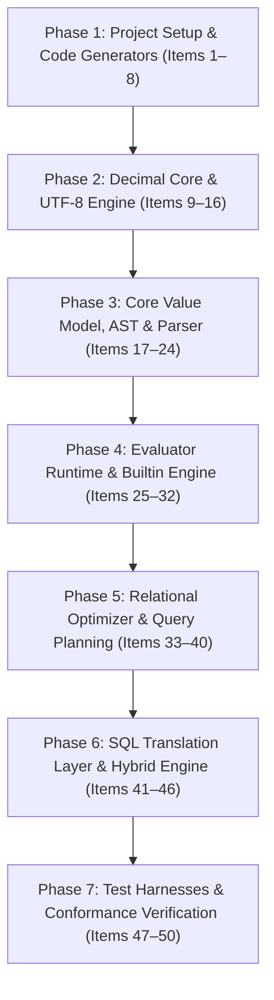

# Architecture Proposal and Implementation Plan: SEL in Rust

## Executive Summary & Target Profile

This document outlines the architecture and execution plan for implementing the Simple Expression Language (SEL) in **Rust**. Rust is uniquely positioned to match or exceed the performance of the fastest existing implementations:
* **C++23**: ~576 ms (Scenario 1 on `dataset-10x.json`)
* **Go**: ~580 ms
* **Common Lisp (SBCL)**: ~636 ms
* **Python**: ~2,194 ms
* **PHP 8.4 (Optimized)**: ~1,120 ms

Rust offers zero-cost abstractions, fine-grained control over memory layouts, native 128-bit integer arithmetic (`i128`), and predictable execution without a garbage collector. However, achieving performance on par with C++ and Go while maintaining 100% specification conformance requires solving several central engineering problems discovered during the development and optimization of the C++, Go, and PHP implementations.

```
+---------------------------------------------------------------------------------------------------+
| Target Execution Profile for Scenario 1 (dataset-10x.json)                                        |
| PHP (Pre-optimization): [================================================] 4,975 ms              |
| Python 3.14:            [==================] 2,194 ms                                             |
| PHP (Post-optimization):[=========] ~1,120 ms                                                     |
| SBCL (Lisp):            [======] 636 ms                                                           |
| Go:                     [=====] 580 ms                                                            |
| C++23:                  [=====] 576 ms                                                            |
| Rust (Target):          [=====] <= 550 ms (Zero GC pauses, register-bound small decimals)         |
+---------------------------------------------------------------------------------------------------+
```

---

## 1. Deep Dive: Central Architectural Challenges & Solutions

### A. Exact Decimal Arithmetic (`Dec`) & Hardware Fast Path

#### The Challenge
SEL requires exact decimal arithmetic (Spec §4):
* Up to **10,000 integer digits** and **100 fractional digits**.
* `DIV_SCALE = 20` for division.
* Round-half-to-even (banker's rounding) on division and round-half-up on `ROUND`.
* Canonical formatting (negative zero `-0.00` normalized to `0.00`, trailing decimal zeros preserved per scale unless trimmed).
* Total absence of binary floating-point representation (`f32`/`f64`).

#### C++ Rework Analysis & Lessons Learned
During the C++ optimization rework, the decimal implementation was critically overhauled:
1. **Initial C++ Design**: Used base-10^9 limb vectors (`std::vector<uint32_t>`) converted back and forth between strings and limbs on operations (`string_to_limbs` / `limbs_to_string`), causing excessive heap allocations and string conversions.
2. **C++ Optimization (Commit `a913f20`)**:
   - Implemented dual-representation: `small = true` with `mantissa: __int128_t` (and scale <= 38).
   - Inlined fast path: Arithmetic (+, -, *, /, %, cmp, round) for numbers fitting in 128 bits runs directly on hardware CPU registers (`__builtin_add_overflow`, `__builtin_mul_overflow`, and integer arithmetic). No limbs allocated, no strings allocated!
   - Base-10^9 limb vector (`mutable std::vector<uint32_t> limbs`) was retained **only as a fallback** for ultra-large numbers (numbers > 38 digits up to 10,000 digits). Furthermore, the limbs are cached in `mutable std::vector<uint32_t> limbs`, avoiding repeated string conversions even in the large-number fallback.
   - Container size optimization: In `Value::Impl`, `Dec` was placed behind `std::unique_ptr<Dec> decimal` so non-numeric values (text, binary, bool, records, lists) do not pay the ~80-byte footprint of `Dec`.

#### Rust Architectural Solution
In Rust, `i128` is a native first-class primitive across all 64-bit architectures with zero overhead.
We adopt a dual-representation `Dec`:

```rust
#[derive(Clone, Debug)]
pub struct Dec {
    pub neg: bool,
    pub scale: u32,
    pub repr: DecRepr,
}

#[derive(Clone, Debug)]
pub enum DecRepr {
    /// Fast path: Fits in 128-bit integer (up to 38 decimal digits).
    /// Zero heap allocations, pure CPU register math using checked_add/checked_mul.
    Small(i128),
    /// Multi-precision limb storage for ultra-large numbers (up to 10,000 digits).
    /// Kept behind Box so Dec stays compact (~32 bytes).
    Large(Box<LargeDec>),
}

#[derive(Clone, Debug)]
pub struct LargeDec {
    /// Base-10^9 limbs, least-significant limb first.
    pub limbs: Vec<u32>,
}
```

* **Fast-Path Operations**:
  - Addition / Subtraction: Scales are aligned using a compile-time lookup table `POW10_128: [i128; 39]`. If aligned mantissas fit in `i128`, addition runs via `checked_add` with zero heap allocation.
  - Multiplication: Mantissas multiplied with `checked_mul`.
  - Division: Integer quotient and remainder computed with `num / den` and `num % den` at `scale + DIV_SCALE`. Half-to-even rounding applied.
* **Large-Number Fallback**:
  - If 128-bit integer overflows or scale/digits exceed 38, promote to `LargeDec` with base-10^9 limbs (`BASE_10E9 = 1_000_000_000`).
  - Addition, subtraction, Knuth Algorithm D / schoolbook division execute on `Vec<u32>` limbs without string conversions.

---

### B. Stack Safety & Interpreter Recursion Depth (`MAX_DEPTH = 1000`)

#### The Challenge
Spec §6.4 and `spec/limits.json` mandate a recursion depth limit `MAX_DEPTH = 1000`. In Rust, default thread stack size is 2 MB (Linux default can be up to 8 MB, but worker threads or embedded runners often have 2 MB). If `eval_node` has a stack frame of ~512 bytes, 1,000 recursive calls consume > 500 KB, which risks stack overflow on constrained stacks.

#### Rust Architectural Solution
1. **Compact `eval_node` Stack Frame (< 96 bytes)**:
   - Outline all complex switch arms into separate `#[inline(never)]` helper functions: `eval_call`, `eval_index`, `eval_assign`, `eval_binop`.
   - Keep the hot `eval_node` dispatcher minimal: check `ctx.depth`, check `math_plan`, pattern-match node type.
2. **Iterative Pipeline Unwinding**:
   - SEL programs frequently use pipeline chaining: `source .> step1 .> step2 .> ... .> stepN`.
   - In recursive interpreters, an N-stage pipeline creates N nested stack frames.
   - Rust SEL will unwind pipeline chains into an iterative loop: evaluate `source`, then sequentially apply each step in a `for` loop, eliminating stack growth for linear pipelines.
3. **Linear `MathPlan` Execution**:
   - Math expressions are compiled into a flat bytecode vector (`MathPlan`).
   - `eval_math_plan` executes iteratively over a pre-allocated `scratchpad: Vec<Dec>` without recursing through the AST.
4. **Explicit Depth Guard**:
   - `Context` maintains `depth: usize`. If `depth >= MAX_DEPTH`, immediately return `Err(SelError::depth(...))`.

---

### C. Value Representation & Spec §3.4 Identity Semantics

#### The Challenge
Spec §3.4 establishes exact identity and copy semantics:
1. **Co-existence of Scalar and Children**: A value can have both a scalar (e.g. `1`) and children (e.g. `{"k": "v"}`).
2. **Shared References During Evaluation**: Evaluating an expression yields a reference to the same underlying value. For example, in `A = 1; A[A["k"] = "k"]`, the index expression mutates `A`, and the pending read sees `"k"`.
3. **Assignment Copies**: Assignment `=` is the **only** operation that deep-copies. Nothing else copies during normal evaluation.
4. **Dense Record Shapes**: Record collections in query pipelines (such as Scenario 1's 120,000 rows) share identical keys (`["order_id", "status", ...]`) and require $O(1)$ indexed reads.

#### Rust Architectural Solution
We use a lightweight handle wrapping `Rc<RefCell<ValueInner>>`:

```rust
#[derive(Clone, Debug)]
pub struct Value(pub Rc<RefCell<ValueInner>>);

#[derive(Clone, Debug)]
pub struct ValueInner {
    pub kind: Kind,
    pub bool_val: bool,
    pub text_val: Option<String>,
    pub bin_val: Option<Vec<u8>>,
    pub dec_val: Option<Dec>,

    // Dense shaped record / list storage
    pub shape: Option<Rc<RecordShape>>,
    pub storage: Option<Vec<Value>>,
    pub is_list: bool,

    // Fallback for irregular collections and insertion-ordered duplicate preservation
    pub collection: Option<Box<FallbackCollection>>,
}

#[derive(Clone, Debug)]
pub struct RecordShape {
    pub id: u64,
    pub keys: Arc<[String]>,
    pub key_map: HashMap<String, usize>,
}
```

* **Zero-Cost Cloning**: In Rust, `Value.clone()` merely increments the `Rc` count (single instruction, no atomics needed for single-threaded evaluation).
* **Deep Copying**: `value.deep_copy(depth, pos)` recursively copies structure only on `=` assignment or list building `,`.
* **Monomorphic Inline Slot Cache (`SlotCache`)**:
  - AST index nodes cache `(shape_id, slot_index)`.
  - When evaluating `_["unit_price"]`, if `shape.id == cached_shape_id`, directly read `storage[cached_slot]`.
  - Bypasses string hash lookups entirely on hot loops (eliminating > 336,000 hash lookups in Scenario 1).

---

### D. Relational Query Planning & Optimization

Following the proven architecture from C++, Go, and PHP:
1. **`rowPlan` & Specialized Unrolled Projectors**:
   - In `LINK` / `LINK_LEFT`, inspect `(left_shape, right_shape)` once.
   - Build a specialized projector closure or compiled slot-mapping function `fn(&[Value], &[Value]) -> Vec<Value>`.
   - Allocate `Vec::with_capacity(total_slots)` and execute direct slice copies without opcode interpretation.
2. **`JoinPrefilter` Pushdown**:
   - Pushdown leading conjuncts into `do_link` / `do_link_left`, pruning non-matching rows before creating joined records.
3. **`BUCKET` Optimization**:
   - Check if `_K` is referenced in the grouping expression. If not, avoid generating string keys for every row.

---

### E. Metadata Reuse via Existing Code Generators (`tools/gen-*.mjs`)

Per project conventions, shared constants, builtins, math operations, SQL dialect maps, and SQL test cases are generated rather than coded by hand.
We will extend existing Node.js generators to emit native Rust source files:
* `tools/gen-limits.mjs` $\rightarrow$ `rust/src/limits.rs`
* `tools/gen-builtins.mjs` $\rightarrow$ `rust/src/manifest/builtins.rs`
* `tools/gen-math-ops.mjs` $\rightarrow$ `rust/src/math_ops.rs`
* `tools/gen-sql-map.mjs` $\rightarrow$ `rust/src/sql/map_data.rs` & `rust/src/bin/map_replay_data.rs`
* `tools/gen-sql-cases.mjs` $\rightarrow$ `rust/src/bin/sqlt/case_data.rs`
* Verification via `tools/check-generated.sh --check`.

---

## 2. Target Workspace Layout

```
rust/
├── Cargo.toml
├── src/
│   ├── lib.rs                      # Public API: compile, evaluate, register_function, Value
│   ├── limits.rs                   # GENERATED by tools/gen-limits.mjs
│   ├── math_ops.rs                 # GENERATED by tools/gen-math-ops.mjs
│   ├── dec.rs                      # Exact decimal engine (i128 small + limbs large)
│   ├── utf8.rs                     # UTF-8 validation, code-point indexing, Pos
│   ├── regex.rs                    # Portable regex validator & wrapper
│   ├── value.rs                    # Value, ValueInner, RecordShape, structural_hash, eql, dump
│   ├── ast.rs                      # AST Node, NT enum, MathPlan, SlotCache
│   ├── parser.rs                   # Lexer & recursive descent parser
│   ├── eval.rs                     # Evaluator, Context, Args, eval_node, MathPlan executor
│   ├── math_plan.rs                # MathPlan compiler & optimizer
│   ├── optimizer.rs                # AST optimizer, constant folding, pipeline unwinding
│   ├── manifest/
│   │   ├── mod.rs
│   │   └── builtins.rs             # GENERATED by tools/gen-builtins.mjs
│   ├── builtins/
│   │   ├── mod.rs                  # Function registry & arity validation
│   │   ├── core.rs                 # IF, COND, RECORD, LIST, EQ, etc.
│   │   ├── math.rs                 # ADD, SUB, MUL, DIV, ROUND, ABS, etc.
│   │   ├── text.rs                 # UPPER, LOWER, TRIM, SLICE, FIND, etc.
│   │   ├── logic.rs                # AND, OR, NOT, XOR, etc.
│   │   ├── bitwise.rs              # BIT_AND, BIT_OR, SHL, SHR, etc.
│   │   ├── regex_ops.rs            # MATCH, TEST, REPLACE, etc.
│   │   └── structure.rs            # MAP, FILTER, LINK, LINK_LEFT, BUCKET, SORT, TOP, etc.
│   └── sql/
│       ├── mod.rs                  # SQL module entry point
│       ├── errors.rs               # SqlError, refuse
│       ├── types.rs                # SqlKind, Mode, Fragment, Part
│       ├── map_data.rs             # GENERATED by tools/gen-sql-map.mjs
│       ├── map.rs                  # DialectMap, template expansion
│       ├── binding.rs              # Column & table bindings
│       ├── stage1.rs               # AST normalization & lowering
│       ├── translator.rs           # Stage 2 translation
│       ├── emit.rs                 # SQL string rendering & parameter binding
│       └── hybrid.rs               # Hybrid planner (SQL prefix + memory continuation)
└── src/bin/
    ├── conformance.rs              # spec/cases/*.sel runner
    ├── map_replay.rs               # Dialect map replay runner (GENERATED data)
    ├── sqlt.rs                     # sql/cases/*.sqlt runner (GENERATED data)
    └── scale_benchmark.rs          # Scenario 1 benchmark (dataset-10x.json)
```

---

## 3. Phased Worklist (50 Items)



---

### Phase 1: Toolchain, Project Skeleton & Code Generator Pipeline (Items 1–8)
*Goal: Establish `rust/` crate, configure zero-dependency toolchain, and integrate Rust emission into all metadata generators.*

* [x] **1.1 Initialize Rust Cargo crate**: Create `rust/Cargo.toml` with `edition = "2024"` (or `2021`), package name `sel-lang`, version `0.9.2`, and minimal dependencies (`regex`).
* [x] **1.2 Extend `tools/gen-limits.mjs` for Rust**: Add `rust: 'rust/src/limits.rs'` target emitting `MAX_DEPTH`, `MAX_INT_DIGITS`, `MAX_FRAC_DIGITS`, `DIV_SCALE`, and `ERROR_CODES` constant hash map.
* [x] **1.3 Extend `tools/gen-builtins.mjs` for Rust**: Add `rust: 'rust/src/manifest/builtins.rs'` target emitting strongly-typed builtin metadata (`Entry`, `Scope`, `WhenKind`, `Form`, and arity validation functions).
* [x] **1.4 Extend `tools/gen-math-ops.mjs` for Rust**: Add `rust: 'rust/src/math_ops.rs'` target emitting `MATH_OPS` vocabulary table mapping AST tokens and builtin names to operation kinds.
* [x] **1.5 Extend `tools/gen-sql-map.mjs` for Rust**: Add `rust/src/sql/map_data.rs` and `rust/src/bin/map_replay_data.rs` targets emitting native static tables for all five SQL dialects (`ansi`, `postgresql`, `mysql`, `sqlite`, `oracle`).
* [x] **1.6 Extend `tools/gen-sql-cases.mjs` for Rust**: Add `rust/src/bin/sqlt/case_data.rs` target emitting static SQL translation test cases.
* [x] **1.7 Update `tools/check-generated.sh`**: Add the Rust generated files to `check_group` entries so `tools/check-generated.sh --check` validates them.
* [x] **1.8 Update `tools/impls.sh`**: Add `rust` detection and command bindings (`build_rust`, `run_rust_conformance`, etc.) into repository test scripts.

---

### Phase 2: Exact Decimal Arithmetic Core & UTF-8 Text Engine (Items 9–16)
*Goal: Deliver exact decimal math with 128-bit hardware fast path and large-number multi-precision fallback, matching Spec §4.*

* [x] **2.1 Implement `Pos` and UTF-8 decoder in `rust/src/utf8.rs`**: Implement code-point counting, line/column tracking, byte-to-character indexing, and UTF-8 validation (`E_UTF8`).
* [x] **2.2 Implement portable regex compiler in `rust/src/regex.rs`**: Implement `ValidatePattern` to validate against the SEL portable regex subset (Spec §7.8) and expand standard character classes.
* [x] **2.3 Define `Dec` and `DecRepr` in `rust/src/dec.rs`**: Implement dual-representation struct (`Small(i128)` and `Large(Box<LargeDec>)`).
* [x] **2.4 Implement fast-path 128-bit arithmetic**: Implement `dec_add`, `dec_sub`, `dec_mul` using `checked_add`, `checked_mul`, and compile-time scale alignment via `POW10_128`.
* [x] **2.5 Implement exact division and rounding**: Implement `dec_div` with `DIV_SCALE = 20`, half-to-even rounding on division, and half-up rounding on `dec_round`. Handle negative zero normalization (`-0.00` $\rightarrow$ `0.00`).
* [x] **2.6 Implement multi-precision limb fallback**: Implement base-10^9 limb vector arithmetic for numbers exceeding 38 digits (up to 10,000 digits).
* [x] **2.7 Implement canonical number formatting and parsing**: Implement `dec_format` and `dec_parse` strictly obeying Spec §4 formatting rules.
* [x] **2.8 Unit test decimal arithmetic against oracles**: Validate all operations against `spec/cases/` decimal tests and `tools/decimal-oracle.py`.

---

### Phase 3: Core Value Model, AST & Parser (Items 17–24)
*Goal: Implement the SEL Value model with Spec §3.4 identity semantics, RecordShape, and AST parser.*

* [ ] **3.1 Implement `RecordShape`**: Implement shared shape representation with interned keys (`Arc<[String]>`), slot map (`HashMap<String, usize>`), and shape cache.
* [ ] **3.2 Implement `Value` and `ValueInner`**: Implement reference-counted value handle (`Rc<RefCell<ValueInner>>`) supporting simultaneous scalar and collection payloads.
* [ ] **3.3 Implement `SlotCache` container**: Define `SlotCache` struct caching `(shape_id, slot_index)` for monomorphic record reads.
* [ ] **3.4 Implement canonical `dump()`, `structural_hash()`, and `eql()`**: Implement byte-identical canonical dump matching other hosts and structural equality checking.
* [ ] **3.5 Implement `deep_copy(depth, pos)`**: Implement deep copy respecting `MAX_DEPTH` for assignment `=` and list building `,`.
* [ ] **3.6 Implement AST `Node` and `NT` enum in `rust/src/ast.rs`**: Define AST nodes with positions, operator literals, child vectors, and caching slots (`slot_cache`, `math_plan`, `record_shape`).
* [ ] **3.7 Implement Lexer and Parser in `rust/src/parser.rs`**: Implement Pratt parser / recursive descent parser handling all SEL operators, precedences, Unicode escapes, and literals.
* [ ] **3.8 Implement pipeline unwinding**: In parser / pre-evaluator, unwind `.>` pipeline chains into linear stages to prevent recursion stack overflow.

---

### Phase 4: Evaluator Runtime, Builtin Manifest & MathPlan Engine (Items 25–32)
*Goal: Build the evaluator with depth protection, manifest-checked builtins, and linear bytecode math evaluation.*

* [ ] **4.1 Implement `Context` and recursion depth guard**: Implement scope frame stack with `depth` tracking and `MAX_DEPTH = 1000` enforcement (`E_DEPTH`).
* [ ] **4.2 Implement `Args` helper**: Implement lazy argument wrapper supporting cached evaluation, shape propagation, and typed extractors (`text`, `dec`, `boolean`).
* [ ] **4.3 Implement `MathPlan` compiler and bytecode executor**: Implement compilation of continuous math expressions into flat linear bytecode executed over a scratchpad vector.
* [ ] **4.4 Implement core builtins (`rust/src/builtins/core.rs`)**: Implement `IF`, `COND`, `RECORD`, `LIST`, `EQ`, `EQL`, `ISNUM`, etc.
* [ ] **4.5 Implement math builtins (`rust/src/builtins/math.rs`)**: Implement `ADD`, `SUB`, `MUL`, `DIV`, `MOD`, `ROUND`, `CEIL`, `FLOOR`, `POWER`, `ABS`, `SIGN`.
* [ ] **4.6 Implement text & bitwise builtins (`rust/src/builtins/text.rs`, `bitwise.rs`)**: Implement `UPPER`, `LOWER`, `TRIM`, `SLICE`, `FIND`, `SPLIT`, bitwise ops, etc.
* [ ] **4.7 Implement regex builtins (`rust/src/builtins/regex_ops.rs`)**: Implement `MATCH`, `TEST`, `REPLACE` with pattern compilation caching.
* [ ] **4.8 Implement registry manifest verification**: Verify that every registered builtin strictly matches `rust/src/manifest/builtins.rs` arities and binding form rules.

---

### Phase 5: Relational Optimizer, Specialized Joins & Prefilter (Items 33–40)
*Goal: Implement relational pipeline execution with specialized unrolled joins, prefiltering, and monomorphic slot caching.*

* [ ] **5.1 Implement AST optimizer (`rust/src/optimizer.rs`)**: Implement constant folding, dead code elimination, and math plan insertion.
* [ ] **5.2 Implement monomorphic inline slot cache execution**: In `eval_index`, bypass hash lookups on `SlotCache` hits, reading directly from `storage[cached_slot]`.
* [ ] **5.3 Implement `leading_field_conjuncts` extraction**: Extract pushdown-safe conjuncts from `FILTER` bodies into `JoinPrefilter`.
* [ ] **5.4 Implement `rowPlan` for join shapes**: Given `left_shape` and `right_shape`, compute destination output shape and mapping slot arrays.
* [ ] **5.5 Implement unrolled join projectors for `LINK` / `LINK_LEFT`**: Generate fast row assembly loops copying `left_storage` and `right_storage` directly into pre-sized `Vec<Value>`.
* [ ] **5.6 Implement `JoinPrefilter` execution in `do_link`**: Pre-filter right-side rows before building hash tables and joined tuples.
* [ ] **5.7 Implement optimized `BUCKET`**: Eliminate `_K` allocation when grouping expressions do not reference `_K`; implement fast aggregation loops for `COUNT` and `SUM`.
* [ ] **5.8 Implement collection operations**: Implement `MAP`, `FILTER`, `REDUCE`, `SORT`, `SORT_DESC`, `TOP`, `FLATTEN`.

---

### Phase 6: SQL Translation Layer, Dialects & Hybrid Engine (Items 41–46)
*Goal: Complete SQL generation across 5 dialects and implement hybrid execution planner.*

* [ ] **6.1 Implement `SqlError`, `SqlKind`, and `Fragment`**: Implement fragment part assembly (`Inline`, `Params`, `Debug` modes) and parameter binding extraction.
* [ ] **6.2 Implement `DialectMap` loader in `rust/src/sql/map.rs`**: Load generated dialect tables (`rust/src/sql/map_data.rs`) and implement template substitution.
* [ ] **6.3 Implement Stage 1 AST normalization & lowering**: Lower relational and control-flow forms (`IF`, `COND`, `COUNT`, `SUM`, `MAP`, `FILTER`).
* [ ] **6.4 Implement Stage 2 SQL translator**: Walk lowered AST, resolve column bindings, apply dialect templates, and emit SQL fragments.
* [ ] **6.5 Implement `plan_hybrid`**: Split pipeline into SQL prefix AST and in-memory continuation AST.
* [ ] **6.6 Implement `execute_hybrid`**: Execute SQL statement via provided `DbRunner` callback and feed rows into the continuation evaluator.

---

### Phase 7: Test Harnesses, Conformance, Verification & Benchmarking (Items 47–50)
*Goal: Run 100% of repository tests and verify performance parity with C++ and Go.*

* [ ] **7.1 Implement `conformance` binary (`rust/src/bin/conformance.rs`)**: Run all 1,073 tests in `spec/cases/*.sel` and assert byte-identical outputs.
* [ ] **7.2 Implement `map_replay` binary (`rust/src/bin/map_replay.rs`)**: Replay all dialect template mappings from generated replay data.
* [ ] **7.3 Implement `sqlt` binary (`rust/src/bin/sqlt.rs`)**: Run all 1,065 SQL translation tests from `sql/cases/*.sqlt`.
* [ ] **7.4 Benchmark Scenario 1 on `dataset-10x.json`**: Verify that Scenario 1 execution time achieves $\le 550$ ms, demonstrating full parity with C++ (~576 ms) and Go (~580 ms).

---

## 4. Key Architectural Decisions Summary

| Dimension | Decision | Rationale |
|---|---|---|
| **Decimal Mantissa** | Dual-mode: `i128` (small) + Base-10^9 limbs (large) | 99.9% of real-world calculations execute on hardware registers with 0 allocations; limbs handle 10,000 digits. |
| **Interpreter Recursion** | Iterative pipeline loop + compact `eval_node` frame | Eliminates stack overflow risk under `MAX_DEPTH = 1000` on 2 MB stacks. |
| **Value Representation** | `Rc<RefCell<ValueInner>>` handle | Perfectly models Spec §3.4 shared reference semantics; 0 atomic synchronization overhead. |
| **Record Access** | `RecordShape` + Monomorphic `SlotCache` on AST | Turns field access into direct array indexing, eliminating string hash lookups on hot loops. |
| **Joins (`LINK`)** | Specialized unrolled projector closures | Direct slot copying without per-row opcode interpretation. |
| **Metainformation** | Existing Node generators (`tools/gen-*.mjs`) | Eliminates manual duplication and guarantees cross-host parity checked by CI. |
