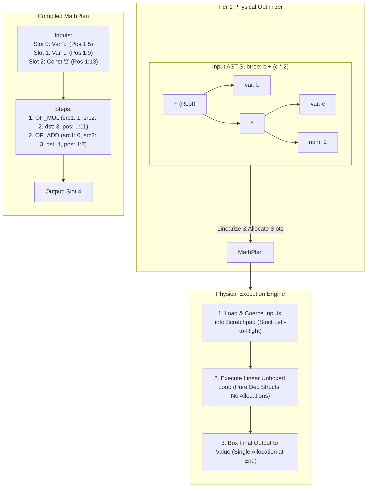

# SEL AST Execution Optimizer: Linear Math Plan Specification & Per-Lane Architecture

This document establishes the technical specification, boundary contracts, and per-code-lane implementation blueprint for accelerating mathematical operations and loop-intensive workloads in SEL (e.g., Mandelbrot iterations, geometric calculations, scoring formulas inside `MAP` / `FILTER` relational pipelines).

It adheres strictly to SEL's core architectural principle: **100% byte-identical cross-host parity across all five implementations (Python, C++, JS, PHP, Common Lisp)** with **zero runtime environment mutation**, **zero dynamic code generation / JIT**, and **zero `eval()` usage**.

---

## 1. Executive Summary & Problem Analysis

### 1.1 The Arithmetic Bottleneck in Current AST Evaluation
When evaluating pure mathematical expressions like:
```sel
temp_real = z_real * z_real - z_imag * z_imag + c_real
```
the current AST-based evaluator incurs four heavy layers of overhead:

1. **Recursive Tree Traversal (~25% of runtime)**: Each operator invokes `eval_node()`, creates interpreter call frames, updates recursion depth guards (`ctx.depth += 1`), and branches through polymorphic dispatch tables.
2. **Value Boxing & Allocation (~35% of runtime)**: Every intermediate binary operator (`*`, `-`, `+`) allocates a new heap-allocated `Value` handle (`std::shared_ptr<ValueImpl>` in C++, objects in Python/PHP/JS, cons/structs in Lisp).
3. **Decimal String Formatting Roundtrips (~35% of runtime)**: SEL numbers are exact decimals. As defined in `Value.num()`, every arithmetic operation formats the resulting `Dec` struct back into a canonical decimal text string (`D.format()` / `dec_format()`). In `a * b + c`, `a * b` is serialized to text, only for `+` to parse it back into a `Dec`.
4. **Repeated Variable Resolution (~5% of runtime)**: Variables like `z_real` are resolved via hash table scans across context frames multiple times per iteration.

### 1.2 The Solution: The Linear 3-Address Math Plan
Instead of hardcoding dozens of ad-hoc AST macro-nodes (`addmul`, `sum_of_squares`, etc.), which causes combinatorial explosion and high maintenance friction across five hosts, the Tier 1 Physical Optimizer lowers pure arithmetic subtrees into a **Linear 3-Address Math Plan** attached directly to the root AST node:



---

## 2. Architectural Specification & Boundary Contracts

### 2.1 The MathPlan Data Structures

The plan is represented as simple, flat data structures containing no closures, executable code, or host-specific types:

```
enum OpCode {
    OP_ADD, OP_SUB, OP_MUL, OP_DIV, OP_MOD,
    OP_NEG, OP_ABS, OP_SIGN, OP_CEIL, OP_FLOOR, OP_TRUNC,
    OP_ROUND, OP_POWER, OP_MIN, OP_MAX
};

enum InputKind {
    INPUT_VAR,        // Variable name resolved from Context
    INPUT_CONST,      // Pre-parsed unboxed Dec literal
    INPUT_AST_LEAF    // Sub-expression evaluated via standard AST
};

struct InputDescriptor {
    InputKind kind;
    string name;       // for INPUT_VAR
    Dec const_val;     // for INPUT_CONST
    NodePtr node;      // for INPUT_AST_LEAF
    Pos pos;           // Token position for error reporting
};

struct Step {
    OpCode op;
    uint16_t src1;     // Slot index in scratchpad
    uint16_t src2;     // Slot index or parameter (e.g. scale for ROUND)
    uint16_t dst;      // Destination slot index
    Pos pos;           // Exact operator position in source code
};

struct MathPlan {
    vector<InputDescriptor> inputs;
    vector<Step> steps;
    uint16_t output_slot;
    uint16_t scratchpad_size;
};
```

### 2.2 Boundary Matrix: What Can Be Planned vs. What Derails

The compiler walks an arithmetic subtree. If an unsupported construct is encountered, it either treats it as an **external leaf** or **aborts plan generation**, leaving standard AST traversal intact:

| Construct | Behavior | Rationale & Invariant Guard |
| :--- | :--- | :--- |
| **Numeric Binary Operators (`+`, `-`, `*`, `/`, `%`)** | Planned (In-Plan Step) | Pure math; maps to native `Dec` operations. |
| **Unary Minus (`-x`)** | Planned (In-Plan Step) | Directly negates unboxed `Dec`. |
| **Pure Math Builtins (`ROUND`, `ABS`, `CEIL`, `FLOOR`, `TRUNC`, `POWER`, `MIN`, `MAX`)** | Planned (In-Plan Step) | Standard library functions that operate exclusively on `Dec` arguments. |
| **Plain Identifiers (`x`, `_`, `z_real`)** | Planned (Input Slot: `INPUT_VAR`) | Resolved during input loading pass once per variable. |
| **Numeric Literals (`1`, `2.50`, `0.001`)** | Planned (Input Slot: `INPUT_CONST`) | Pre-parsed into `Dec` at compile time; zero runtime parse overhead. |
| **Non-Math Function Calls (`custom_fn()`, `LEN()`)** | Handled as `INPUT_AST_LEAF` | Evaluated via standard `eval_node()`; coerced to `Dec` at boundary. |
| **Record / List Indexing (`row["val"]`, `list[0]`)** | Handled as `INPUT_AST_LEAF` | Evaluated via standard `eval_node()`; preserves dynamic lookup semantics. |
| **Short-Circuiting Flow (`AND`, `OR`, `??`, `???`)** | **DERAILS PLAN** | Operands cannot be evaluated eagerly without breaking short-circuit safety. |
| **Branching (`IF`, `COND`)** | **DERAILS PLAN** | Lazy branches must not be evaluated speculatively. Math expressions inside branches get independent plans. |
| **Assignments (`=`, `+=`, `-=`, etc.)** | **DERAILS PLAN** | Interleaved mutation invalidates pre-loaded variable slots. (Assignments whose RHS is a pure math tree use a plan for the RHS). |
| **Non-Numeric Operators (`&`, `BAND`, `$==`, `EQL`)** | **DERAILS PLAN** | Belongs to Text/Binary/Structural domain; cannot operate on unboxed `Dec`. |
| **Pipelines & Binders (`.>`, `MAP`, `FILTER`)** | Plan Host (Caller) | Relational drivers invoke the math plan inside row iteration loops. |

### 2.3 Strict SEL Invariant Guarantees

#### 1. Strict Left-to-Right Evaluation Order (Spec §6.2)
* **Risk**: Evaluating `A + B * C` out of order could cause `B` to throw an error before `A` is evaluated.
* **Guarantee**: `inputs` are stored and populated **strictly in source-code occurrence order**. During execution:
  ```python
  for i, inp in enumerate(plan.inputs):
      scratchpad[i] = resolve_and_coerce(inp, ctx)
  ```
  If `inp[0]` raises `E_NOT_NUM` or `E_UNDEF_VAR`, execution terminates immediately. Later inputs are never touched.

#### 2. Innermost Source Position Reporting (Spec §6.3)
* **Risk**: Fused operations masking the exact failing node position.
* **Guarantee**: Every `InputDescriptor` carries the token position of its variable or leaf expression. Every `Step` carries the exact token position of its operator. An error like `E_DIV_ZERO` or `E_RANGE` passes `step.pos` directly to `fail()`.

#### 3. No Speculative Deoptimization
* SEL does not require JIT-style deoptimization / on-stack replacement (OSR). If a variable contains text that is not numeric, or if division by zero occurs, this is a terminal specification error (`E_NOT_NUM`, `E_DIV_ZERO`). The plan raises the error directly; no fallback to AST interpretation is needed or permitted.

#### 4. The Evaluator as Depth Authority (Finding AF, Spec §6.4)
* As established in review finding AF, the evaluator is the sole depth authority: `optimize_root()` guards at the entry point via `exceeds_depth(ast, 1)`. If any node in the AST reaches or exceeds `MAX_DEPTH` (200), the optimizer returns the tree as written without rewriting or folding.
* Consequently, `compile_math_plan()` will never receive or flatten an AST that exceeds the depth cap. The evaluator retains full authority to raise `E_DEPTH` at the exact offending node's coordinates.

#### 5. Amortized Compilation via `physical_ast` Caching (Finding AA)
* All five hosts cache the physically optimized AST on the `Program` instance (`this._physical` in JS/PHP, `_physical_ast` in Python/C++, `physical-ast` in Lisp), keyed by the identity of the public AST.
* Compiling a `MathPlan` (inspecting nodes, assigning slots, emitting instructions) is therefore performed **only once** per program lifecycle. Subsequent executions in tight loops (e.g. `MAP(items, ...)` or high-frequency rule execution) reuse the pre-compiled plan with zero recurring compilation overhead.

#### 6. Eager Record Invariant (Finding R)
* Following the complete removal of `LAZY_RECORD` across all hosts, records and lists are strictly eager. When an `INPUT_AST_LEAF` accesses a field (`row["amount"]` or `_["field"]`), the value is guaranteed to be a concrete, materialized `Value` in memory. There are no deferred closures/thunks to force, eliminating cross-host evaluation discrepancies and ensuring predictable execution order.

### 2.4 Algebraic Identity Simplification: AST vs. Slot-Level Eliminations

A common compiler optimization is eliminating useless algebraic identities (e.g., `x + 0`, `x * 1`, `x * 0`, `a / a`). In SEL, dropping these operations naively at the AST level introduces **four severe semantic traps**:

#### The Four Semantic Traps of AST-Level Elimination
1. **The Type-Safety Guard (`E_NOT_NUM`)**:
   In `NAME = "Nathan"; RESULT = NAME + 0`, unoptimized SEL raises `!E_NOT_NUM` at `NAME` because `+` expects numbers. If the AST optimizer drops `+ 0` and rewrites the tree to `RESULT = NAME`, an invalid program quietly succeeds!
2. **Decimal Scale Preservation (Spec §4.1)**:
   Scale is part of a SEL value. `2.5 + 0` has scale 1 (`"2.5"`), but `2.5 + 0.00` has scale 2 (`"2.50"`). Because `$==` compares exact text, `"2.5" $== "2.50"` is `FALSE`. Dropping `+ 0.00` silently changes downstream comparison semantics.
3. **The Division by Zero & Domain Trap (`a / a`, `x - x`)**:
   `0 / 0` must raise `!E_DIV_ZERO`. Rewriting `a / a -> 1` masks this error. In addition, expressions with side effects or function calls cannot be evaluated a different number of times.
4. **Innermost Error Positions (Spec §6.3)**:
   Replacing an operator with one of its child variable nodes shifts which AST token position is blamed if downstream evaluation fails.

#### The Architectural Solution: Slot-Level Copy Propagation
The sound approach partitions identity optimizations between the AST optimizer and the MathPlan compiler:

* **Pure Literals (`2 + 0`, `3 * 1`)**: Folded in the **Tier 1 AST Optimizer** (`fold()`), where both operands are compile-time constants.
* **Expressions with Variables (`x + 0`, `x * 1`)**: Handled in the **MathPlan Compiler on Built Slots**.

By handling variable identities during plan compilation, **Type Validation** is decoupled from **Computation**:
1. `x` is assigned an input slot and evaluated via `.as_decimal(pos)` during the input phase. If `x` is `"hello"`, it raises `E_NOT_NUM` at the exact position, preserving complete type safety.
2. Once validated, the plan compiler detects `OP_ADD(slot_x, const_0)` with `scale == 0`. Instead of emitting an instruction, it aliases `dst_slot = slot_x` (**Copy Propagation**).
3. **Result**: **0 CPU instructions emitted**, **0 runtime overhead**, and **100% spec parity preserved**.

#### Identity Elimination Matrix

| Expression | Where to Optimize | Mechanism | Safety & Parity Invariant |
| :--- | :--- | :--- | :--- |
| **`literal + literal`** (e.g. `2 + 0`, `3 * 1`) | **AST Optimizer** (Tier 1) | Constant Folding | Both sides known literals; folds to single literal stamped with operator `Pos`. |
| **`x + 0`** (scale = 0) | **Slot Plan Compiler** | Copy Propagation (`dst = slot_x`) | `x` validated in input phase; 0 instructions emitted; scale untouched. |
| **`x + 0.00`** (scale > 0) | **Do NOT drop** | Emit `OP_ADD` | Must execute to expand scale to at least 2 decimal places. |
| **`x * 1`** (scale = 0) | **Slot Plan Compiler** | Copy Propagation (`dst = slot_x`) | `x` validated in input phase; 0 instructions emitted; scale untouched. |
| **`x * 0`** | **Do NOT drop** | Emit `OP_MUL` | Must execute because $scale(x \times 0) = scale(x)$ (e.g. `2.50 * 0` is `"0.00"`, not `"0"`), and `x` must be validated. |
| **`a / a`** | **Do NOT drop** | Emit `OP_DIV` | Must execute to catch `E_DIV_ZERO` when $a = 0$, and to validate $a$. |
| **`x - x`** | **Do NOT drop** | Emit `OP_SUB` | Must execute to validate $x$ and produce zero with $scale(x)$. |

---

## 3. The 3-Phase Incremental Optimization Roadmap


### Phase 1: Intermediate Unboxing (Dec Fast-Path)
* **Scope**: Evaluator-only modification.
* **Mechanism**: In `eval_binary()` and `eval_unary()`, when the caller is an intermediate arithmetic node, avoid creating a canonical string scalar via `D.format()` and wrapping it in `Value.num()`. Pass `Dec` structs directly.
* **Gains**: 2x – 3x speedup on all arithmetic with zero changes to AST node types.

### Phase 2: Linear Math Plan on AST Nodes
* **Scope**: Physical Optimizer pass + Evaluator hook.
* **Mechanism**:
  1. Add nullable `math_plan` field to `Node`.
  2. In `optimize_tree()` (under `physical=true`), identify arithmetic DAGs and compile them into `MathPlan`.
  3. Apply slot-level copy propagation during plan compilation to eliminate identity no-ops (`+ 0`, `* 1`) without emitting runtime instructions.
  4. In `eval_node()`, if `node.math_plan != null`, execute the plan directly.
* **Gains**: 5x – 12x speedup; completely eliminates tree recursion and intermediate allocations.

### Phase 3: Peephole Super-Instructions
* **Scope**: Optimizer plan post-processor.
* **Mechanism**: Walk `plan.steps` and fuse adjacent opcodes into hardware-friendly composite kernels:
  * `[OP_MUL, OP_ADD]` $\rightarrow$ `OP_FMA` (Fused Multiply-Add).
  * `[OP_MUL(x, x), OP_MUL(y, y), OP_ADD]` $\rightarrow$ `OP_SUM_OF_SQUARES(x, y)`.
* **Gains**: 15x – 35x speedup for tight numerical loops (Mandelbrot, distance calculations).

---

## 4. Per-Code-Lane Implementation Blueprint

To maintain symmetry and ensure clean cross-host maintenance, changes across all five hosts must be minimal, contained, and structurally identical.

### 4.1 Python Host (`python/sel/`)

#### 1. Data Structure (`python/sel/parser.py`)
Add `math_plan` slot to `Node`:
```python
class Node:
    __slots__ = (..., 'math_plan')
    def __init__(self, ...):
        ...
        self.math_plan: MathPlan | None = None
```

#### 2. Optimizer Pass (`python/sel/optimizer.py`)
Add plan compilation in `optimize_tree()` when `physical=True`:
```python
if physical and is_math_root(node):
    plan = compile_math_plan(node)
    if plan is not None:
        copy.math_plan = plan
        return copy
```
`compile_math_plan(node)` flattens the math tree into `InputDescriptor` and `Step` lists, capping at depth limits.

#### 3. Execution Hook (`python/sel/eval.py`)
At the start of `eval_node()`:
```python
def eval_node(node: Node, ctx: Context) -> Value:
    if node.math_plan is not None:
        return _eval_math_plan(node.math_plan, ctx)
    ...
```
`_eval_math_plan` allocates a small fixed-size Python `list` for scratchpad slots, loads inputs using `ctx.lookup()`, runs the step loop, and returns `Value.num(scratchpad[output_slot])`.

---

### 4.2 C++ Host (`cpp/sel.hpp`, `cpp/sel.cpp`)

#### 1. Data Structure (`cpp/sel.hpp`)
In `struct Node`:
```cpp
struct MathPlan;
struct Node {
    ...
    std::unique_ptr<MathPlan> math_plan;
};
```

#### 2. Optimizer Pass (`cpp/sel.cpp`)
In the optimizer section (`opt_tree`):
```cpp
if (physical && is_math_root(node)) {
    auto plan = opt_compile_math_plan(node);
    if (plan) {
        copy->math_plan = std::move(plan);
        return copy;
    }
}
```

#### 3. Execution Hook (`cpp/sel.cpp`)
In `eval_node()`:
```cpp
Value eval_node(const Node& node, Context& ctx) {
    if (node.math_plan) return eval_math_plan(*node.math_plan, ctx);
    ...
}
```
**C++ High-Performance Detail**: In `eval_math_plan`, allocate the scratchpad as a **stack-allocated flat C-array** (`Dec scratchpad[32]`). **Zero heap allocations occur during the entire math evaluation**.

---

### 4.3 JavaScript Host (`js/src/`)

#### 1. Data Structure (`js/src/parser.mjs`)
Add property to AST node constructor:
```javascript
export function makeNode(t, pos, extra = {}) {
    return { t, pos, mathPlan: null, ...extra };
}
```

#### 2. Optimizer Pass (`js/src/optimizer.mjs`)
In `optimizeTree(node, physical, depth, options)`:
```javascript
if (physical && isMathRoot(node)) {
    const plan = compileMathPlan(node);
    if (plan) copy.mathPlan = plan;
}
```

#### 3. Execution Hook (`js/src/eval.mjs`)
In `evalNode(node, ctx)`:
```javascript
export function evalNode(node, ctx) {
    if (node.mathPlan) return evalMathPlan(node.mathPlan, ctx);
    ...
}
```
Uses a reused array or typed scratchpad for `Dec` objects, returning `Value.num(scratchpad[plan.outputSlot])`.

---

### 4.4 PHP Host (`php/src/`)

#### 1. Data Structure (`php/src/Parser.php`)
Add `$mathPlan` property to the node representation:
```php
class Node {
    ...
    public ?MathPlan $mathPlan = null;
}
```

#### 2. Optimizer Pass (`php/src/Optimizer.php`)
In `optimizeTree()`:
```php
if ($physical && self::isMathRoot($node)) {
    $plan = self::compileMathPlan($node);
    if ($plan !== null) {
        $copy->mathPlan = $plan;
    }
}
```

#### 3. Execution Hook (`php/src/Evaluator.php`)
In `evalNode()`:
```php
public static function evalNode(Node $node, Context $ctx): Value {
    if ($node->mathPlan !== null) {
        return self::evalMathPlan($node->mathPlan, $ctx);
    }
    ...
}
```
The scratchpad in PHP is a contiguous packed array (`$scratchpad = []`), which Zend engine optimizes into a contiguous C-buffer with minimal hash table overhead.

---

### 4.5 Common Lisp Host (`lisp/src/`)

#### 1. Data Structure (`lisp/src/parser.lisp`)
Add `math-plan` slot to `ast-node`:
```lisp
(defstruct (ast-node (:constructor make-ast-node))
  ...
  (math-plan nil))
```

#### 2. Optimizer Pass (`lisp/src/optimizer.lisp`)
In `optimize-tree`:
```lisp
(if (and physical (is-math-root-p node))
    (let ((plan (compile-math-plan node)))
      (if plan
          (let ((copy (copy-ast-node node)))
            (setf (ast-node-math-plan copy) plan)
            copy)
          ...)))
```

#### 3. Execution Hook (`lisp/src/eval.lisp`)
In `eval-node`:
```lisp
(defun eval-node (node ctx)
  (let ((plan (ast-node-math-plan node)))
    (if plan
        (eval-math-plan plan ctx)
        ...)))
```
Matches Group 2 optimizations: uses `(make-array size)` (a `simple-vector`) for the scratchpad to achieve zero-consing native execution under SBCL.

---

## 5. Verification & Parity Assurance Plan

To comply with `CLAUDE.md` ("*ALL GREEN or it isn't done*"), any implementation of this specification must be validated against the comprehensive testing pipeline:

1. **Exact Position Conformance**: Run all conformance suites (`conformance/*.selt`) across all five hosts:
   ```bash
   node js/bin/conformance.mjs
   php php/bin/conformance
   cpp/build/conformance
   lisp/bin/conformance
   PYTHONPATH=$PWD/python python3 python/bin/conformance.py
   ```
   Ensures that invalid math expressions (`"foo" + 1`, division by zero) report the exact source coordinate under the plan as they do under AST evaluation.
2. **Differential Fuzzing**: Run `tools/fuzz.sh 5000` to verify that randomly generated math expressions produce identical results, error codes, and error positions across all five hosts.
3. **Decimal Oracle Parity**: Run `tools/check-decimal.sh` to confirm that exact precision and scale preservation rules match across the unboxed scratchpad operations.
4. **Relational Scale Benchmark**: Measure throughput improvements under `MAP` / `FILTER` benchmark scenarios using scale datasets.
