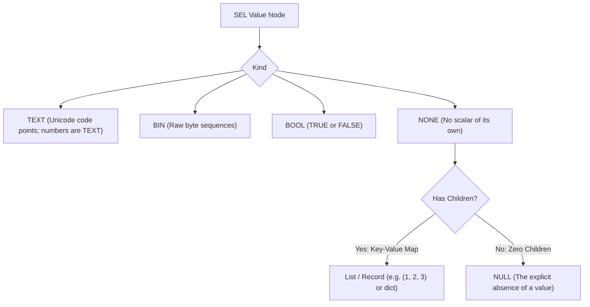

# SEL 0.7.0 Implementation Plan: First-Class NULL, Resilient Schema Guarding & SQL Delegation

## Goal Description

SEL's core promise is: **write a business rule once; run it on the backend, frontend, or database, and get the exact same answer without subtle runtime drift**.

In real-world data processing, rules operate across two environments:
1. **Application Runtimes** (JavaScript, Python, PHP, C++, Common Lisp) evaluating JSON payloads or form submissions.
2. **Relational Databases** (PostgreSQL, MariaDB, MySQL, SQLite) executing queries over SQL tables.

Both environments are rife with **missing values, optional fields, and `NULL`s**. Today:
- SQL silently swallows `NULL` via three-valued logic (`price * NULL -> NULL`, `NULL > 0 -> UNKNOWN`), dropping rows from `WHERE` clauses without warning.
- JavaScript silently coerces: `null + 2` is `2`, `"2" + 2` is `"22"`.
- SEL currently has no `NULL` literal, treats missing keys as fatal errors (`E_NO_KEY`, `E_UNDEF_VAR`), and lacks null-coalescing.

**SEL 0.7.0** bridges this gap without compromising strictness. Technical worries will either:
- **Disappear**: via safe, explicit coalescing (`??` for null, `???` for vacuous/empty values, and in-memory `GET`/`PATH`).
- **Shoot you in the face immediately**: via strict refusal (`E_NULL`) whenever an unhandled `NULL` reaches arithmetic (`NULL + 1`) or comparison (`NULL > 0`).

SEL remains strictly an **expression delegate for data selection, filtering, and calculation** (not a general-purpose programming language or "another COBOL"). The application orchestrates (`GATE(data, rule)`); SEL evaluates expressions.

---

## 1. What NULL Means for SEL (Normative Definition)

In SEL, **`NULL` is the explicit absence of a value**.



### The Invariants:
1. **Kind Representation**: `NULL` is a `Value` of kind `NONE` with no scalar and no children (`children.size() == 0`).
   - Round-trips cleanly through `from_native(None)` / `to_native()` across all five hosts (`None` in Python, `null` in PHP/JS, `std::nullopt` in C++, `nil` in Common Lisp).
2. **Distinctness from Zero and Empty**:
   - `NULL` is **not** `0` (0 is a `TEXT` number).
   - `NULL` is **not** `""` ("" is empty `TEXT`).
   - `NULL` is **not** `FALSE` (FALSE is `BOOL`).
   - `NULL` is **not** truthy or falsy: evaluating `NULL` in `IF(NULL, ...)` raises `E_NOT_BOOL`.
3. **The Loud Refusal Warrant (`E_NULL`)**:
   - Any attempt to use `NULL` in arithmetic (`NULL + 1`, `10 / NULL`) raises **`E_NULL`** at the operator's source position.
   - Any attempt to compare `NULL` numerically or lexicographically (`NULL == 0`, `NULL < 5`, `NULL $== ""`) raises **`E_NULL`**.
   - Any attempt to concatenate `NULL` (`NULL & "x"`) raises **`E_NULL`**.
4. **Structural Identity (`EQL` & `IN`)**:
   - `NULL EQL NULL` is `TRUE`.
   - `NULL EQL 0` and `NULL EQL ""` are `FALSE`.
   - `NULL IN (1, 2, NULL)` is `TRUE`.
   - `NULL IN (1, 2, 3)` is `FALSE`.

---

## 2. Data Invariant Handling: The `???` Operator

In business workflows, forms, and legacy data exports, **missing**, **empty string**, **whitespace-only**, and **empty list** often represent the exact same business invariant: *"no value was provided"*.

To handle this cleanly and visibly, SEL 0.7.0 introduces two complementary operators:

### `??` (Null-Coalescing) vs. `???` (Vacuous / Data Invariant Coalescing)

| Input Value `X` | `X ?? "default"` | `X ??? "default"` | Rationale |
|---|---|---|---|
| `NULL` | `"default"` | `"default"` | Missing value |
| Missing key / variable | `"default"` | `"default"` | Missing field in payload |
| `""` (empty string) | `""` | `"default"` | Vacuous text |
| `"   "` (whitespace only) | `"   "` | `"default"` | Vacuous text (untrimmed form input) |
| `()` (empty list) | `()` | `"default"` | Vacuous collection |
| `0` (numeric zero) | `0` | `0` *(or "default" if Zero mode selected)* | Numeric zero is usually a valid amount/quantity |
| `"valid"` | `"valid"` | `"valid"` | Non-empty value |
| `123` | `123` | `123` | Non-empty number |

> [!TIP]
> **Why `???`?**
> The triple question mark `???` is visually unmistakable, cannot be mistaken for a typo, immediately draws the reader's attention to data invariant normalization, and desugars in SQL to:
> ```sql
> COALESCE(NULLIF(TRIM({0}), ''), {1})
> ```

---

## 3. In-Memory `GET` and `PATH` (Dictionary Structure Navigation)

As requested, **`GET` and `PATH` are strictly in-memory dictionary/list navigators**. They do **not** introduce JSON/XML parsing or database JSON column syntax into SEL 0.7.0.

### 3.1 `GET(target, key [, default])`
- **Lane A (Strict)**.
- Reads child `key` from `target`.
- If `key` exists: yields the child value.
- If `key` is absent or `target` is `NULL`: yields `default` (or `NULL` if `default` omitted).

### 3.2 `PATH(target, path_str [, default])`
- **Lane A (Strict)**.
- Splits `path_str` on `.` and traverses nested SEL `Value` maps in memory.
- Example: `PATH(ORDER, "shipping.address.postcode", "UNKNOWN")`.
- If any segment is missing or target has no children: yields `default` (or `NULL` if omitted).
- Never throws `E_NO_KEY` or `E_NO_SCALAR`.

---

## 4. Scope of Changes (Python Pilot Walkthrough)

The changes are designed to be concise, robust, and cleanly translatable across all five hosts. Here is the concrete scope in the Python pilot:

### 4.1 Lexer (`python/sel/lexer.py`)
```python
# 1. Add operator tokens (longest match first)
OPERATORS = [
    '???', '??',                         # <-- NEW: Vacuous and Null coalescing
    '$==', '$!=', '$<=', '$>=',
    '$<', '$>', '==', '!=', '<=', '>=', '+=', '-=', '*=', '/=', '%=', '&=',
    '+', '-', '*', '/', '%', '&', '=', '<', '>', '(', ')', '[', ']', ',', ';',
]

# 2. Add NULL to reserved words
RESERVED = frozenset([
    'TRUE', 'FALSE', 'NULL',             # <-- NEW: NULL literal
    'AND', 'OR', 'NOT', 'XOR', 'EQL', 'IN', 'BAND', 'BOR', 'BXOR',
])
```

### 4.2 Parser (`python/sel/parser.py`)
```python
# Binding power: sits right above comparison (8), tighter than comparison, looser than concat (12)
BP_COMPARE = 8
BP_COALESCE = 9                         # <-- NEW: ?? and ???
BP_BOR = 10
...

INFIX_OPS: dict[str, tuple[int, str]] = {
    '??': (BP_COALESCE, 'R'),           # Right-associative: A ?? B ?? C
    '???': (BP_COALESCE, 'R'),
    ...
}

# In parse_primary:
if tok.t == 'ident' and tok.v == 'NULL':
    self.i += 1
    return Node(t='null', pos=tok.pos)  # <-- NEW: Null node
```

### 4.3 Value Representation & Refusal (`python/sel/value.py`)
```python
class Value:
    def is_null(self) -> bool:
        return self.kind == NONE and self.size() == 0 and self.scalar is None

    def scalar_source(self, pos: Pos | None = None) -> Value:
        v = self
        guard = 0
        while v.kind == NONE:
            if not v.children:
                # <-- LOUD REFUSAL: raises E_NULL pointing directly at the node!
                fail('E_NULL', 'value is NULL; use ?? or COALESCE to provide a fallback', pos)
            v = next(iter(v.children.values()))
            guard += 1
            if guard > 1000:
                fail('E_DEPTH', 'scalar context nested too deeply', pos)
        return v
```

### 4.4 Evaluator (`python/sel/eval.py`)
```python
# In _dispatch:
if t == 'null':
    return Value.none()

# In _eval_binary:
if op == '??':
    try:
        l = eval_node(node.l, ctx)
        if not l.is_null():
            return l
    except SelError as e:
        if e.code not in ('E_NO_KEY', 'E_UNDEF_VAR'):
            raise
    return eval_node(node.r, ctx)

if op == '???':
    try:
        l = eval_node(node.l, ctx)
        if not _is_vacuous(l):
            return l
    except SelError as e:
        if e.code not in ('E_NO_KEY', 'E_UNDEF_VAR'):
            raise
    return eval_node(node.r, ctx)
```

### 4.5 Built-ins (`python/sel/builtins/null.py`)
```python
def _is_null(args: Args, ctx: Context) -> Value:
    return Value.bool(args.val(0).is_null())

def _is_not_null(args: Args, ctx: Context) -> Value:
    return Value.bool(not args.val(0).is_null())

def _coalesce(args: Args, ctx: Context) -> Value:
    # Lazy: short-circuits on first non-null
    for i in range(args.count()):
        v = args.eval_node(args.node(i))
        if not v.is_null():
            return v
    return Value.none()

def _get(args: Args, ctx: Context) -> Value:
    target = args.val(0)
    key = args.text(1)
    child = target.get(key)
    if child is not None:
        return child
    return args.val(2) if args.count() == 3 else Value.none()

def _path(args: Args, ctx: Context) -> Value:
    target = args.val(0)
    path = args.text(1).split('.')
    cur = target
    for segment in path:
        if cur.kind != NONE or cur.size() == 0:
            return args.val(2) if args.count() == 3 else Value.none()
        cur = cur.get(segment)
        if cur is None:
            return args.val(2) if args.count() == 3 else Value.none()
    return cur
```

---

## 5. SQL Translation Layer Mapping

In `sql/dialects/ansi.json` (inherited by PostgreSQL, MySQL, MariaDB, SQLite):

```json
{
  "ops": {
    "??": {
      "tpl": "COALESCE({0}, {1})",
      "ret": "FIRST"
    },
    "???": {
      "tpl": "COALESCE(NULLIF(TRIM({0}), ''), {1})",
      "ret": "FIRST"
    }
  },
  "funcs": {
    "IS_NULL": {
      "tpl": "({0} IS NULL)",
      "ret": "BOOL"
    },
    "IS_NOT_NULL": {
      "tpl": "({0} IS NOT NULL)",
      "ret": "BOOL"
    },
    "COALESCE": {
      "tpl": "COALESCE({*})",
      "ret": "FIRST"
    },
    "IS_BLANK": {
      "tpl": "(({0} IS NULL) OR (TRIM({0}) = ''))",
      "ret": "BOOL"
    },
    "IS_PRESENT": {
      "tpl": "(({0} IS NOT NULL) AND (TRIM({0}) <> ''))",
      "ret": "BOOL"
    }
  }
}
```

---

## 6. Test Cases & Verification Taxonomy

We will build two dedicated test suites:

### 6.1 In-Place Conformance Suite (`conformance/13-null.selt`)
**Estimated Count: ~75 assertions**

| Category | Description | Example Assertions |
|---|---|---|
| `null.lit` | Literal syntax, case insensitivity, round-trip | `NULL => null`<br/>`null => null`<br/>`toNative(NULL) == None` |
| `null.loud` | Strict refusal on unhandled null | `!E_NULL NULL + 1`<br/>`!E_NULL 10 / NULL`<br/>`!E_NULL NULL & "a"`<br/>`!E_NULL NULL > 0`<br/>`!E_NOT_BOOL IF(NULL, 1, 2)` |
| `null.eql` | Structural equality and membership | `NULL EQL NULL => TRUE`<br/>`NULL EQL 0 => FALSE`<br/>`NULL IN (1, 2, NULL) => TRUE`<br/>`NULL IN (1, 2, 3) => FALSE` |
| `op.coalesce` | `??` short-circuiting and missing key rescue | `NULL ?? 5 => 5`<br/>`MISSING_VAR ?? 10 => 10`<br/>`PAYLOAD["missing"] ?? "def" => def`<br/>`7 ?? (1 / 0) => 7` *(short-circuits)*<br/>`!E_DIV_ZERO (1 / 0) ?? 5` *(does not swallow logic errors)* |
| `op.vacuous` | `???` data invariant blank coalescing | `NULL ??? "x" => x`<br/>`"" ??? "x" => x`<br/>`"   " ??? "x" => x`<br/>`() ??? "x" => x`<br/>`"real" ??? "x" => real` |
| `func.null` | `IS_NULL`, `IS_NOT_NULL`, `COALESCE` | `IS_NULL(NULL) => TRUE`<br/>`IS_NULL(0) => FALSE`<br/>`COALESCE(NULL, NULL, "hit", 1/0) => hit` |
| `func.dict` | In-memory `GET` and `PATH` | `M["a"] = 1; GET(M, "a") => 1`<br/>`GET(M, "b", 99) => 99`<br/>`P["x"]["y"] = "ok"; PATH(P, "x.y") => ok`<br/>`PATH(P, "x.missing", "none") => none` |

### 6.2 SQL Translation Cases (`sql/cases/21-null.sqlt`)
**Estimated Count: ~35 cases (running against 4 dialects = 140 assertions)**

| Category | Source Expression | Expected SQL Translation |
|---|---|---|
| `sql.coalesce` | `QTY ?? 0` | `COALESCE(`o`.`qty`, 0)` |
| `sql.coalesce.chain` | `A ?? B ?? 10` | `COALESCE(`a`, COALESCE(`b`, 10))` |
| `sql.vacuous` | `CODE ??? "N/A"` | `COALESCE(NULLIF(TRIM(`code`), ''), 'N/A')` |
| `sql.is_null` | `IS_NULL(DISCOUNT)` | `(`o`.`discount` IS NULL)` |
| `sql.is_not_null` | `IS_NOT_NULL(DISCOUNT)`| `(`o`.`discount` IS NOT NULL)` |
| `sql.coalesce.func` | `COALESCE(A, B, 0)` | `COALESCE(`a`, `b`, 0)` |
| `sql.is_blank` | `IS_BLANK(POSTCODE)` | `((`postcode` IS NULL) OR (TRIM(`postcode`) = ''))` |

---

## 7. Documentation Plan (Including Dedicated SEL->SQL Guide)

### 7.1 `README.md` Additions
Add a dedicated top-level section: **"Pushing rules into SQL"**:
- Explaining the mental model: author once in SEL, evaluate in-memory, or compile to SQL for the database.
- Clear runnable examples in all 5 languages showing how to call the translator:
  - Python: `from sel.sql import translate, Binding`
  - PHP: `use Sel\Sql\Translator; use Sel\Sql\Binding;`
  - JS: `import { translate, Binding } from 'sel-lang/sql';`
  - C++: `#include "sel_sql.hpp"`
  - Common Lisp: `(sel.sql:translate ...)`
- Showing how the emitted SQL fragment drops directly into a `WHERE` or `CHECK` clause.

### 7.2 `docs/LANGUAGE.md` Updates
- Add `NULL` to the **Values** section alongside `TEXT`, `BIN`, `BOOL`, `NONE`.
- Document `??` (Null-Coalescing) and `???` (Vacuous Coalescing) in the **Operators** table.
- Document `IS_NULL`, `IS_NOT_NULL`, `COALESCE`, `GET`, `PATH`, `IS_BLANK`, `IS_PRESENT` in the **Function Reference**.

### 7.3 `CHANGELOG.md`
Detailed entry for `0.7.0 — 2026-09-XX`:
- First-class `NULL` literal and value.
- Strict refusal `E_NULL` on unhandled arithmetic and comparisons.
- Operators `??` and `???`.
- In-memory dictionary helpers `GET` and `PATH`.
- Shipped SQL dialect translations for `??`, `???`, `IS_NULL`, `COALESCE`.
- Dedicated SEL->SQL user guide.

---

## Verification Plan

1. **Local Test Harness**:
   ```bash
   tools/check.sh
   tools/check-sql-map.sh
   tools/check-docs.sh
   tools/check-version.sh 0.7.0
   ```
2. **Differential Fuzzing**:
   Run `tools/fuzz.py` and `tools/fuzz-sql.sh` across all 5 implementations to assert byte-identical execution and error positions for `NULL`, `??`, and `???`.
3. **Multi-Database Live Verification**:
   Verify against MariaDB, PostgreSQL, MySQL, and SQLite using the Python SQL test runner.
