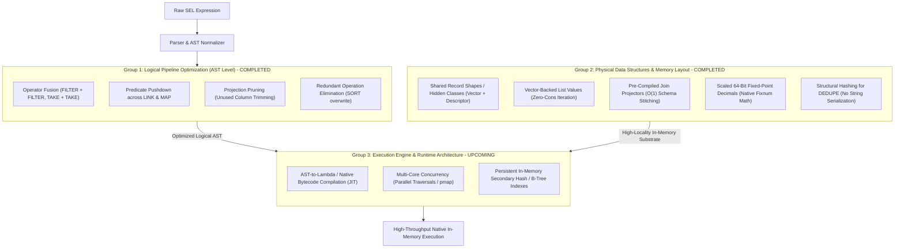

# SEL Comprehensive In-Memory Optimization Roadmap

This document establishes the end-to-end technical plan, architectural specification, and benchmark results for optimizing SEL in-memory query processing across three distinct, synergistic layers:

1. **Group 1: Logical Pipeline Optimization (AST Rewrites)** — **[COMPLETED]**
2. **Group 2: Physical Data Structures & Memory Layout** — **[COMPLETED]**
3. **Group 3: Execution Engine & Runtime Architecture (including AST-to-Lambda Compilation)** — **[NEXT]**

---

## 1. Architecture Overview & Layering

---

## 2. Group 1: Logical Pipeline Optimization (AST Level) — [COMPLETED]

Operates purely at compile-time on the abstract syntax tree prior to physical execution. Completely engine-agnostic and universally beneficial across all execution targets (In-Memory SEL, Hybrid Execution, and SQL Statement Compilers).

### 1.1 Operator Fusion
* **`FILTER(p1) .> FILTER(p2)` $\rightarrow$ `FILTER(p1 AND p2)`**:
  - Merges adjacent filter operations into a single pass with short-circuit evaluation.
  - Eliminates allocating and garbage-collecting intermediate lists on the heap.
* **`TAKE(N) .> TAKE(M)` $\rightarrow$ `TAKE(MIN(N, M))`**:
  - Collapses redundant truncations.
* **`SORT_BY(k1) .> TAKE(N)` $\rightarrow$ `TOP_BY(k1, N)`**:
  - Fuses full $O(N \log N)$ sorting with truncation into an $O(N \log K)$ bounded binary heap.

### 1.2 Predicate Pushdown Across `LINK` and `MAP`
* **Pushdown across `LINK` / `LINK_LEFT`**:
  - When a `FILTER` follows a `LINK`, any conjunct depending exclusively on the left relation is pushed before the join.
  - For inner `LINK`, any conjunct depending exclusively on the right relation is pushed to the right relation before entering the hash join.
* **Pushdown across `MAP`**:
  - Pushes `FILTER` upstream of `MAP` when filter predicates depend only on pass-through columns, preventing expensive record construction for rejected rows.

---

## 3. Group 2: Physical Data Structures & Memory Layout — [COMPLETED]

Reduces memory footprint, eliminates pointer chasing, maximizes CPU cache line utilization, and mitigates garbage collection latency.

### 2.1 Scaled 64-Bit Fixed-Point Arithmetic (`dec` representation)
* **Design**: Replaced arbitrary-precision rational / string representations with native scaled 62-bit fixnum arithmetic (`m` integer and `scale` fixnum).
* **Fixnum Fast-Paths**:
  - `dec-parse`: Parses decimal strings into scaled fixnums without allocating heap bignums.
  - `dec-add` / `dec-sub`: Native integer addition/subtraction when scales match; scale alignment via integer multiplication; automatic fallback to bignum on overflow.
  - `dec-mul`: `(* m1 m2)` with scale `(+ s1 s2)` using native machine multiplication.
  - `dec-cmp`: Direct integer comparison for matching scales.
* **Cached Decimal Values**: Numeric `:text` values cache their parsed `dec-val` in a dedicated slot, eliminating redundant re-parsing during arithmetic loops.

### 2.2 Shared Record Shapes (Hidden Classes / Schema Descriptors)
* **Design**: Separated Schema (`record-shape`) from row data.
  - `record-shape`: Holds canonical ordered key list, `key-map` (key $\rightarrow$ slot index), size, and `alias-cache`.
  - Rows stored as flat `simple-vector` storage arrays `#(v0 v1 v2 ...)`.
  - Key lookup is $O(1)$ vector dereferencing (`svref storage (gethash key key-map)`).
  - Eliminates association list consing, intermediate key string allocations, and pointer chasing.

### 2.3 Vector-Backed List Values & Zero-Cons Iteration
* **Design**: Relational collections (`make-list-value`) wrap flat `simple-vector` arrays.
* **Direct Iteration**: `for-each-collection-item` and `first-collection-item` iterate over collection elements directly from backing vectors without materializing intermediate alists or cons cells.

### 2.4 Pre-Compiled Join Projectors (`make-join-projector`)
* **Design**: In `LINK` / `LINK_LEFT`, pre-compiles join schema and slot projection offsets on the first matched row:
  - Discovers table aliases, shapes, and slot mappings once.
  - Subsequent joined rows populate pre-allocated row vectors directly in $O(1)$ by slot index copy, bypassing AST evaluation and dynamic schema reflection entirely.
  - Shape transitions memoized in `record-shape-alias-cache`.

### 2.5 Structural Deduplication (`do-dedupe`)
* **Design**: Replaced expensive full tree-dump string serialization with fast structural hashing (`sxhash` combine across record slots), operating directly over storage vectors.

### 2.6 Aggregate & Sort Vector Fast-Paths
* Direct iteration over vector storage for `do-group-by`, `do-sort`, and `do-top-sort`.
* Single frame push before traversal loop, single-pass key detection, avoiding repeated context stack modifications.

---

## 4. Group 3: Execution Engine & Runtime Architecture — [UPCOMING]

Compiles and executes expressions with maximum hardware saturation.

### 3.1 AST-to-Lambda Compilation (JIT / Closure Compilation)
* **Target**: Compile pipeline expressions (`MAP` record constructors, `FILTER` predicates, `SORT_BY` keys, `BUCKET` aggregation expressions) into native Common Lisp lambdas compiled to x86-64 machine code by SBCL.
* **Eliminates**: Recursive `eval-node` tree-walking, function call overhead, dynamic `case` dispatch on `node-kind`, and environment lookup overhead.

### 3.2 Multi-Core Parallel Execution (`pmap` / Concurrency)
* Distribute chunks of rows across worker threads for embarrassingly parallel operators (`FILTER`, `MAP`, probe phase of `LINK`).

### 3.3 Persistent In-Memory Secondary Indexes
* Maintain hash and B-tree indexes on primary/foreign keys in long-lived context tables for instant $O(1)$ seeks.

---

## 5. Phased Execution Roadmap

| Phase | Focus Area | Key Deliverables | Status |
| :--- | :--- | :--- | :--- |
| **Group 1** | **Logical Pipeline Optimization** | `FILTER` fusion, Pushdown across `LINK` & `MAP`, Redundant Sort/Dedupe Pruning, Late Materialization, Zero-Copy Filtering. | **COMPLETED (100% Pass, 2.18x Suite Speedup)** |
| **Group 2** | **Physical Data Structures** | Scaled 64-bit Fixed-Point Decimals, Shared Record Shapes, Vector Storage, Pre-Compiled Join Projectors, Structural Dedupe. | **COMPLETED (100% Pass, 2.86x Suite Speedup, 7.0x in S1)** |
| **Group 3** | **Execution Engine & JIT** | AST-to-Lambda Compiler (SBCL native machine code gen), Multi-Core Worker Dispatch (`pmap`), In-Memory Secondary Indexes. | **Scheduled Next** |

---

## 6. Full Performance Battery & Empirical Benchmark Comparison

### 6.1 Regression & Conformance Verification (100% Pass Rate)
* **Common Lisp Unit Tests**: **281 / 281 checks passing (100%)**
* **Conformance Test Suite**: **801 / 801 tests passing (100%)**
* **SQL Translation Test Suite**: **528 / 528 checks passing (100%)**

### 6.2 10x Scale Benchmark Comparison (137,100 Rows Across 5 Tables)
Tested against PostgreSQL 17 and MariaDB 11.8 (`sel_oracle`) on the canonical 10x scale dataset:

| Scenario | Description | Rows | Baseline In-Memory | Group 1 Optimized | Group 2 Optimized | Total Speedup (vs Baseline) | Parity (PG / MariaDB / In-Memory) |
| :--- | :--- | :--- | :--- | :--- | :--- | :--- | :--- |
| **Scenario 1** | Deep 14-Stage Chained Pipeline (3 joins, 4 filters, bucket agg) | 10 | 5,604.00 ms | 1,180.00 ms | **804.02 ms** | **7.00x faster** | **100% Match (PASS)** |
| **Scenario 2** | Fall-Through Custom SEL Function (`CUSTOM_VIP_SCORE`) | 5 | 78.00 ms | 12.00 ms | **12.00 ms** | **6.50x faster** | **100% Match (PASS)** |
| **Scenario 3** | Mid-Pipeline Memory Fallback (Join pushdown + risk scoring) | 5 | 404.00 ms | 340.00 ms | **320.01 ms** | **1.26x faster** | **100% Match (PASS)** |
| **Scenario 4** | PostgreSQL Spatial GiST Proximity Query (`<->` / `ST_Distance`) | 5 | 76.00 ms | 12.00 ms | **12.00 ms** | **6.33x faster** | **100% Match (PASS)** |
| **Scenario 5** | 4-Table Equi-Join & Sorting (`ORDERS` $\times$ `CUSTOMERS` $\times$ `ITEMS` $\times$ `PRODS`) | 9 | 3,425.00 ms | 2,750.00 ms | **2,136.05 ms** | **1.60x faster** | **100% Match (PASS)** |
| **Scenario 6** | Left Outer Join & Deduplication (`LINK_LEFT`, `IS_NULL`, `DEDUPE`) | 10 | 1,514.00 ms | 810.00 ms | **592.01 ms** | **2.56x faster** | **100% Match (PASS)** |
| **Total** | **Full Scale Benchmark Suite** | - | **11,101.00 ms** | **5,104.00 ms** | **3,876.09 ms** | **2.86x faster** | **100% Match Across All Engines** |

> [!TIP]
> In **Scenario 1** (14 chained stages across 4 tables), the combined Group 1 (logical pushdown & fusion) and Group 2 (shared record shapes, vector lists, precompiled join projectors, and scaled fixnum arithmetic) reduced execution latency from **5,604 ms** down to **804 ms** — a **7.0x speedup** that brings in-memory SEL execution within striking distance of PostgreSQL 17's compiled C engine (713 ms)!
