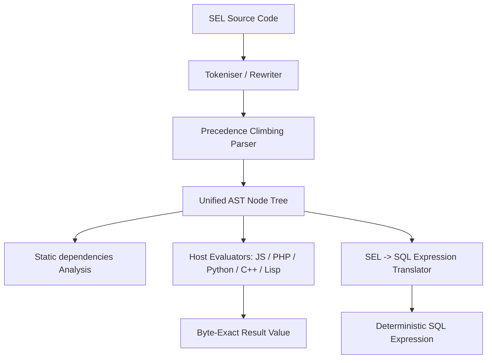
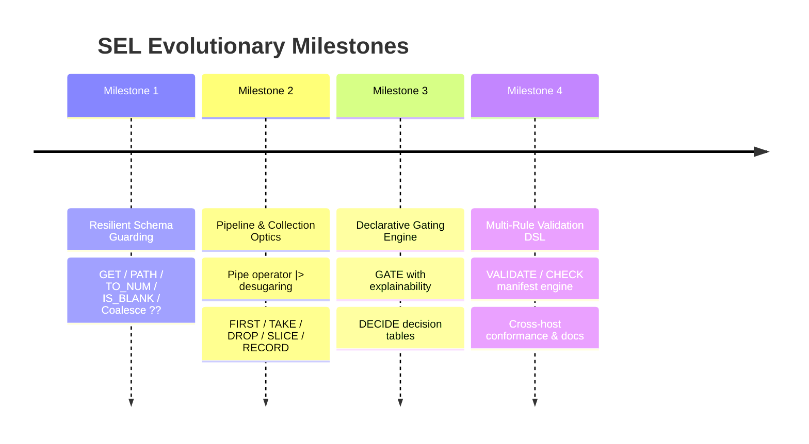

# SEL Strategic Roadmap: Scripting Data Filtering, Selection, Gating, and Validation

## Goal Description

SEL has achieved a remarkable milestone in **v0.6.1**: five disparate language runtimes (Python, PHP, JavaScript, C++23, Common Lisp) execute expressions with byte-exact parity, exact decimal arithmetic, zero dependencies, and compile to standard SQL dialects (MariaDB, MySQL, PostgreSQL, SQLite).

However, as SEL expands from atomic business rules (`IF(QTY * PRICE > LIMIT, ...)`) into **scripting data filtering, structured selection, policy gating, and multi-field validation**, several limitations in the current language design become apparent:
1. **Inside-out nested expressions** (`JOIN(MAP(FILTER(ITEMS, ...), ...), ...)`), which obscure pipeline intent and hurt readability.
2. **Single-failure termination** (`COND(...)`), which is inadequate for form validation and batch ETL where developers require a complete diagnostic report of all rule violations.
3. **Boolean gating without explainability**, forcing applications to guess or reverse-engineer *why* a policy gate failed.
4. **Brittleness with semi-structured data** (`E_NO_KEY` and `E_UNDEF_VAR`), requiring defensive boilerplate when navigating nullable or optional payload fields.
5. **No record/object projection syntax**, making data shaping inside `MAP` awkward and mutation-prone.

This document outlines **four cohesive, non-overlapping architectural directions** to develop SEL into an expressive, ergonomic, and unambiguous engine for data filtering, selection, gating, and validation, while fiercely preserving SEL's core virtues: zero dependencies, determinism, exact arithmetic, five-host parity, and static analyzability.

---

## Architecture Overview & Core Invariants

Any evolution of SEL must uphold the foundational constraints defined in `spec/SPEC.md`:



### The Invariants That Cannot Be Broken
1. **Five Hosts in Exact Agreement**: Python, PHP, JS, C++23, and Common Lisp must execute identically and produce byte-identical results, error codes, and error positions.
2. **Deterministic, Exact Semantics**: No floating point, no truthiness, explicit UTF-8 code point text semantics, byte-oriented binary.
3. **No Unbounded Loops or Hidden Recursion**: Safety guarantees (`MAX_DEPTH`, single expression model) must remain inviolate.
4. **Static Analyzability**: `dependencies()` must continue to resolve all free input variables statically without running the code.
5. **SQL Translatability**: Features must either lower cleanly to SQL expressions or have clean, unambiguous compile-time refusal semantics (`E_SQL_REFUSED`).

---

## Direction 1: The Pipeline & Collection Optics Engine
*Fluent Data Pipelining, Collection Primitives, and Record Projection*

### 1.1 The Problem Today
Filtering, transforming, and projecting collections in SEL currently requires deep inside-out function nesting:
```sel
# Current SEL: Hard to read, hard to scan, nesting hides data flow
JOIN(MAP(FILTER(ITEMS, _["QTY"] > 0 AND _["PRICE"] < 50.00), _["SKU"] & ":" & _["QTY"]), "; ")
```
The reader must locate the innermost data source (`ITEMS`), look left to `FILTER`, look right to the predicate, look left to `MAP`, look right to the projection, and look left to `JOIN`.

Furthermore, SEL has no way to construct a new structured record (dictionary) inline during a `MAP`. Users are forced to mutate variables across sequence boundaries:
```sel
# Current SEL: Projecting a subset of fields requires mutation workarounds
M = ""; M["sku"] = _["SKU"]; M["total"] = _["QTY"] * _["PRICE"]; M
```

### 1.2 Proposed Evolution

#### A. The Pipeline Operator (`|>`)
The binary operator `|>` passes the evaluated left-hand operand as the **first argument** to the right-hand function call:
```sel
TARGET |> FUNCTION(arg2, arg3)   ==>   FUNCTION(TARGET, arg2, arg3)
TARGET |> FUNCTION               ==>   FUNCTION(TARGET)
```

With `|>`, data pipelines read strictly left-to-right and top-to-bottom:
```sel
ITEMS
  |> FILTER(_["QTY"] > 0 AND _["PRICE"] < 50.00)
  |> MAP(_["SKU"] & ":" & _["QTY"])
  |> JOIN("; ")
```

#### B. AST Desugaring at Parse Time (Zero Runtime Cost)
Because `|>` can be desugared directly in `parse_term` / `parse_infix` into a standard `call` node:
- **Evaluator changes**: **0 lines** (the evaluator never sees a `|>` node).
- **Static analysis (`dependencies()`)**: Works automatically without modification.
- **SQL translation**: Works automatically without modification (translates as normal function calls).
- **Parity risk**: Zero, because the AST emitted is identical to writing nested calls.

#### C. Core Collection Primitives
Promote common filtering, selection, and slicing operations into core Lane B and Lane A functions:

| Function | Lane | Signature | Description |
|---|---|---|---|
| `FIRST` | B | `FIRST(list [, name], body [, default])` | Returns first matching element, or `default` (or `NONE`) |
| `LAST` | B | `LAST(list [, name], body [, default])` | Returns last matching element, or `default` (or `NONE`) |
| `TAKE` | A | `TAKE(list, n)` | Returns first `n` elements (1-based, preserves keys) |
| `DROP` | A | `DROP(list, n)` | Returns list skipping first `n` elements |
| `SLICE` | A | `SLICE(list, start, len)` | 1-based sub-list extraction, matching `SUBSTR` |
| `DISTINCT` | A | `DISTINCT(list)` | Deduplicates list by element scalar equality |
| `DISTINCT_BY`| B | `DISTINCT_BY(list [, name], body)` | Deduplicates by evaluated projection |
| `SORT_BY` | B | `SORT_BY(list [, name], body [, "ASC"\|"DESC"])` | Deterministic exact sort (decimal or UTF-8) |
| `INDEX_BY` | B | `INDEX_BY(list [, name], body)` | Re-keys a list of records by evaluated key |

#### D. First-Class Record Construction (`RECORD(...)` or Dict Literals)
Introduce `RECORD(k1, v1, k2, v2, ...)` to build a structured `NONE` value with children in a single expression:
```sel
ACTIVE_CUSTOMERS = CUSTOMERS
  |> FILTER(_["STATUS"] $== "ACTIVE")
  |> MAP(RECORD(
       "id",       _["ID"],
       "name",     _["FIRST_NAME"] & " " & _["LAST_NAME"],
       "balance",  _["BALANCE"]
     ));
```

### 1.3 Why It Leaves Zero Space for Ambiguity
- Left-to-right data flow matches human reading order.
- No parentheses count matching needed across multiple lines.
- Every transformation step is isolated and explicit.

---

## Direction 2: First-Class Validation DSL & Multi-Error Diagnostics
*Comprehensive Validation Manifests, Field-Level Errors, and Non-Aborting Rules*

### 2.1 The Problem Today
SEL's existing control-flow construct for validation is `COND(...)`:
```sel
COND(TRIM(EMAIL) $== "",                 "email required",
     NOT RMATCH('^[^@]+@[^@]+', EMAIL), "invalid email",
     TOTAL > LIMIT,                      "over limit",
     "ok")
```
`COND` suffers from a fundamental limitation in real-world validation: **it halts at the very first failure**.
In web forms, API input validation, and data quality batch checks, stopping at the first error creates a frustrating user experience: the user fixes the email, re-submits, only to be told the postcode is wrong, re-submits, and is told the quantity is invalid.

Developers currently must write host-level glue code (like `RuleSet` in `examples/integration-js.mjs`) to run dozens of separate SEL programs per request.

### 2.2 Proposed Evolution

#### A. The `VALIDATE` / `CHECK` Block
Introduce a declarative validation manifest block that executes all rules, collects all failures, and returns a structured diagnostic report:

```sel
REPORT = VALIDATE(
  CHECK(CUSTOMER,    TRIM(_) $!= "",             "ERR_REQUIRED", "Customer name is required"),
  CHECK(EMAIL,       RMATCH('^[^@]+@[^@]+', _),   "ERR_EMAIL",    "Valid email address is required"),
  CHECK(POSTCODE,    RMATCH('^\d{2}-\d{3}$', _), "ERR_POSTCODE", "Postcode must be format 12-345"),
  CHECK(ITEMS,       COUNT(_) > 0,               "ERR_EMPTY",    "Order must contain at least one item"),
  CHECK(ITEMS,       ALL(_, _["QTY"] > 0),       "ERR_QTY",      "All lines must have a positive quantity"),
  CHECK(TOTAL,       _ <= CREDIT_LIMIT,          "ERR_LIMIT",    "Total {TOTAL} exceeds limit {CREDIT_LIMIT}")
);
```

#### B. Syntax & Semantics
- `VALIDATE(...)` is a Lane B function.
- It evaluates each `CHECK` in declaration order without short-circuiting.
- Inside `CHECK(target, predicate, code, message)`:
  - `target` is evaluated once.
  - `_` is bound to the target value (and `_K` if applicable).
  - `predicate` must evaluate to `BOOL`.
  - If `predicate` is `FALSE`: a diagnostic record is added to the report.
  - If `predicate` is `TRUE`: nothing is added.

#### C. The Result Structure: Dual Scalar / Map
The resulting `REPORT` value provides immediate ergonomic utility:
```
REPORT:
  kind: BOOL (TRUE if 0 errors, FALSE if >= 1 error)
  children:
    "IS_VALID" -> TRUE | FALSE
    "COUNT"    -> count of errors
    "ERRORS"   -> list of error records:
      [1] -> { "FIELD": "EMAIL", "CODE": "ERR_EMAIL", "MESSAGE": "Valid email address is required" }
      [2] -> { "FIELD": "POSTCODE", "CODE": "ERR_POSTCODE", "MESSAGE": "Postcode must be format 12-345" }
```

Because `REPORT` has a boolean scalar kind:
```sel
# Works directly in boolean contexts!
IF(REPORT, "Order accepted", "Errors found: {REPORT['COUNT']}")
```
And host code can inspect `REPORT.children["ERRORS"]` directly without parsing error strings!

#### D. Conditional Checks (`CHECK_IF`)
For optional fields or gated checks:
```sel
CHECK_IF(HAS(PAYLOAD, "TAX_ID"), TAX_ID, RMATCH('^\d{10}$', _), "ERR_TAX", "Tax ID must be 10 digits")
```

### 2.3 Why It Leaves Zero Space for Ambiguity
- Single unified syntax: `Target -> Rule -> Code -> Message`.
- Eradicates fragile convention where empty string `""` meant success and non-empty string meant failure.
- Separates machine-readable error codes (`ERR_EMAIL`) from human messages (`"Valid email is required"`).

---

## Direction 3: Declarative Gating Matrices & Decision Tables
*Explainable Authorization, Risk Gating, and Tabular Business Rules*

### 3.1 The Problem Today
Gating logic (feature flags, transaction limits, authorization policies, checkout gating) usually turns into convoluted boolean expressions:
```sel
# Current SEL: What failed when this evaluates to FALSE?
ALLOWED = (STATUS $== "ACTIVE") AND (KYC_LEVEL >= 2) AND (ORDER_TOTAL <= DAILY_LIMIT) AND (NOT IS_FLAGGED);
```
When `ALLOWED` evaluates to `FALSE`, the host system has **zero insight into which condition failed**. Was the user inactive? Was the KYC level too low? Did they exceed their limit?

To log or explain the decision, authors must duplicate the predicates into branches or write messy procedural cascades.

### 3.2 Proposed Evolution

#### A. Explainable Gating with `GATE(...)`
Introduce `GATE(...)` to evaluate named policy constraints and produce an auditable result:

```sel
DECISION = GATE(
  "USER_ACTIVE"    => USER["STATUS"] $== "ACTIVE",
  "KYC_VERIFIED"   => USER["KYC_LEVEL"] >= 2,
  "FUNDS_AVAILABLE"=> ACCOUNT["BALANCE"] >= ORDER["TOTAL"],
  "RISK_ACCEPTABLE"=> RISK_SCORE < 70,
  "REGION_ALLOWED" => USER["COUNTRY"] IN ("DE", "PL", "FR", "NL")
);
```

#### B. The Gating Result Structure
`GATE` yields a `BOOL` value with rich diagnostic metadata:
- **Scalar**: `TRUE` (if all constraints passed) or `FALSE` (if any constraint failed).
- **Children**:
  - `DECISION["PASSED"]`: List of string keys that evaluated to `TRUE`.
  - `DECISION["BLOCKED_BY"]`: List of string keys that evaluated to `FALSE`.
  - `DECISION["FIRST_BLOCK"]`: The first failing gate key (for quick error dispatch).

Usage in SEL or host code:
```sel
IF(DECISION,
   "Transaction approved",
   "Transaction blocked by: " & JOIN(DECISION["BLOCKED_BY"], ", "))
```

#### C. Declarative Decision Tables (`DECIDE` / `TABLE`)
For pricing grids, shipping rules, tax bands, or multi-condition state machines, nested `COND` quickly becomes illegible. A decision table format makes rules explicit and tabular:

```sel
SHIPPING_RATE = DECIDE(
  WHEN(REGION $== "DOMESTIC"      AND WEIGHT <= 5.0,  "4.99"),
  WHEN(REGION $== "DOMESTIC"      AND WEIGHT > 5.0,   "8.99"),
  WHEN(REGION $== "EU"            AND WEIGHT <= 2.0,  "9.99"),
  WHEN(REGION $== "EU"            AND WEIGHT > 2.0,  "14.99"),
  WHEN(REGION $== "INTERNATIONAL",                   "24.99"),
  DEFAULT(                                           "49.99")
);
```

Or a matrix-style lookup table:
```sel
DISCOUNT = LOOKUP_TABLE(
  # (CUSTOMER_TIER, CART_SIZE >=) => DISCOUNT_RATE
  ROW("PLATINUM", 500.00,  "0.25"),
  ROW("PLATINUM",   0.00,  "0.15"),
  ROW("GOLD",     500.00,  "0.15"),
  ROW("GOLD",       0.00,  "0.10"),
  ROW("SILVER",   100.00,  "0.05"),
  DEFAULT("0.00")
);
```

### 3.3 Why It Leaves Zero Space for Ambiguity
- Every policy constraint has an explicit, named identifier.
- Full auditability: no black-box boolean dropouts.
- Decision tables guarantee that priority and matching order are visually aligned.

---

## Direction 4: Resilient Schema Guarding & Null-Safety
*Defensive Data Navigation, Optional Chaining, and Safe Coercions*

### 4.1 The Problem Today
SEL is uncompromisingly strict:
- Missing map key: `ORDER["SHIPPING"]["ZIP"]` throws `E_NO_KEY`.
- Undefined variable: `PROMO_CODE` throws `E_UNDEF_VAR`.
- Non-numeric string: `" 10"` + 1 throws `E_NOT_NUM`.
- Empty/scalar mismatch: `E_NO_SCALAR`.

While strictness is crucial in calculation engines to prevent silent bugs, in **data filtering, selection, and gating on untrusted external JSON/webhooks**, payloads are frequently sparse, nullable, or optional.
Today, defensive checking creates unreadable code:
```sel
# Current SEL: 4 lines of defensive boilerplate for one optional field
ZIP = IF(HAS(ORDER, "SHIPPING") AND HAS(ORDER["SHIPPING"], "ZIP"),
         ORDER["SHIPPING"]["ZIP"],
         "UNKNOWN");
```

### 4.2 Proposed Evolution

#### A. The Null-Coalescing Operator (`??`)
A binary operator `EXPR ?? FALLBACK` that evaluates `EXPR`; if `EXPR` is `NONE` or encounters a missing key/variable, it yields `FALLBACK`:
```sel
ZIP = ORDER["SHIPPING"]["ZIP"] ?? "UNKNOWN";
COUPON = PAYLOAD["COUPON"] ?? "NONE";
LIMIT = USER["CUSTOM_LIMIT"] ?? 5000.00;
```
Precedence: Binds between `OR` and comparison, or tighter than comparison.

#### B. Safe Path Traversal (`PATH` / `GET`)
Add built-in functions for deep traversal of nested maps without exception hazards:
- `GET(target, key [, default])`:
  Retrieves key from map. If missing or `target` is not a map, returns `default` (or `NONE`).
  ```sel
  TIER = GET(USER, "TIER", "BRONZE")
  ```
- `PATH(target, path_string [, default])`:
  Navigates dot-delimited hierarchy safely:
  ```sel
  POSTCODE = PATH(PAYLOAD, "order.shipping.address.postcode", "-")
  ```

#### C. Resilient Coercion Primitives
Safe casting functions that provide fallback values instead of throwing `E_NOT_NUM` or `E_NOT_TEXT`:

| Function | Signature | Behavior |
|---|---|---|
| `TO_NUM` | `TO_NUM(x, fallback)` | Returns exact decimal if parseable, else `fallback` |
| `IS_BLANK` | `IS_BLANK(x)` | `TRUE` if `x` is `NONE`, `""`, or whitespace only |
| `IS_PRESENT` | `IS_PRESENT(x)` | Inverse of `IS_BLANK` |
| `COALESCE` | `COALESCE(v1, v2, ..., fallback)` | Returns first non-blank value |

### 4.3 Why It Leaves Zero Space for Ambiguity
- Eliminates messy `IF(HAS(...) AND HAS(...), ...)` cascades.
- Explicit fallback semantics replace error-trapping boilerplate.
- The distinction between mandatory fields (throw `E_NO_KEY`) and optional fields (use `??` or `PATH`) is instantly visible in the source code.

---

## Cross-Cutting Comparison Matrix

| Criteria | 1. Pipeline & Collection Optics | 2. Validation Manifest DSL | 3. Declarative Gating & Decisions | 4. Resilient Schema Guarding |
|---|---|---|---|---|
| **Primary Use Case** | Data filtering, selection & shaping | Form, API & batch data validation | Authorization, policies & feature gating | Ingesting messy / optional payloads |
| **Language Impact** | Grammar (`|>`), Lane B/A built-ins | Lane B built-in (`VALIDATE`/`CHECK`) | Lane B built-in (`GATE`/`DECIDE`) | Grammar (`??`), Lane A built-ins |
| **Readability Gain** | Very High (left-to-right flow) | Maximum (standardized check format) | Very High (explicit naming & tables) | High (removes defensive noise) |
| **Ambiguity Reduction** | Eliminates inside-out nesting | Eliminates single-error halting | Eliminates unexplained boolean drops | Eliminates nested `HAS()` trees |
| **Implementation Scope** | Parser desugar + ~6 functions | 1-2 Lane B built-ins | 2 Lane B built-ins | 1 binary op + ~4 functions |
| **Cross-Host Risk** | Low (AST desugaring) | Low (pure Lane B evaluator logic) | Low (pure Lane B evaluator logic) | Medium (error suppression boundary) |
| **SQL Translatability** | High (desugars to functions/SQL) | N/A (Validation DSL is host-side) | Medium (CASE WHEN lowering) | High (COALESCE mapping) |

---

## User Review Required

> [!IMPORTANT]
> **Key Architectural Choices for Discussion:**
> 1. **Direction Priority**: Which of these 4 directions best aligns with your primary roadmap? (They can also be delivered in stages: e.g., Stage 1: Pipeline Optics & Schema Guarding; Stage 2: Validation & Gating DSL).
> 2. **Pipeline Operator Syntax**: Is `|>` the preferred syntax for data pipelining, or is a function-only chaining approach preferred? (Note that `|>` is pure parse-time desugaring and requires zero runtime overhead).
> 3. **Validation Result Format**: For Direction 2 (`VALIDATE`), should the result be a dual-personality `Value` (BOOL scalar + error children map) or an explicit tuple/record?
> 4. **Record Literal Syntax**: For structured projection in Direction 1, do you prefer a dedicated built-in `RECORD("k1", v1, "k2", v2)` (which requires zero grammar changes) or bracket/brace syntax `[ k1: v1 ]`?

---

## Open Questions

> [!NOTE]
> - **SQL Translation Scope**: Validation manifests (`VALIDATE`) and explainable gating (`GATE`) are primarily evaluated in-memory on application servers. Should their SQL translators refuse them with `E_SQL_REFUSED`, or should `GATE` compile into boolean SQL expressions?
> - **Error Suppression Scope of `??`**: Does `A["B"]["C"] ?? "default"` only catch `E_NO_KEY` and `E_UNDEF_VAR`, or also type mismatches (`E_NOT_TEXT`)? (Recommendation: catch only missing keys/variables and NONE, preserving strict type checking).

---

## Proposed Execution Plan & Milestones

If approved, the work would proceed in four phased, independently verifiable milestones:



### Phase 1: Resilient Schema Guarding (Foundation)
- Add Lane A built-ins: `GET`, `PATH`, `TO_NUM`, `IS_BLANK`, `COALESCE`.
- Add `??` null-coalescing operator in `spec/grammar.md` and parser tables across all 5 hosts.
- Conformance suite: `conformance/13-coalesce.selt`, `conformance/14-paths.selt`.
- Verification: Differential fuzzing and SQL mapping (`COALESCE`).

### Phase 2: Pipeline & Collection Optics (Filtering & Selection)
- Add `|>` operator to lexer and precedence climbing parser (desugared to `call` nodes at parse time).
- Add collection functions: `FIRST`, `LAST`, `TAKE`, `DROP`, `SLICE`, `DISTINCT`, `SORT_BY`, `RECORD`.
- Conformance suite: `conformance/15-pipeline.selt`, `conformance/16-collections.selt`.
- Verification: Full 5-host parity test (`tools/check.sh`).

### Phase 3: Declarative Gating (Policy & Flags)
- Implement `GATE` and `DECIDE` Lane B built-ins.
- Implement structured explainability map (`PASSED`, `BLOCKED_BY`).
- Conformance cases and worked documentation examples.

### Phase 4: Multi-Rule Validation DSL (Validation Manifests)
- Implement `VALIDATE`, `CHECK`, and `CHECK_IF` Lane B built-ins.
- Update `examples/integration-*` to show full form validation using the new DSL.
- Final documentation updates to `docs/LANGUAGE.md`, `spec/SPEC.md`, and `README.md`.

---

## Verification Plan

### Automated Tests
1. **Conformance Suite**:
   Every new operator and function will have exhaustive normative `.selt` files testing:
   - Valid evaluation and edge cases (empty lists, scalar context, unicode keys).
   - Expected errors, stable codes, and exact character positions.
   Run across all hosts:
   ```bash
   tools/check.sh
   ```
2. **Differential Parity Fuzzer**:
   Feed random pipeline expressions and validation manifests through `tools/fuzz.py` across all 5 implementations to ensure byte-exact match on output and error codes.
3. **SQL Translation & Dialect Tests**:
   For pipeline and coalesce operators that lower to SQL:
   ```bash
   python3 tools/check-sql-cases.py
   python3 -m tests.sql.test_mariadb
   ```
4. **Static Analysisparities**:
   Ensure `dependencies()` correctly identifies all free variables in pipelines, `VALIDATE`, and `GATE` blocks without falsely reporting aggregate binders or gate keys.
