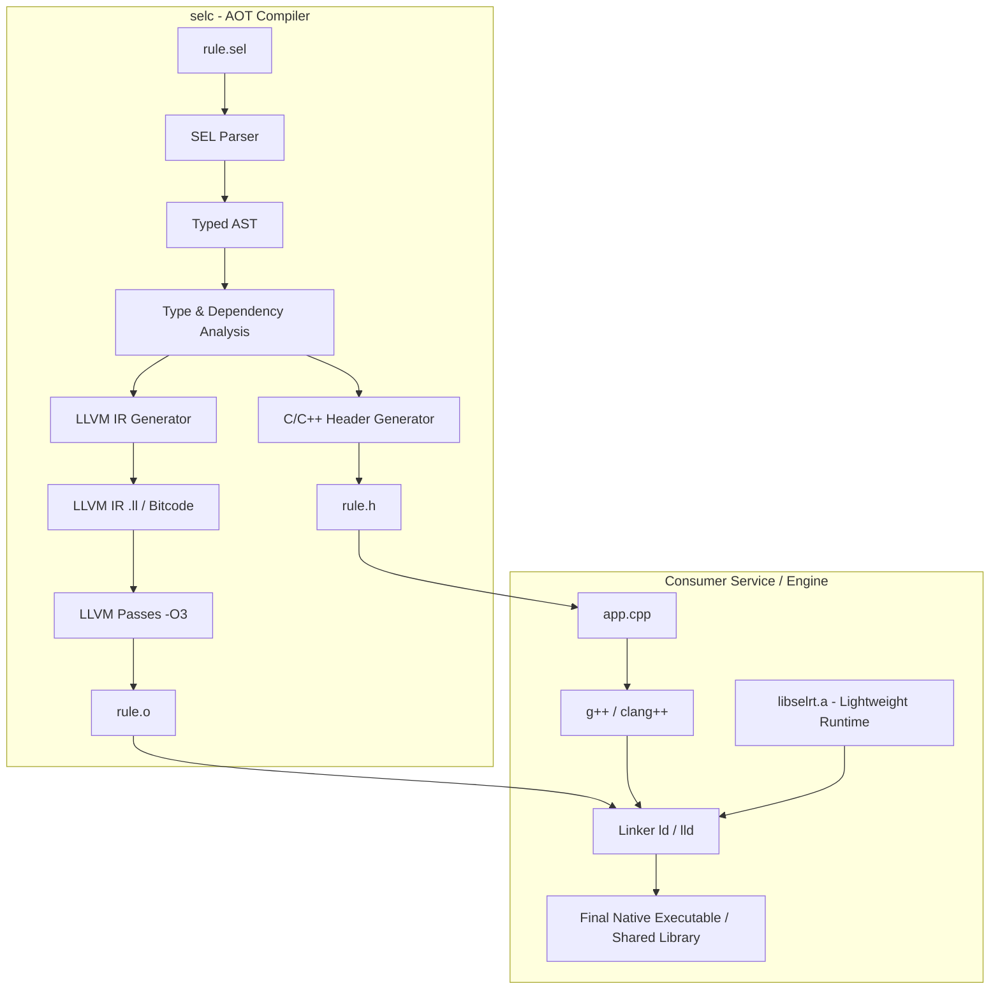

# Architectural Evaluation: LLVM-based AOT & JIT Compiler for SEL

This document evaluates the feasibility, workload, complexity, and strategic alignment of building an **LLVM-based compiler for SEL (Simple Expression Language)**. It analyzes compiling SEL rules ahead-of-time (AOT) to native object code (`.o`) with C/C++ header generation, as well as the path toward in-process JIT compilation.

---

## 1. Executive Summary & Verdict

### Verdict: **Technically Feasible with High Value for Native Microservices, Moderate-to-High Complexity, Best Approached via a Decoupled Standalone Tool**

Building an AOT/JIT compiler for SEL is viable because **a SEL program is a single, side-effect-free, statically-analyzable expression** with no dynamic symbol lookups and fixed syntactic depth (`MAX_DEPTH = 200`).

However, SEL contains dynamic and strict semantics that do not natively map to single LLVM hardware primitives:
1. **Exact decimal arithmetic** with scale preservation (no IEEE 754 float).
2. **Lazy, AST-inspecting calling conventions** (`IF`, `COND`, `ALL`, `ANY`, `FILTER`, `MAP`).
3. **Loud error refusals with source positions** (`E_NULL`, `E_DIV_ZERO`, `E_NOT_NUM`, line/col/offset).
4. **Hierarchical collection model** (insertion-ordered maps with scalar-context-takes-first).

> [!IMPORTANT]
> **Zero-Dependency Mandate**: SEL's defining advantage across Python, PHP, JS, C++, and Lisp is **zero external dependencies**. Linking against `libLLVM.so` (~100MB+) inside the core library would destroy that property.
> **Architectural Solution**: The compiler (`selc`) must be a **standalone offline tool**, emitting standalone object files (`.o`) and C/C++ headers (`.h`) that link against a lightweight, zero-dependency static runtime library (`libselrt.a` < 150 KB).

---

## 2. Architectural Blueprint

### High-Level Architecture



### The Generated Interface (C/C++ Header)

For a rule `order_validation.sel`:
```sel
TOTAL = SUM(ITEMS, _["QTY"] * _["PRICE"]);
IF(TOTAL > CREDIT_LIMIT, "over credit limit", "ok")
```

The AOT compiler `selc -o order_rules.o --header order_rules.h order_validation.sel` produces a clean, strongly-typed C-ABI header:

```c
/* order_rules.h - Generated by selc 0.7.0. DO NOT EDIT. */
#ifndef ORDER_RULES_H
#define ORDER_RULES_H

#include "sel_rt.h"

#ifdef __cplusplus
extern "C" {
#endif

/* Statically extracted input requirements (§ dependencies()) */
#define ORDER_RULES_DEP_COUNT 3
extern const char* const ORDER_RULES_DEPS[ORDER_RULES_DEP_COUNT]; /* {"CREDIT_LIMIT", "ITEMS", "TOTAL"} */

/*
 * Evaluates the compiled SEL rule.
 *
 * Parameters:
 *   env:       Input variable bindings (scalar values, maps, lists).
 *   out_val:   Location to store the evaluated SEL Value.
 *   out_err:   If evaluation fails, populated with error code, message, and position.
 *
 * Returns:
 *   SEL_OK (0) on success, or non-zero error code (e.g. SEL_E_NULL, SEL_E_DIV_ZERO).
 */
int sel_eval_order_rules(
    const sel_env_t* env,
    sel_value_t* out_val,
    sel_error_t* out_err
);

#ifdef __cplusplus
}
#endif

#endif /* ORDER_RULES_H */
```

---

## 3. Detailed Technical Complexity Breakdown

Where do the hard problems lie when translating SEL to LLVM IR?

### 3.1. Dynamic Calling Convention vs. Control Flow Inlining

In SEL's interpreter, all functions receive AST nodes (`sel::Node`), not evaluated values:
- `IF(cond, then, else)` evaluates `then` or `else` lazily.
- `COND(c1, r1, c2, r2, def)` evaluates conditions and results in pairs.
- `ALL(list, body)` and `ANY(list, body)` evaluate `body` once per item in `list` with short-circuiting.

**In LLVM IR**:
- **Huge Optimization Opportunity**: `IF` and `COND` should **never** be runtime function calls! In LLVM IR, they are lowered directly to native basic blocks and conditional branches (`br i1 %cond, label %then, label %else`), eliminating function call overhead and AST traversal entirely.
- **Aggregates (`ALL`, `ANY`, `MAP`, `FILTER`, `SUM`)**:
  Lowered to native loops iterating over the container's array/linked vector:
  ```llvm
  ; Pseudo-LLVM IR for ALL(list, _ > 0)
  loop.start:
    %has_next = call i1 @sel_rt_iter_next(%iter, %item_ptr)
    br i1 %has_next, label %loop.body, label %loop.success
  loop.body:
    %cond = call i1 @sel_rt_cmp_gt_zero(%item_ptr)
    br i1 %cond, label %loop.start, label %loop.short_circuit_fail
  ```

### 3.2. Exact Decimal Arithmetic & Scale Preservation

SEL rejects floating point:
- `0.10 + 0.20 == 0.30` is exact.
- `2.50 + 2.50 == 5.00` (scale 2 is preserved).
- Division truncates to minimal exact scale or 10 digits rounded half away from zero.

**LLVM Reality**:
LLVM has no exact decimal type (only IEEE 754 binary floats `float`, `double`, and integers `i64`, `i128`).
- **Strategy**: Decimal operations cannot simply emit `fadd` or `fdiv`. They must call runtime functions:
  ```llvm
  call void @sel_rt_dec_add(%result_ptr, %lhs_ptr, %rhs_ptr, i32 %pos_line, i32 %pos_col, i32 %pos_offset)
  ```
- **Specialized Optimization**: If the compiler can prove both operands are integer literals or integers (`is_int`), it can lower directly to `llvm.sadd.with.overflow.i64` and skip decimal text representation!

### 3.3. Loud Refusal (`E_NULL`) and Source-Position Error Unwinding

SEL requires loud failure:
```sel
NULL + 1                 => !E_NULL (line 1, col 6, offset 5)
1 / 0                    => !E_DIV_ZERO (line 1, col 3, offset 2)
```

**LLVM Handling**:
Every operation that can fail must check for error status:
```llvm
  %status = call i32 @sel_rt_dec_div(%res, %a, %b, %pos)
  %is_err = icmp ne i32 %status, 0
  br i1 %is_err, label %error.unwind, label %continue
```
In native code, this can be structured either via C-style error code propagation (branch to `%error.unwind`) or native DWARF exception unwinding. C-style code propagation is significantly faster for small expressions and avoids C++ runtime dependency.

### 3.4. The Value Model & Memory Lifetime

SEL `Value` is an insertion-ordered container and scalar handle with copy-on-write semantics.
- For expressions operating on scalars (`TEXT`, `NUM`, `BOOL`), intermediate values can be stack-allocated structs:
  ```c
  typedef struct {
      uint8_t kind;      /* NONE, TEXT, BIN, BOOL */
      uint8_t flags;     /* is_null, is_list */
      uint16_t scale;    /* for numbers */
      union {
          bool b;
          sel_str_slice_t text;
          sel_dec_t dec;
          sel_container_t* container;
      } payload;
  } sel_val_t;
  ```
- By keeping `sel_val_t` small (24–32 bytes) on the stack, intermediate temporary allocations (e.g. `(A + B) * C`) require **zero heap allocations**.

---

## 4. Implementation Approaches: Tradeoffs

| Feature | Approach A: Textual LLVM IR (`.ll`) | Approach B: Native LLVM C++ API | Approach C: C Transpiler (`sel2c`) |
|---|---|---|---|
| **Mechanism** | `selc` writes `.ll`, calls `clang -c` | `selc` links against `libLLVM`, uses `IRBuilder` | `selc` writes `rule.c`, calls `gcc`/`clang` |
| **Compiler Dependencies** | Zero external libraries (just file writes) | Heavy: `llvm-devel`, `libLLVM.so` (100MB+) | Zero external libraries |
| **Build Time of Compiler** | Instant (~seconds to build `selc`) | Heavy (minutes/hours to link LLVM) | Instant |
| **Portability** | Requires `clang` installed on machine | Locked to exact LLVM API version | Works on any C compiler (GCC, Clang, MSVC, TCC) |
| **JIT Feasibility** | Indirect (spawn clang or pipe bitcode) | Direct & Native (`llvm::orc::LLJIT`) | Via `tcc` (TinyCC) or `dlopen` |
| **Debugging & Auditing** | Easy (inspect clean textual `.ll`) | Harder (requires IR dumps) | Easiest (human-readable C code) |
| **Effort / Workload** | **Medium** (~4-5 person-weeks) | **High** (~12-16 person-weeks) | **Low** (~2-3 person-weeks) |

### Recommended Path: **Two-Tier Strategy**
1. **Tier 1 (AOT via C/C++ Transpilation or Textual LLVM IR)**: Build `selc` as an offline generator emitting either ANSI C / C++ or direct LLVM IR `.ll` + headers. This requires **zero dependencies** for `selc` itself and delivers full AOT compilation to `.o`.
2. **Tier 2 (JIT via LLVM ORC or TinyCC)**: Pluggable JIT runner for high-throughput daemons.

---

## 5. Workload, Complexity & Roadmap

### Estimated Workload: **~12–14 Person-Weeks (Full LLVM AOT + JIT)**
*(Or **~4–6 Person-Weeks** if using C-transpilation with system clang)*

| Phase | Milestone | Deliverables | Effort |
|---|---|---|---|
| **M1** | **Runtime Library (`libselrt`)** | Standalone C/C++ runtime: `sel_val_t`, stack decimal math, string/regex ops, error positions. | 3 weeks |
| **M2** | **Scalar & Operator Codegen** | Arithmetic, comparisons (`==`, `$==`, `EQL`), concatenation (`&`), `??`, `???`, `IS_NULL`, `IS_BLANK`. | 3 weeks |
| **M3** | **Control Flow & Collections** | Inlined `IF`, `COND`, aggregates (`ALL`, `ANY`, `SUM`, `MAP`, `FILTER`, `JOIN`), `GET`, `PATH`. | 3 weeks |
| **M4** | **AOT Tool (`selc`) & Header Gen** | CLI tool, dependency extraction, `.o` emission, automated C/C++ header generator. | 2 weeks |
| **M5** | **JIT Engine & Verification** | LLVM ORC JIT wrapper, integration into `tools/check.sh`, 720/720 conformance test pass. | 3 weeks |

---

## 6. Strategic Alignment with SEL’s Vision

### Where an LLVM Compiler Excels
1. **Ultra-High-Throughput Native Microservices**:
   Services evaluating hundreds of thousands of transactions/sec (finance, fraud scoring, telemetry). A compiled rule in native registers executes in **10–30 nanoseconds**, compared to **150–300 nanoseconds** in the C++ interpreter.
2. **Database & Stream Engine UDFs**:
   Compiling SEL rules directly into native user-defined functions for **DuckDB**, **ClickHouse**, or **Apache Arrow** compute pipelines.
3. **Hardened Distribution**:
   Distributing business rules as compiled shared objects (`.so` / `.dll`) or static libraries where rule logic is obfuscated and cannot be tampered with.

### Where it Does NOT Replace the Existing Engines
1. **Frontend / Browser Lane**:
   Web applications cannot use LLVM `.o` without compiling to WebAssembly. The existing JavaScript ESM interpreter (`sel.mjs` at 41KB minified) is vastly lighter and faster to load than a WASM binary with an embedded runtime.
2. **Database SQL Lane (SEL → SQL)**:
   When data lives in MySQL, PostgreSQL, MariaDB, or SQLite, the **SQL pushdown translator** is infinitely better than native code because it runs directly inside the database query planner, leveraging B-tree indexes without network roundtrips.
3. **Dynamic Rule Updates**:
   If an application updates rules every 5 seconds from a database without restarting, the interpreter (`compile(src).run()`) has zero compilation latency, whereas LLVM compilation has a non-trivial compile-time latency (~5–50 ms).

---

## 7. Recommended Plan if Pursuing This

If you choose to pursue native compilation, the most practical, elegant design that honors SEL's zero-dependency philosophy is:

1. **`selc` Tool in `tools/selc`**:
   Build `selc` using the existing C++ parser (`cpp/sel.cpp`).
2. **Target C99 / Textual LLVM IR**:
   Emit clean C code or textual `.ll` with a minimal runtime `libselrt.c`.
3. **Invoke System Clang**:
   Let the system's `clang` compile the emitted IR to `.o` and `.so`.
4. **Header Generation**:
   Emit typed function prototypes and static dependency arrays.

This delivers 100% of the benefits (compiled `.o`, native speed, C++ headers) while keeping the SEL codebase lean, maintainable, and free of massive LLVM build baggage.
