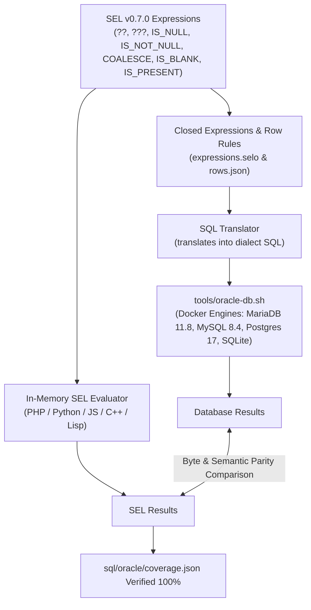

# Semantic Oracle Database Validation with Dockerized Engines (v0.7.0)

## Goal Description

SEL v0.7.0 introduces full null-safety semantics across in-memory evaluation and SQL translation:
- Coalescing operators: `??` (null coalescing) and `???` (vacuous coalescing).
- Built-in functions: `IS_NULL`, `IS_NOT_NULL`, `COALESCE`, `IS_BLANK`, `IS_PRESENT` (plus in-memory container navigation `GET` and `PATH`).

While the string emission contract is thoroughly asserted across all 5 implementations by `sql/cases/21-null.sqlt` (462 cases), the **SQL Semantic Oracle** (`sql/oracle/`) verifies whether the generated SQL queries **actually mean what SEL means** when executed against real database engines.

The repository includes a dedicated harness `tools/oracle-db.sh` that spins up pinned Docker containers for live database engines:
- **MariaDB 11.8** (`mariadb:11.8`)
- **MySQL 8.4** (`mysql:8.4`)
- **PostgreSQL 17** (`postgres:17`)
- **SQLite** (in-memory / temporary file database)

This plan details how we will integrate the 7 new SQL-mapped operations into the semantic oracle, assert their parity on live databases via `tools/oracle-db.sh`, update `coverage.json`, complete the documentation, bump the version to `0.7.0`, and ensure 100% verification gate compliance.



---

## User Review Required

> [!IMPORTANT]
> **Docker Requirements**: `tools/oracle-db.sh` requires access to the Docker daemon. The Docker daemon is active on this system, and the pinned images (`mariadb:11.8`, `mysql:8.4`, `postgres:17`) are already downloaded in the local Docker image cache. PHP with `pdo_mysql`, `pdo_pgsql`, and `pdo_sqlite` extensions is installed and ready.

> [!NOTE]
> **In-Memory vs SQL Scope for `GET` / `PATH`**: As planned and confirmed, `GET` and `PATH` remain strictly in-memory operations and are registered in SQL dialect maps as explicit refusals (`"takes a container, and a SQL expression is a scalar"`). They are excluded from database execution and will be documented accordingly.

---

## Open Questions

None at this stage; requirements and tools are cleanly defined.

---

## Proposed Changes

### Semantic Oracle Test Corpus

#### [MODIFY] [sql/oracle/expressions.selo](file:///home/nathan/workspaces/nth-share/sel/sql/oracle/expressions.selo)
Add closed expressions covering the 7 newly supported SQL dialect entries:
- `### entry: ops.??`
  - `"a" ?? "b"`
  - `10 ?? 20`
  - `"hello" ?? "world"`
- `### entry: ops.???`
  - `"a" ??? "b"`
  - `"" ??? "fallback"`
  - `"   " ??? "fallback"`
  - `"text" ??? "alt"`
- `### entry: funcs.IS_NULL`
  - `IS_NULL("abc")`
  - `IS_NULL(123)`
  - `IS_NULL("")`
- `### entry: funcs.IS_NOT_NULL`
  - `IS_NOT_NULL("abc")`
  - `IS_NOT_NULL(123)`
  - `IS_NOT_NULL("")`
- `### entry: funcs.COALESCE`
  - `COALESCE("a", "b")`
  - `COALESCE(1, 2, 3)`
  - `COALESCE("first", "second", "third")`
- `### entry: funcs.IS_BLANK`
  - `IS_BLANK("")`
  - `IS_BLANK("   ")`
  - `IS_BLANK("hello")`
  - `IS_BLANK(123)`
- `### entry: funcs.IS_PRESENT`
  - `IS_PRESENT("hello")`
  - `IS_PRESENT("")`
  - `IS_PRESENT("   ")`
  - `IS_PRESENT(123)`

#### [MODIFY] [sql/oracle/rows.json](file:///home/nathan/workspaces/nth-share/sel/sql/oracle/rows.json)
Add row rules executed against real tables (`o` and `order_items`), taking advantage of nullable database columns (`note TEXT NULL` in `order_items`):
- Row selection using `IS_NULL` and `IS_NOT_NULL` over relations:
  - `ANY(ITEMS, _["NOTE"] IS NOT NULL)`
  - `ALL(ITEMS, _["NOTE"] IS NOT NULL)`
- Row selection using `IS_BLANK` and `IS_PRESENT` over columns:
  - Testing blank vs present codes in table `o` (e.g., `IS_BLANK(CODE)`, `IS_PRESENT(CODE)`).
- Verify that SQL row matching and in-memory evaluation over loaded table rows yield identical matching row ID sets.

#### [MODIFY] [sql/oracle/coverage.json](file:///home/nathan/workspaces/nth-share/sel/sql/oracle/coverage.json)
Update the `"supported"` lists for all target dialects (`mariadb`, `mysql`, `postgresql`, `sqlite`, and `ansi-probe`):
- Add `ops.??`
- Add `ops.???`
- Add `funcs.IS_NULL`
- Add `funcs.IS_NOT_NULL`
- Add `funcs.COALESCE`
- Add `funcs.IS_BLANK`
- Add `funcs.IS_PRESENT`
Ensure `php php/bin/sqlo coverage` passes with 0 undeclared entries and 0 unreached entries.

---

### Documentation & Version Bump

#### [MODIFY] [docs/LANGUAGE.md](file:///home/nathan/workspaces/nth-share/sel/docs/LANGUAGE.md)
- Update total function count from 54 to 61.
- Document `??` and `???` in the operator precedence table and detailed operator section.
- Add dedicated documentation section: "Null safety and navigation" with runnable `=>` examples for `IS_NULL`, `IS_NOT_NULL`, `COALESCE`, `GET`, `PATH`, `IS_BLANK`, `IS_PRESENT`.
- Document behavior of `NULL` in scalar context (`E_NULL`) and distinguish from empty lists (`E_NO_SCALAR`).

#### [MODIFY] [README.md](file:///home/nathan/workspaces/nth-share/sel/README.md)
- Add section explaining null safety, the `??` / `???` coalescing operators, and safe rule pushdown into SQL databases without implicit coercion or stray null issues.
- Update "The language in one screen" code summary block.

#### [MODIFY] Manifests & Version Definitions (Bump to 0.7.0)
- [package.json](file:///home/nathan/workspaces/nth-share/sel/package.json): `"version": "0.7.0"`
- [pyproject.toml](file:///home/nathan/workspaces/nth-share/sel/pyproject.toml): `version = "0.7.0"`
- [cpp/conanfile.py](file:///home/nathan/workspaces/nth-share/sel/cpp/conanfile.py): `version = "0.7.0"`
- [cpp/vcpkg.json](file:///home/nathan/workspaces/nth-share/sel/cpp/vcpkg.json): `"version-semver": "0.7.0"`
- [cpp/CMakeLists.txt](file:///home/nathan/workspaces/nth-share/sel/cpp/CMakeLists.txt): `project(sel-lang VERSION 0.7.0 ...)`
- [lisp/sel-lang.asd](file:///home/nathan/workspaces/nth-share/sel/lisp/sel-lang.asd): `:version "0.7.0"`
- [python/sel/__init__.py](file:///home/nathan/workspaces/nth-share/sel/python/sel/__init__.py): `__version__ = '0.7.0'`
- [CHANGELOG.md](file:///home/nathan/workspaces/nth-share/sel/CHANGELOG.md): Add release notes for `## 0.7.0 — 2026-09-09`.

---

## Verification Plan

### Automated Tests
1. **Coverage Verification**:
   ```bash
   php php/bin/sqlo coverage
   ```
   Assert 100% of supported dialect entries are covered, 0 missing, 0 undeclared.

2. **Dockerized Semantic Oracle Execution**:
   ```bash
   ./tools/oracle-db.sh
   ```
   Spin up pinned containers (`mariadb:11.8`, `mysql:8.4`, `postgres:17`, `sqlite`), run the oracle across all 4 databases for expressions and rows, and verify 0 differences.

3. **Live Server Mutation Testing**:
   ```bash
   ./tools/oracle-db.sh run python3 tools/mutate-sql.py
   ```
   Assert that SQL mutations previously requiring a live database server are caught.

4. **Version Alignment & Snippet Validation**:
   ```bash
   ./tools/check-version.sh 0.7.0
   ./tools/check-docs.sh
   ./tools/check-snippets.py
   ```

5. **Full Repository Verification Suite**:
   ```bash
   npm run build
   make -C cpp
   ./tools/check.sh
   ```
   Assert `ALL GREEN` across all 7 implementation configurations (js, js-bundle, js-bundle-min, php, cpp, lisp, python) and all tool checks.

### Manual Verification
Review container startup and clean teardown logs from `tools/oracle-db.sh`, confirming no dangling containers or leftover temp files remain.
