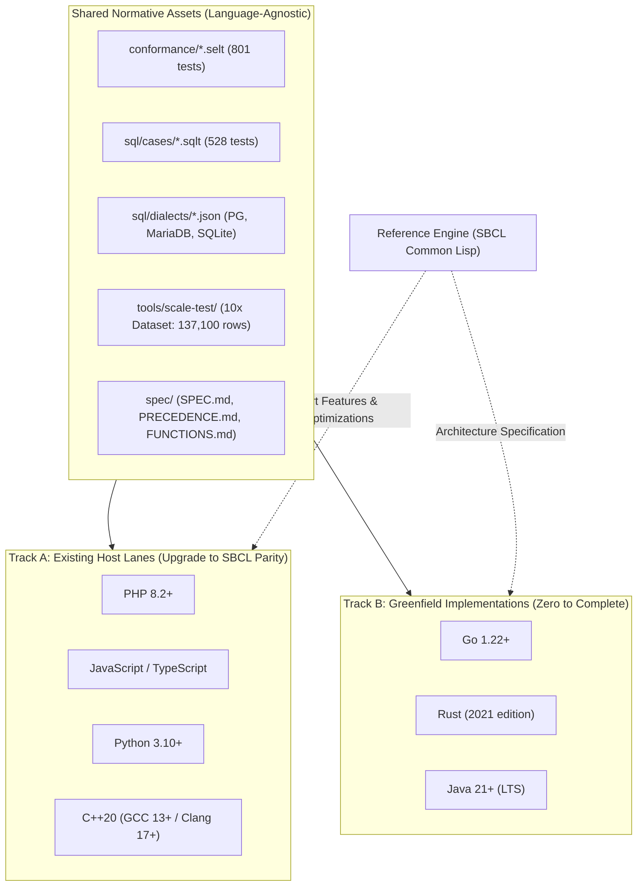
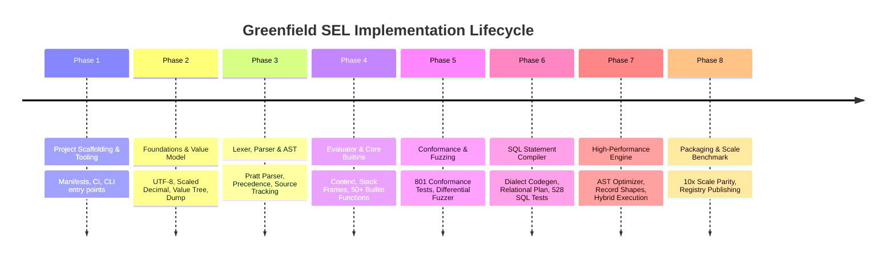

# SEL Porting Worklist & Implementation Checklist

This document provides the definitive, actionable engineering worklist and verification checklist for two core scenarios:
1. **Track A (Porting Upgrades)**: Porting the state-of-the-art features and optimizations from Common Lisp (SBCL) into the existing host lanes (**PHP**, **JavaScript/Node.js**, **Python**, and **C++20**).
2. **Track B (Greenfield Implementation)**: Designing and bootstrapping complete, production-grade SEL implementations from zero for new languages (**Go**, **Rust**, and **Java 21+**).

---

## 1. Architectural Overview & Context



---

# PART I: TRACK A — Porting SBCL State-of-the-Art to PHP, JS, Python, and C++

## 1. Gap Analysis Matrix (Current State vs SBCL)

| Capability / Module | SBCL (Reference) | Python | JS / Node.js | PHP | C++20 | Porting Scope |
| :--- | :--- | :--- | :--- | :--- | :--- | :--- |
| **Core Value & Builtins** | Full (801 / 801) | Full (788+) | Full (788+) | Full (788+) | Full (788+) | Standard baseline in sync |
| **Basic Relational Ops** (`RECORD`, `LIST`, `TAKE`, `DROP`, `SELECT_COLS`, `DISTINCT`, `SORT`, `GROUP_BY`) | Complete | Complete | Complete | Complete | Complete | Shipped across all 5 hosts |
| **Relational Join Operators** (`LINK`, `LINK_LEFT`) | **Complete (Optimized)** | Missing | Missing | Missing | Missing | **Port Phase A1** |
| **Relational Utilities** (`TOP`, `TOP_DESC`, `TOP_BY`, `DEDUPE`, `BUCKET`, `LAZY_RECORD`) | **Complete** | Missing | Missing | Missing | Missing | **Port Phase A1** |
| **SQL Statement Compiler** (Single-table SELECT, WHERE, GROUP BY, HAVING, ORDER BY, LIMIT) | Complete | Complete | Complete | Complete | Complete | Shipped across all 5 hosts |
| **SQL Multi-Table Joins** (`LINK`/`LINK_LEFT` $\to$ INNER/LEFT JOIN, aliases, derived tables) | **Complete** | Missing | Missing | Missing | Missing | **Port Phase A2** |
| **Hybrid Execution Planner** (SQL pushdown prefix + in-memory continuation engine) | **Complete** | Missing | Missing | Missing | Missing | **Port Phase A3** |
| **Group 1: Logical AST Optimizer** (Filter fusion, predicate pushdown across joins & maps, sort pruning) | **Complete** | Missing | Missing | Missing | Missing | **Port Phase A4** |
| **Group 2: Physical Record Shapes** (Hidden classes, flat row arrays, $O(1)$ slot access) | **Complete** | Missing | Missing | Missing | Missing | **Port Phase A5** |
| **Group 2: Scaled 64-Bit Fixed-Point Decimals** (Native int64 math with scale, bignum fallback) | **Complete** | Decimal class | Number/BigInt | BCMath/Float | int64/double | **Port Phase A5** |
| **Group 2: Pre-Compiled Join Projectors & Structural Dedupe** | **Complete** | Missing | Missing | Missing | Missing | **Port Phase A5** |
| **10x Scale Benchmark & Parity Validation** (137,100 rows vs Postgres 17 & MariaDB 11.8) | **Complete (100% Match)** | Harness missing | Harness missing | Harness missing | Harness missing | **Port Phase A6** |

---

## 2. Track A Step-by-Step Porting Worklist

### Phase A1: Extended Relational Built-in Operators
Port the newly stabilized relational operators from [`lisp/src/builtins/structure.lisp`](file:///home/nathan/workspaces/nth-share/sel/lisp/src/builtins/structure.lisp) and [`lisp/src/builtins/aggregate.lisp`](file:///home/nathan/workspaces/nth-share/sel/lisp/src/builtins/aggregate.lisp) into each host:

1. **`LINK(left, right, condition, [l_binder, r_binder])` (Inner Equi/Theta Hash Join)**:
   - Evaluates `left` and `right` collections.
   - Build phase: hashes the right collection by key or evaluates join condition.
   - Probe phase: streams through left collection, binds `_1` (or custom binder) to left row, binds `_2` (or custom binder) to right row.
   - On match, merges rows into a composite record with table-aliased namespaces (e.g. `_['orders']['id']`, `_['customers']['name']`).
2. **`LINK_LEFT(left, right, condition, [l_binder, r_binder])` (Left Outer Join)**:
   - Same as `LINK`, but when no right row matches, emits a row with left values intact and right namespace populated with `NONE`/`NULL`.
3. **`TOP`, `TOP_DESC`, `TOP_BY` (Bounded Min/Max Heap Selection)**:
   - Implement an in-memory bounded binary heap (`PriorityQueue`) of size $K$.
   - Avoids full $O(N \log N)$ sorting when only top $K$ items are needed ($O(N \log K)$).
4. **`DEDUPE()` (Structural Record Deduplication)**:
   - Computes structural hash over row values (not string serialization).
   - Keeps insertion order of first occurrence.
5. **`BUCKET(key_expr, agg_record)` (Convenience Group-By)**:
   - Groups input collection by `key_expr`, binds `_` to group row list and `_K` to group key, evaluates `agg_record`.
6. **`LAZY_RECORD(k1, v1, k2, v2, ...)` (Thunk-Backed Field Evaluation)**:
   - Wraps fields in thunks for lazy evaluation, evaluating only when indexed.

#### Language-Specific Target Files:
* **Python**: `python/sel/builtins/structure.py` and `python/sel/builtins/aggregate.py`.
* **JS**: `js/src/builtins/structure.mjs` and `js/src/builtins/aggregate.mjs`.
* **PHP**: `php/src/Builtins/Core.php` and `php/src/Builtins/Structure.php`.
* **C++**: `cpp/sel.cpp` (built-in registration).

---

### Phase A2: SQL Statement Compiler Multi-Table Joins & Derived Tables
Extend the SQL statement generator in each host:

1. **Relational Plan Schema Expansion (`RelationalPlan`)**:
   - Add `JoinPlan` node: `kind` (`INNER` / `LEFT`), `right_table`, `alias`, `on_condition`.
   - Add `DerivedTablePlan`: wraps a nested `RelationalPlan` with alias (e.g. `_sub1`, `_sub2`).
2. **Pipeline-to-Plan Lowering**:
   - Detect `LINK` and `LINK_LEFT` in pipeline AST.
   - Extract join condition, identify left and right table aliases.
   - Lower chained joins into left-deep join tree.
   - When a step cannot be pushed directly (e.g. complex MAP or nested subquery), wrap the upstream pipeline into a derived table subquery (`FROM (SELECT ...) AS _sub1`).
3. **Dialect Statement Emission**:
   - Generate `SELECT ... FROM table1 alias1 INNER JOIN table2 alias2 ON condition WHERE ... GROUP BY ... HAVING ... ORDER BY ... LIMIT ...`.
   - Support table-qualified identifiers across all 3 dialects:
     - PostgreSQL: `"table"."column"`
     - MariaDB / MySQL: `` `table`.`column` ``
     - SQLite: `"table"."column"`

#### Language-Specific Target Files:
* **Python**: `python/sel/sql/relational_plan.py`, `python/sel/sql/translator.py`.
* **JS**: `js/src/sql/relational-plan.mjs`, `js/src/sql/translator.mjs`.
* **PHP**: `php/src/Sql/RelationalPlan.php`, `php/src/Sql/Translator.php`.
* **C++**: `cpp/sel_sql_translator.hpp`, `cpp/sel_sql_translator.cpp`.

---

### Phase A3: Hybrid Execution Planner Port
Port [`lisp/src/sql/hybrid.lisp`](file:///home/nathan/workspaces/nth-share/sel/lisp/src/sql/hybrid.lisp) to all four hosts:

1. **Planner Interface**:
   - Input: AST root node, target SQL dialect, database catalog/table list.
   - Output: `HybridPlan` object containing:
     - `sql_query`: generated SQL string (or `null` if entirely in-memory).
     - `dialect`: target database dialect.
     - `continuation_ast`: remaining pipeline AST to execute in memory on database result rows (or `null` if fully pushed down).
     - `is_hybrid`: boolean flag.
     - `source_tables`: list of accessed database tables.
2. **Pipeline Split Algorithm**:
   - Walk pipeline stages from root.
   - For each stage, test whether it is translatable to the target SQL dialect.
   - Stop at the first non-pushdown stage (e.g. host-only custom function, file read, unsupported construct).
   - Emit SQL for the prefix; attach remainder as `continuation_ast`.

---

### Phase A4: Group 1 Logical AST Pipeline Optimizer Port
Port [`lisp/src/optimizer.lisp`](file:///home/nathan/workspaces/nth-share/sel/lisp/src/optimizer.lisp) to all four hosts:

1. **AST Pipeline Representation**:
   - Flatten pipeline chains (`A .> B .> C`) into ordered stage lists.
2. **Optimization Rules**:
   - **Filter Fusion**: `FILTER(p1) .> FILTER(p2)` $\rightarrow$ `FILTER(p1 AND p2)`.
   - **Take Fusion**: `TAKE(n) .> TAKE(m)` $\rightarrow$ `TAKE(MIN(n, m))`.
   - **Top-N Selection Fusion**: `SORT_BY(k, dir) .> TAKE(n)` $\rightarrow$ `TOP_BY(k, dir, n)`.
   - **Join Predicate Pushdown**:
     - Analyze `FILTER` predicates following `LINK(R, on)`.
     - Split conjuncts by column dependencies.
     - Push left-dependent conjuncts *before* the join.
     - Push right-dependent conjuncts into the right relation (for inner joins).
   - **Map Predicate Pushdown**:
     - Push `FILTER` upstream of `MAP` when filter expressions only reference unmodified pass-through fields.
   - **Redundant Sort Elimination**:
     - In consecutive `SORT` operations without intermediate grouping/barriers, prune shadowed upstream sorts.

---

### Phase A5: Group 2 Physical Data Structures & Memory Layout Port
Adapt SBCL's shared record shapes and vector-backed lists to the idioms of each language:

1. **Shared Record Shapes (`RecordShape` / Hidden Classes)**:
   - **C++20**:
     - `struct RecordShape { std::vector<std::string> keys; std::unordered_map<std::string, size_t> key_map; };`
     - Wrap in `std::shared_ptr<const RecordShape>`.
     - `Value`: store `std::shared_ptr<const RecordShape> shape;` and `std::vector<Value> storage;`.
     - Row field lookup is $O(1)$: `storage[shape->key_map.at(key)]`.
   - **Python**:
     - `class RecordShape: __slots__ = ('keys', 'key_map', 'size')`.
     - `Value`: store `_shape: RecordShape` and `_storage: list[Value]`.
     - Direct slot indexing: `_storage[_shape.key_map[key]]`.
   - **JavaScript / Node.js**:
     - `class RecordShape { constructor(keys) { this.keys = keys; this.keyMap = new Map(...); } }`.
     - Flat array `this.storage = [...]` on the `Value` instance.
   - **PHP**:
     - `RecordShape` with property map.
     - Utilize PHP 8.2+ packed arrays (`array_is_list($storage)` for continuous C-level zval arrays).
2. **Scaled 64-Bit Fixed-Point Decimals**:
   - **C++20**:
     - `struct Dec { int64_t mantissa; int32_t scale; };`
     - Native 64-bit integer arithmetic; use `__int128_t` for intermediate multiplication before scale reduction.
   - **Python**:
     - `Dec(int, int)`: integer mantissa and scale. Fast-path integer math; Python automatically handles arbitrary precision integers without overflow.
   - **JavaScript**:
     - BigInt scaled arithmetic (`mantissa: bigint`, `scale: number`) or 53-bit safe integer fast-path.
   - **PHP**:
     - Native `int` mantissa + `int` scale; fallback to `ext-bcmath` or GMP only on 64-bit boundary overflow.
3. **Pre-Compiled Join Projectors**:
   - On the first matched pair of rows in `LINK`/`LINK_LEFT`, inspect left and right `RecordShape`.
   - Compile a static slot offset mapping: `left_slot[i] -> out_slot[j]`, `right_slot[k] -> out_slot[m]`.
   - Subsequent matched rows copy values directly into the pre-allocated destination array by integer index, bypassing property lookups and AST evaluation.

---

### Phase A6: Multi-Engine Benchmark & Parity Verification
1. **Harness Integration**:
   - Add CLI runners for Python, JS, PHP, and C++ into `tools/scale-test/sel_benchmarks.*`.
2. **10x Scale Verification (137,100 Rows)**:
   - Run the 6 enterprise benchmark scenarios across all 5 implementations.
   - Validate 100% exact value parity against PostgreSQL 17 and MariaDB 11.8.
   - Compare latencies and verify 2x–5x performance gains in each language.

---

## 3. Track A Verification Checklist

### Python Lane Checklist
- [ ] Implement `LINK` and `LINK_LEFT` in `python/sel/builtins/structure.py`
- [ ] Implement `TOP`, `TOP_DESC`, `TOP_BY`, `DEDUPE`, `BUCKET` in `python/sel/builtins/aggregate.py`
- [ ] Update `python/sel/sql/relational_plan.py` and `translator.py` for multi-table joins and derived tables
- [ ] Implement `python/sel/sql/hybrid.py` for hybrid plan generation
- [ ] Implement `python/sel/optimizer.py` (Logical AST Optimizer)
- [ ] Implement `RecordShape` and flat list storage in `python/sel/value.py`
- [ ] Implement scaled int64 math in `python/sel/decimal.py`
- [ ] Verify `tools/check.sh` passes with `python`
- [ ] Run `python3 tools/scale-test/run_benchmarks.py` and achieve 100% parity

### JavaScript / Node.js Lane Checklist
- [ ] Implement `LINK` and `LINK_LEFT` in `js/src/builtins/structure.mjs`
- [ ] Implement `TOP`, `TOP_DESC`, `TOP_BY`, `DEDUPE`, `BUCKET` in `js/src/builtins/aggregate.mjs`
- [ ] Update `js/src/sql/relational-plan.mjs` and `translator.mjs` for multi-table joins and derived tables
- [ ] Implement `js/src/sql/hybrid.mjs`
- [ ] Implement `js/src/optimizer.mjs`
- [ ] Implement `RecordShape` and flat array storage in `js/src/value.mjs`
- [ ] Implement BigInt scaled arithmetic in `js/src/decimal.mjs`
- [ ] Verify `tools/check.sh` passes with `js`, `js-bundle`, `js-bundle-min`
- [ ] Run benchmark parity against Postgres and MariaDB

### PHP Lane Checklist
- [ ] Implement `LINK` and `LINK_LEFT` in `php/src/Builtins/Core.php`
- [ ] Implement `TOP`, `TOP_DESC`, `TOP_BY`, `DEDUPE`, `BUCKET` in `php/src/Builtins/Structure.php`
- [ ] Update `php/src/Sql/RelationalPlan.php` and `Translator.php` for multi-table joins
- [ ] Implement `php/src/Sql/Hybrid.php`
- [ ] Implement `php/src/Optimizer.php`
- [ ] Implement `RecordShape` and packed arrays in `php/src/Value.php`
- [ ] Implement scaled integer arithmetic in `php/src/Dec.php`
- [ ] Verify `tools/check.sh` passes with `php`
- [ ] Run benchmark parity against Postgres and MariaDB

### C++20 Lane Checklist
- [ ] Implement `LINK` and `LINK_LEFT` in `cpp/sel.cpp`
- [ ] Implement `TOP`, `TOP_DESC`, `TOP_BY`, `DEDUPE`, `BUCKET` in `cpp/sel.cpp`
- [ ] Update `cpp/sel_sql_translator.cpp` and `sel_sql_translator.hpp` for joins and subqueries
- [ ] Implement `cpp/sel_sql_hybrid.cpp`
- [ ] Implement `cpp/sel_optimizer.cpp`
- [ ] Implement `RecordShape` and `std::vector<Value>` storage in `cpp/sel.hpp`
- [ ] Implement scaled int64 fixed-point decimal in `cpp/sel.hpp`
- [ ] Verify `tools/check.sh` passes with `cpp` under GCC 13+ and Clang 17+
- [ ] Run AddressSanitizer and UndefinedBehaviorSanitizer (`cd cpp && make asan`)
- [ ] Run benchmark parity against Postgres and MariaDB

---

# PART II: TRACK B — Greenfield Implementation for Go, Rust, and Java

## 1. Target Language Architecture Specifications

### 1.1 Go 1.22+ (`go/`)
* **Package / Module**: `github.com/nathanjel/sel/go`
* **Type System & Value Design**:
  ```go
  type Kind uint8
  const (
      KindNone Kind = iota
      KindText
      KindBin
      KindBool
  )
  type Value struct {
      kind     Kind
      scalar   string      // holds text or canonical decimal string
      bytes    []byte      // holds binary
      boolean  bool
      shape    *RecordShape
      storage  []Value     // flat record or list elements
      children *orderedMap // legacy fallback for irregular unshaped maps
  }
  ```
* **Performance Strategy**:
  - Minimize heap escapes using `sync.Pool` for `Context` frames and transient slices.
  - Scaled 64-bit integer arithmetic (`int64` mantissa, `int16` scale) with `math/big` fallback.
  - Zero-copy string splitting using `unsafe` string-to-byte casting or `strings.Builder`.

### 1.2 Rust (2021 Edition) (`rust/`)
* **Crate**: `sel-lang`
* **Type System & Value Design**:
  ```rust
  #[derive(Clone, Debug, PartialEq)]
  pub enum ValueKind {
      None,
      Text(Arc<str>),
      Bin(Arc<[u8]>),
      Bool(bool),
  }

  #[derive(Clone, Debug)]
  pub struct Value {
      pub kind: ValueKind,
      pub shape: Option<Arc<RecordShape>>,
      pub storage: SmallVec<[Value; 4]>,
      pub dec_val: Option<Dec>,
  }
  ```
* **Performance Strategy**:
  - `SmallVec<[Value; 4]>` eliminates heap allocation for small records and scalars.
  - `Arc<RecordShape>` provides atomic, thread-safe zero-copy schema sharing across worker threads.
  - Pattern matching for evaluator dispatch eliminates virtual dispatch overhead.
  - Parallel collection processing via Rayon (`par_iter()`) for `pmap` execution.

### 1.3 Java 21+ LTS (`java/`)
* **Artifact**: `org.sel-lang:sel-lang` (Maven / Gradle)
* **Type System & Value Design**:
  ```java
  public sealed interface Value permits NoneValue, TextValue, BinValue, BoolValue, ShapedRecordValue, ListValue {
      Kind kind();
      String asText();
      boolean asBool();
      Dec asDecimal();
      Value get(String key);
  }

  public record RecordShape(String[] keys, Map<String, Integer> keyMap) {}
  public record ShapedRecordValue(RecordShape shape, Value[] storage) implements Value { ... }
  ```
* **Performance Strategy**:
  - Java 21 `sealed` hierarchies permit exhaustiveness checking and direct polymorphic dispatch in HotSpot.
  - Primitive arrays (`Value[]`) ensure sequential cache locality.
  - High-throughput parallel streams and virtual threads for concurrent pipeline traversals.

---

## 2. Greenfield Implementation Roadmap (8 Phases)



---

### Phase B1: Project Setup & Harness CLI Entry Points
Each host must implement the 5 mandatory CLI tools defined in `tools/README.md`, operating from repository root:

1. **`conformance`**:
   - Reads `conformance/*.selt`.
   - Parses case blocks (`### name`, `--- setup`, `--- source`, `--- expect`).
   - Compiles and evaluates program; formats output using normative `sel:value-dump`.
   - Exits `0` if all pass, non-zero on error.
2. **`batch`**:
   - Reads corpus files (`tools/run-batch.*`).
   - Evaluates each line as an independent SEL expression; prints one canonical output line per program.
3. **`e2e`**:
   - Executes `examples/order-validation.sel` with sample input.
   - Outputs formatted scenario report.
4. **`api`**:
   - Executes host API probes; prints one `NN name = value` line per probe (`tools/check-api.sh`).
5. **`check-decimal`**:
   - Evaluates arithmetic against the Python decimal oracle corpus (`tools/check-decimal.sh`).
6. **Register in `tools/impls.sh`**:
   - Add new host identifier (e.g. `go`, `rust`, `java`).
   - Wire `impl_conformance()`, `impl_batch()`, `impl_api()`, `impl_decimal()`, `impl_e2e()`, `impl_sql()`.

---

### Phase B2: UTF-8, Scaled Decimal & Value Model

1. **UTF-8 Strict Validation**:
   - Reject unpaired UTF-16 surrogates (`U+D800` to `U+DFFF`).
   - Reject overlong encodings.
   - Signal error `E_UTF8` on invalid input text.
2. **Scaled 64-Bit Fixed-Point Decimal (`Dec`)**:
   - Fixed-point representation: `mantissa` (64-bit integer) and `scale` (integer).
   - Fast-path arithmetic for matching scales; integer scale realignment on mismatch.
   - Arbitrary precision fallback on overflow.
   - Accurate decimal formatting matching spec §3.4 (e.g. `0.100` $\to$ `"0.1"` or canonical representation).
3. **Value Tree Representation**:
   - Kinds: `NONE`, `TEXT`, `BIN`, `BOOL`.
   - Structural properties:
     - `scalar`: native scalar value.
     - `children`: ordered association map or array.
     - `tail`: reference to last child cons cell for $O(1)$ append.
     - `count`: number of children.
     - `index`: hash map (`key -> child`) constructed once `count >= 16`.
   - Normative Value Dump Formatter (`value_dump`):
     - `tree -{"k"=t"v", "num"=t"42"}`
     - Scalars: `t"hello"`, `42`, `TRUE`, `FALSE`, `none`.

---

### Phase B3: Lexer, Parser & AST Architecture

1. **Tokenizer / Lexer**:
   - Characters: UTF-8 source stream.
   - Tokens:
     - Keywords: `TRUE`, `FALSE`, `NULL`, `AND`, `OR`, `NOT`.
     - Numbers: Integer, Decimal, Scientific notation.
     - Strings: Double/Single quoted strings with escape sequences (`\n`, `\t`, `\r`, `\\`, `\"`, `\'`, `\uXXXX`).
     - Operators: `+`, `-`, `*`, `/`, `^`, `%`, `==`, `!=`, `$==`, `$!=`, `<`, `<=`, `>`, `>=`, `.>`, `?`, `??`, `:=`.
     - Identifiers: variable and function names.
   - Source Tracking: Record line (1-indexed), column (1-indexed), and absolute byte offset for every token.
2. **Parser (Pratt / Operator Precedence Climbing)**:
   - Implement exact precedence table matching [`spec/PRECEDENCE.md`](file:///home/nathan/workspaces/nth-share/sel/spec/PRECEDENCE.md).
   - Support forward pipeline operator `.>`: `A .> B(arg)` lowers to `B(A, arg)`.
   - Error Codes: Emit normative syntax errors (`E_SYNTAX`, `E_UNCLOSED_STRING`, `E_BAD_CHAR`).

---

### Phase B4: Evaluator Runtime & Standard Builtins

1. **Evaluation Context & Environment Stack**:
   - `Context` structure holding active `Frame` stack.
   - Scoped binder cells for pipeline iterations (`_`, `_K`, `_1`, `_2`).
2. **Function Registry (`Registry`)**:
   - Register functions with `min_arity`, `max_arity`, `is_lazy`, `binds_scope`.
   - Arity verification: emit `E_ARITY` on mismatch.
3. **Core Built-in Library (50+ Functions)**:
   - **Control**: `IF`, `AND`, `OR`, `NOT`, `COALESCE`, `TRY`.
   - **Null / Type**: `IS_NULL`, `IS_NOT_NULL`, `KIND`, `DEFAULT`.
   - **Text**: `CONCAT`, `SUBSTR`, `SPLIT`, `TRIM`, `UPPER`, `LOWER`, `REPLACE`, `CONTAINS`, `STARTS_WITH`, `ENDS_WITH`, `LEN`.
   - **Regex**: `REGEX_MATCH`, `REGEX_REPLACE`, `REGEX_EXTRACT`.
   - **Math**: `ROUND`, `ABS`, `MIN`, `MAX`, `FLOOR`, `CEIL`.
   - **Aggregates**: `ALL`, `ANY`, `MAP`, `FILTER`, `SUM`, `JOIN`, `SORT`, `SORT_DESC`, `SORT_BY`, `GROUP_BY`.
   - **Relational**: `RECORD`, `LIST`, `TAKE`, `DROP`, `SELECT_COLS`, `DISTINCT`, `LINK`, `LINK_LEFT`, `TOP`, `TOP_DESC`, `TOP_BY`, `DEDUPE`, `BUCKET`.

---

### Phase B5: Conformance Testing & Differential Fuzzing
1. **Conformance Test Execution**:
   - Run `./tools/check.sh` on the new host.
   - Must achieve **801 / 801 passes (100%)** on `conformance/*.selt`.
2. **Differential Fuzzing**:
   - Execute `./tools/fuzz.sh 4000` against reference implementations (SBCL, Python, JS).
   - Ensure zero discrepancies across thousands of randomized AST programs.

---

### Phase B6: SQL Statement Compiler & Dialect Map Generation

1. **Dialect Map Generation (`tools/gen-sql-map.mjs`)**:
   - Add code generator in `tools/` for the target language (e.g. `tools/go-emit.mjs`, `tools/rust-emit.mjs`, `tools/java-emit.mjs`).
   - Ingest `sql/dialects/*.json` (PostgreSQL, MariaDB, SQLite) and generate static code containing template maps and caveats.
2. **Relational Plan IR & AST Normalization**:
   - Normalize pipeline AST into relational plan (`SELECT`, `FROM`, `JOIN`, `WHERE`, `GROUP BY`, `HAVING`, `ORDER BY`, `LIMIT`).
3. **SQL Dialect Emitter**:
   - Emit valid SQL for PostgreSQL, MariaDB, SQLite.
   - Run `sql/cases/*.sqlt`: must achieve **528 / 528 passes (100%)**.
   - Pass `sqlreplay` and `sqlfuzz`.

---

### Phase B7: High-Performance Engine (Groups 1 & 2 Optimizations)
1. **Group 1 AST Optimizer**:
   - Port operator fusion, predicate pushdowns, and sort pruning.
2. **Group 2 Physical Memory Layout**:
   - Implement `RecordShape` with flat array/slice row storage.
   - Implement precompiled join projectors.
   - Implement structural integer hashing for `DEDUPE`.
3. **Hybrid Execution Planner**:
   - Implement SQL prefix extraction and in-memory continuation engine.

---

### Phase B8: Packaging & 10x Scale Benchmark Validation
1. **Worked Examples**:
   - Add worked examples under `examples/*/` (e.g. `examples/order-validation/go.go`).
   - Verify byte-for-byte output identity with existing hosts (`tools/check-examples.sh`).
2. **10x Scale Benchmark Battery (137,100 Rows)**:
   - Implement scale test harness in target language.
   - Execute against PostgreSQL 17 and MariaDB 11.8 on the 10x dataset.
   - Verify 100% exact parity across all 6 enterprise scenarios.
3. **Packaging & Release**:
   - Go: ensure clean `go.mod`, tag releases matching semantic version.
   - Rust: configure `Cargo.toml`, package for `crates.io`.
   - Java: configure `pom.xml` with source/javadoc plugins for Maven Central.

---

## 3. Greenfield Implementation Checklists

### Go Implementation Checklist (`go/`)
- [ ] Initialize `go.mod` under `github.com/nathanjel/sel/go`
- [ ] Implement UTF-8 validator (`utf8.go`)
- [ ] Implement scaled 64-bit decimal arithmetic (`decimal.go`)
- [ ] Implement Value data structure and value dump formatter (`value.go`)
- [ ] Implement Lexer and Pratt Parser with position tracking (`lexer.go`, `parser.go`)
- [ ] Implement Context, Stack Frames, and Function Registry (`eval.go`, `registry.go`)
- [ ] Implement 50+ built-in functions including relational operators (`builtins/`)
- [ ] Implement CLI tools: `conformance`, `batch`, `api`, `check-decimal`, `e2e`
- [ ] Add Go to `tools/impls.sh` and pass 801 conformance tests in `tools/check.sh`
- [ ] Add `tools/go-emit.mjs` and generate Go dialect maps
- [ ] Implement SQL translator and pass 528 SQL cases
- [ ] Implement Group 1 AST Optimizer and Group 2 Record Shapes
- [ ] Connect Go runner to `tools/scale-test/` and verify 100% scale parity

### Rust Implementation Checklist (`rust/`)
- [ ] Initialize `Cargo.toml` (`sel-lang`)
- [ ] Implement UTF-8 string handling (`src/utf8.rs`)
- [ ] Implement scaled 64-bit decimal struct (`src/decimal.rs`)
- [ ] Implement `ValueKind` enum, `Value` struct, and dump formatter (`src/value.rs`)
- [ ] Implement Tokenizer, AST types, and Pratt Parser (`src/lexer.rs`, `src/parser.rs`)
- [ ] Implement Context frame stack and function registration (`src/eval.rs`, `src/registry.rs`)
- [ ] Implement standard built-in functions (`src/builtins/`)
- [ ] Implement binary entry points in `src/bin/` (`conformance`, `batch`, `api`, `check_decimal`, `e2e`)
- [ ] Add Rust to `tools/impls.sh` and pass 801 conformance tests
- [ ] Add `tools/rust-emit.mjs` and generate Rust dialect maps
- [ ] Implement SQL relational plan and dialect emitter; pass 528 SQL cases
- [ ] Implement Group 1 AST Optimizer and Group 2 Record Shapes
- [ ] Run benchmark battery on 10x scale dataset and verify 100% parity

### Java Implementation Checklist (`java/`)
- [ ] Initialize Maven `pom.xml` (`org.sel-lang:sel-lang`, Java 21+)
- [ ] Implement UTF-8 validation (`Utf8.java`)
- [ ] Implement scaled 64-bit decimal record (`Dec.java`)
- [ ] Implement sealed `Value` hierarchy and value dump formatter (`Value.java`)
- [ ] Implement Lexer, Token stream, and Pratt Parser (`Lexer.java`, `Parser.java`)
- [ ] Implement Context, Scope Frames, and Builtin Registry (`Context.java`, `Registry.java`)
- [ ] Implement standard built-in functions (`Builtins.java`)
- [ ] Implement CLI runners in `org.sel_lang.cli.*` (`Conformance`, `Batch`, `Api`, `CheckDecimal`, `E2E`)
- [ ] Add Java to `tools/impls.sh` and pass 801 conformance tests
- [ ] Add `tools/java-emit.mjs` and generate Java dialect maps
- [ ] Implement SQL translator and pass 528 SQL cases
- [ ] Implement Group 1 AST Optimizer and Group 2 Record Shapes
- [ ] Run benchmark battery on 10x scale dataset and verify 100% parity
