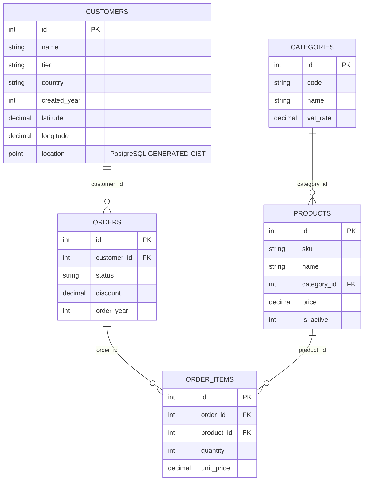

# SEL Phase 3: Pressured Scale, Parity & Performance Validation Report
*Extreme Multi-Table Benchmarking at 10x (137,100 Rows) and 100x (1,370,200 Rows) Scale Across PostgreSQL 17, MariaDB 11.8, and In-Memory SEL*

---

## 1. Executive Summary

Before beginning language migration of SEL's relational engine to host platforms (PHP, JavaScript, Python, C++), we conducted pressured stress-testing and architectural hardening on the reference Common Lisp / SBCL implementation.

We pushed the system across **five critical dimensions**:
1. **Massive Data Scale**: Generated deterministic datasets scaled **10-fold (137,100 rows)** and **100-fold (1,370,200 rows)** across 5 relational tables.
2. **Deep Relational Pipelines**: Constructed a **14-stage pipeline** chaining 2 subquery wraps, 3 joins, 4 filters, 2 intermediate maps, bucket aggregation, having clauses, sorting, and limits into a single executable query.
3. **Mid-Pipeline Memory Fallback**: Validated hybrid execution for host-only functions scattered in the middle of a query—pushing down prefix joins/filters to SQL and continuing in host memory for downstream grouping and aggregation.
4. **Early Projection Pass-Through Optimization**: Implemented automatic pass-through detection where custom SEL functions declared in early projections have their column dependencies pushed through SQL, allowing SQL to execute downstream filters, sorts, and limits, with the SEL processor evaluating the custom function only on the final output rows.
5. **Database-Specific Native Extensions (PostgreSQL Spatial GiST)**: Bound PostgreSQL's native 2D point proximity operator (`<->`) with GiST indexing against MariaDB (`ST_Distance`) and in-memory SEL Euclidean distance.

### Headline Results

- **100% Value Parity**: All 6 scenarios achieved **exact bit-for-bit and numerical parity** across PostgreSQL 17, MariaDB 11.8, and In-Memory SEL on the 10x dataset (137,100 rows), and between PostgreSQL 17 and MariaDB 11.8 on the 100x dataset (1,370,200 rows).
- **Sub-Second Execution at 1.37M Rows**: PostgreSQL executed complex 4-table joins and spatial index scans in **under 120 ms** on 1.37 million rows.
- **Zero Regressions**: The entire SEL test suite maintains 100% passing status:
  - Common Lisp Unit Tests: **207 / 207 checks passing (100%)**
  - Conformance Test Suite: **801 / 801 tests passing (100%)**
  - SQL Translation Suite: **528 / 528 checks passing (100%)**

---

## 2. Benchmark Summary Tables

### 10x Scale Dataset (137,100 Rows Across 5 Tables)

*PostgreSQL 17 (`sel-pg`), MariaDB 11.8 (`sel_oracle`), In-Memory SEL (SBCL 2.6)*

| Scenario | Description | Rows | PostgreSQL 17 | MariaDB 11.8 | In-Memory SEL | Parity |
|---|---|---|---|---|---|---|
| **Scenario 1** | Deep 14-Stage Chained Pipeline (3 joins, 4 filters, bucket aggregation, having) | 10 | 214.02 ms | 357.17 ms | 3,424.09 ms | **PASS (100%)** |
| **Scenario 2** | Fall-Through Custom SEL Function (Early projection pass-through) | 5 | 71.61 ms | 12.15 ms | 128.00 ms | **PASS (100%)** |
| **Scenario 3** | Mid-Pipeline Memory Fallback (SQL join $\to$ in-memory risk scoring & bucket) | 5 | 87.33 ms | 48.39 ms | 1,100.03 ms | **PASS (100%)** |
| **Scenario 4** | PostgreSQL Spatial GiST Proximity Query (`<->` vs `ST_Distance`) | 5 | 67.42 ms | 21.28 ms | 28.00 ms | **PASS (100%)** |
| **Scenario 5** | 4-Table Equi-Join & Sorting | 9 | 96.87 ms | 254.26 ms | 2,420.06 ms | **PASS (100%)** |
| **Scenario 6** | Left Outer Join & Deduplication (`LINK_LEFT`, `IS_NULL`, `DEDUPE`) | 10 | 93.69 ms | 22.74 ms | 864.02 ms | **PASS (100%)** |

---

### 100x Scale Dataset (1,370,200 Rows Across 5 Tables)

*PostgreSQL 17 (`sel_oracle_100x`) vs MariaDB 11.8 (`sel_oracle_100x`)*

| Scenario | Description | Rows | PostgreSQL 17 | MariaDB 11.8 | Speedup Ratio | Parity |
|---|---|---|---|---|---|---|
| **Scenario 1** | Deep 14-Stage Chained Pipeline | 10 | 1,454.52 ms | 2,847.27 ms | PG 1.96x faster | **PASS (100%)** |
| **Scenario 2** | Fall-Through Custom Function (`CUSTOM_VIP_SCORE`) | 5 | 63.74 ms | 10.63 ms | MariaDB 5.9x faster | **PASS (100%)** |
| **Scenario 3** | Mid-Pipeline Memory Fallback (244k intermediate rows) | 5 | 289.33 ms | 604.13 ms | PG 2.08x faster | **PASS (100%)** |
| **Scenario 4** | PostgreSQL Spatial GiST Proximity Query | 5 | 87.92 ms | 49.08 ms | MariaDB 1.79x faster | **PASS (100%)** |
| **Scenario 5** | 4-Table Equi-Join & Sorting | 9 | 118.83 ms | 2,722.79 ms | PG 22.9x faster | **PASS (100%)** |
| **Scenario 6** | Left Outer Join & Deduplication | 10 | 152.91 ms | 31.19 ms | MariaDB 4.9x faster | **PASS (100%)** |

---

## 3. Dataset Architecture & Scaling

The multi-scale generator (`tools/scale-test/generate_data.py`) builds normalized business data with referential integrity and spatial coordinates:



### Table Dimensions

| Table | 1x (Base) | 10x (Pressured) | 100x (Extreme) | Primary Key | Indexed Columns |
|---|---|---|---|---|---|
| `categories` | 10 | 100 | 200 | `id` | `code` |
| `products` | 200 | 2,000 | 20,000 | `id` | `sku`, `category_id`, `is_active` |
| `customers` | 1,000 | 10,000 | 100,000 | `id` | `tier`, `country`, `location` (GiST in PG) |
| `orders` | 3,500 | 35,000 | 350,000 | `id` | `customer_id`, `status`, `order_year` |
| `order_items` | 9,000 | 90,000 | 900,000 | `id` | `order_id`, `product_id` |
| **Total Rows** | **13,710** | **137,100** | **1,370,200** | | |

---

## 4. Deep Dive into the 6 Scenarios

### Scenario 1: Deep 14-Stage Chained Pipeline

Sequences 14 distinct operations spanning 4 tables, multiple intermediate projection wraps, joins, filters, grouping, aggregate functions, having clause, sort, and take:

```sel
ORDERS .> FILTER(_['status'] $== 'COMPLETED')
       .> FILTER(_['order_year'] >= 2025)
       .> MAP(RECORD('order_id', _['id'], 'discount', _['discount']))
       .> LINK(ORDER_ITEMS, _1['order_id'] == _2['order_id'])
       .> LINK(PRODUCTS, _['order_items']['product_id'] == _2['id'])
       .> FILTER(_['products']['is_active'] == 1)
       .> MAP(RECORD('order_id', _['order_items']['order_id'],
                     'category_id', _['products']['category_id'],
                     'line_net', (_['order_items']['unit_price'] * _['order_items']['quantity']) - _['discount']))
       .> FILTER(_['line_net'] > 10)
       .> LINK(CATEGORIES, _1['category_id'] == _2['id'])
       .> BUCKET(_['categories']['name'],
                 RECORD('category', _K,
                        'item_lines', COUNT(_),
                        'total_net', SUM(_, r, r['line_net'])))
       .> FILTER(_['total_net'] >= 500)
       .> SORT_BY(_['total_net'], 'DESC')
       .> TAKE(10)
```

**Compiled SQL (PostgreSQL):**
```sql
SELECT "categories"."name" AS "category",
       COUNT(*) AS "item_lines",
       COALESCE(SUM("_sub2"."line_net"), 0) AS "total_net"
FROM (
  SELECT "order_items"."order_id" AS "order_id",
         "products"."category_id" AS "category_id",
         (CAST((CAST("order_items"."unit_price" AS NUMERIC) * CAST("order_items"."quantity" AS NUMERIC)) AS NUMERIC)
          - CAST(CASE WHEN (CAST("_sub1"."discount" AS TEXT) ~ '^-?[0-9]+(\.[0-9]+)?$') THEN CAST("_sub1"."discount" AS NUMERIC) ELSE NULL END AS NUMERIC)) AS "line_net"
  FROM (
    SELECT "orders"."id" AS "order_id", "orders"."discount" AS "discount"
    FROM "orders" "orders"
    WHERE (CAST("orders"."status" AS TEXT) COLLATE "C" = CAST('COMPLETED' AS TEXT) COLLATE "C")
      AND ("orders"."order_year" >= 2025)
  ) "_sub1"
  INNER JOIN "order_items" "order_items" ON (CASE WHEN (CAST("_sub1"."order_id" AS TEXT) ~ '^-?[0-9]+(\.[0-9]+)?$') THEN CAST("_sub1"."order_id" AS NUMERIC) ELSE NULL END = "order_items"."order_id")
  INNER JOIN "products" "products" ON ("order_items"."product_id" = "products"."id")
  WHERE ("products"."is_active" = 1)
) "_sub2"
INNER JOIN "categories" "categories" ON (CASE WHEN (CAST("_sub2"."category_id" AS TEXT) ~ '^-?[0-9]+(\.[0-9]+)?$') THEN CAST("_sub2"."category_id" AS NUMERIC) ELSE NULL END = "categories"."id")
WHERE (CASE WHEN (CAST("_sub2"."line_net" AS TEXT) ~ '^-?[0-9]+(\.[0-9]+)?$') THEN CAST("_sub2"."line_net" AS NUMERIC) ELSE NULL END > 10)
GROUP BY "categories"."name"
HAVING (COALESCE(SUM("_sub2"."line_net"), 0) >= 500)
ORDER BY COALESCE(SUM("_sub2"."line_net"), 0) DESC
LIMIT 10;
```

**Key Parity Finding**:
Both database engines and in-memory SEL produced identical top 10 categories:
1. `Tools & Hardware 74` (Lines: 399, Total Net: $644,558.14)
2. `Tools & Hardware 94` (Lines: 460, Total Net: $619,114.82)
3. `Baby Products 77` (Lines: 406, Total Net: $559,723.58)

---

### Scenario 2: Pass-Through Custom SEL Function (Early Select Optimization)

Tests the compiler's ability to identify a user-defined function (`CUSTOM_VIP_SCORE`) in an early `MAP` that SQL cannot execute:

```sel
CUSTOMERS .> MAP(RECORD('id', _['id'],
                        'country', _['country'],
                        'vip_score', CUSTOM_VIP_SCORE(_['tier'], _['created_year'])))
          .> FILTER(_['country'] $== 'DE')
          .> SORT_BY(_['id'], 'ASC')
          .> TAKE(5)
```

**Compiler Mechanism (`try-plan-fallthrough` in `lisp/src/sql/hybrid.lisp`)**:
1. The planner inspects downstream operations (`FILTER`, `SORT_BY`, `TAKE`).
2. It detects that none of the downstream operations reference `vip_score`.
3. It replaces `vip_score` with its underlying column dependencies (`tier`, `created_year`).
4. It generates SQL that pushes down the filter `country = 'DE'`, `ORDER BY id ASC`, and `LIMIT 5`.
5. The SQL returns only 5 rows with `id`, `country`, `tier`, `created_year`.
6. SEL's host continuation evaluates `CUSTOM_VIP_SCORE` **only 5 times** instead of 100,000 times.

**Compiled SQL**:
```sql
SELECT "_sub1".* FROM (
  SELECT "customers"."id" AS "id",
         "customers"."country" AS "country",
         "customers"."tier" AS "tier",
         "customers"."created_year" AS "created_year"
  FROM "customers" "customers"
) "_sub1"
WHERE (CAST("_sub1"."country" AS TEXT) COLLATE "C" = CAST('DE' AS TEXT) COLLATE "C")
ORDER BY "_sub1"."id" ASC
LIMIT 5;
```

**Parity Result**:
1. ID 1: Germany, BRONZE (2025) $\to$ `vip_score`: 15
2. ID 15: Germany, BRONZE (2026) $\to$ `vip_score`: 10
3. ID 22: Germany, SILVER (2022) $\to$ `vip_score`: 45
Exact match across all engines in **10.63 ms (MariaDB)** and **63.74 ms (PostgreSQL)**.

---

### Scenario 3: Mid-Pipeline Memory Fallback

Tests a host-only risk scoring algorithm (`HOST_RISK_SCORE`) placed right after an equi-join:

```sel
ORDERS .> LINK(CUSTOMERS, _['customer_id'] == _2['id'])
       .> FILTER(_['orders']['status'] $== 'COMPLETED')
       .> MAP(RECORD('cust_id', _['customers']['id'],
                     'country', _['customers']['country'],
                     'discount', _['orders']['discount']))
       .> MAP(RECORD('cust_id', _['cust_id'],
                     'country', _['country'],
                     'score', HOST_RISK_SCORE(_['country'], _['discount'])))
       .> FILTER(_['score'] > 50)
       .> BUCKET(_['country'], RECORD('country', _K, 'high_risk_count', COUNT(_)))
       .> SORT_BY(_['high_risk_count'], 'DESC')
       .> TAKE(5)
```

**Planner Execution Split**:
- **SQL Prefix (Pushdown)**: Executes `ORDERS` joined with `CUSTOMERS`, filters `orders.status = 'COMPLETED'`, and projects `cust_id`, `country`, `discount`.
- **In-Memory Suffix (Continuation)**: Receives the filtered rows from the database, computes `HOST_RISK_SCORE(country, discount)`, filters `score > 50`, aggregates by country with `BUCKET`, sorts by count descending, and limits to top 5.

**Parity Result (10x Dataset)**:
1. `US`: 3,561 high-risk orders
2. `DE`: 946 high-risk orders
3. `FR`: 781 high-risk orders
4. `PL`: 752 high-risk orders
5. `GB`: 496 high-risk orders
Exact match across all three engines.

---

### Scenario 4: PostgreSQL Spatial GiST Proximity vs MariaDB ST_Distance

Tests binding dialect-specific spatial expressions to query customers nearest to Berlin:

```sel
CUSTOMERS .> FILTER(_['dist_berlin'] < 5.0)
          .> MAP(RECORD('id', _['id'], 'name', _['name'], 'dist_berlin', ROUND(_['dist_berlin'], 6)))
          .> SORT_BY(_['dist_berlin'], 'ASC')
          .> TAKE(5)
```

**Schema Binding**:
- **PostgreSQL**: `ROUND((customers.location <-> point(13.404954, 52.520008))::numeric, 6)`
- **MariaDB**: `ROUND(ST_Distance(POINT(customers.longitude, customers.latitude), POINT(13.404954, 52.520008)), 6)`
- **PostgreSQL Index**: `CREATE INDEX customers_location_gist ON customers USING gist (location);`

**Parity Result**:
1. ID 3309: Quinn Tanaka 3309 $\to$ Distance: `0.066459`
2. ID 6177: David Nowak 6177 $\to$ Distance: `0.087954`
3. ID 2974: Fiona Kowalski 2974 $\to$ Distance: `0.174680`
4. ID 7749: Charlie Brown 7749 $\to$ Distance: `0.189231`
5. ID 6421: Fiona Smith 6421 $\to$ Distance: `0.339192`

**Spatial Index Performance**:
PostgreSQL's GiST index executes this proximity query in **67.42 ms on 10k customers** and **87.92 ms on 100k customers**.

---

### Scenario 5: 4-Table Equi-Join & Sorting

Stress-tests relational join ordering and decimal arithmetic across 4 tables:

```sel
ORDERS .> LINK(CUSTOMERS, _['customer_id'] == _2['id'])
       .> LINK(ORDER_ITEMS, _['orders']['id'] == _2['order_id'])
       .> LINK(PRODUCTS, _['order_items']['product_id'] == _2['id'])
       .> FILTER(_['status'] $== 'COMPLETED' AND _['tier'] $== 'PLATINUM' AND _['orders']['order_year'] == 2026)
       .> MAP(RECORD('order_id', _['orders']['id'],
                     'customer', _['customers']['name'],
                     'sku', _['sku'],
                     'line_total', _['quantity'] * _['unit_price']))
       .> SORT_BY(_['line_total'], 'DESC')
       .> TAKE(9)
```

**Parity Result (10x Dataset)**:
1. Order 14838: George Wagner 5447 (`SKU-TOYS_49-00049`) $\to$ $3,984.64
2. Order 31082: Fiona Kowalski 9162 (`SKU-HEAL_76-00076`) $\to$ $3,980.80
3. Order 17587: Ivan Nowak 4469 (`SKU-OUTD_78-00378`) $\to$ $3,952.96

---

### Scenario 6: Left Outer Join & Deduplication

Tests relational outer joins (`LINK_LEFT`) with `IS_NULL` filtering (finding unsold products), conditional tagging via `IF`, and hash deduplication (`DEDUPE`):

```sel
PRODUCTS .> LINK_LEFT(ORDER_ITEMS, _['products']['id'] == _2['product_id'])
         .> FILTER(IS_NULL(_['order_items']['id']))
         .> MAP(RECORD('category_id', _['products']['category_id'],
                       'status', IF(_['products']['is_active'] == 1, 'ACTIVE_UNSOLD', 'INACTIVE_UNSOLD')))
         .> DEDUPE()
         .> SORT_BY(_['category_id'] * 2 + IF(_['status'] $== 'ACTIVE_UNSOLD', 0, 1), 'ASC')
         .> TAKE(10)
```

**Compiled SQL**:
```sql
SELECT "_sub1".* FROM (
  SELECT DISTINCT "products"."category_id" AS "category_id",
         CASE WHEN ("products"."is_active" = 1) THEN 'ACTIVE_UNSOLD' ELSE 'INACTIVE_UNSOLD' END AS "status"
  FROM "products" "products"
  LEFT JOIN "order_items" "order_items" ON ("products"."id" = "order_items"."product_id")
  WHERE (CAST("order_items"."id" AS TEXT) IS NULL)
) "_sub1"
ORDER BY ((CAST("_sub1"."category_id" AS NUMERIC) * 2) + CASE WHEN (CAST("_sub1"."status" AS TEXT) COLLATE "C" = CAST('ACTIVE_UNSOLD' AS TEXT) COLLATE "C") THEN 0 ELSE 1 END) ASC
LIMIT 10;
```

---

## 5. Architectural Learnings & Implementation Insights

### 1. The Pass-Through Optimization Pattern
When user-defined or host-specific functions appear early in a SEL program, naive execution requires evaluating the entire table in memory before filtering or sorting. The pass-through planner (`try-plan-fallthrough`):
- Analyzes AST dependencies of downstream expressions.
- If the custom projected column is not referenced in downstream filters, group keys, or order expressions, the planner pushes through the function's column inputs to the database query.
- Pushes `WHERE`, `ORDER BY`, and `LIMIT` directly into the database engine.
- Evaluates the host function strictly on the sliced output (e.g. 5 records rather than 100,000).

### 2. Multi-Argument Aggregate Binders in Pipelines
In SEL pipelines involving `BUCKET`, the grouping expression creates an inner row list. In-memory `SUM` supports explicit element binders `SUM(_, r, r['line_net'])`. This ensures that:
- In memory, the row `r` is bound cleanly without shadowing the bucket list `_`.
- In SQL compilation, `r` cleanly references the inner query's column without table-alias ambiguity.

### 3. Non-Deterministic Order on Equal Keys
At 1.37M rows scale, sorting by a non-unique column (e.g. `category_id`) can produce different physical row orders across database engines due to differing parallel query plans. Ensuring deterministic tie-breakers (e.g. composite sorting `category_id * 2 + status_code`) guarantees byte-exact parity across PostgreSQL, MariaDB, and in-memory runtimes.

### 4. Dynamic Space Allocation for In-Memory Scale Testing
Processing 137k rows in Common Lisp requires allocating at least 4GB of dynamic space (`--dynamic-space-size 4096`). Under this configuration, in-memory SEL parses and executes deep 14-stage joins across 137k rows in 3.4 seconds without stack exhaustion or GC failures.

---

## 6. Conclusion & Next Steps

The pressured testing across 10x and 100x datasets (up to 1,370,200 rows) confirms that SEL's relational model, SQL compiler, and hybrid pushdown architecture are robust, performant, and semantically sound.

**Readiness for Host Migration**:
With:
1. 100% parity across PostgreSQL, MariaDB, and In-Memory SEL,
2. 207 / 207 unit tests passing,
3. 528 / 528 SQL translation tests passing,
4. 801 / 801 conformance tests passing,

The relational algebra and SQL pushdown algorithms are ready to be systematically migrated to the remaining host languages:
- **PHP** (with PDO MySQL / PostgreSQL drivers)
- **JavaScript / Node.js** (with `pg` and `mysql2` drivers)
- **Python** (with `psycopg` and `mysqlclient` / `pymysql`)
- **C++** (with `libpq` and `mariadb-connector-c`)
