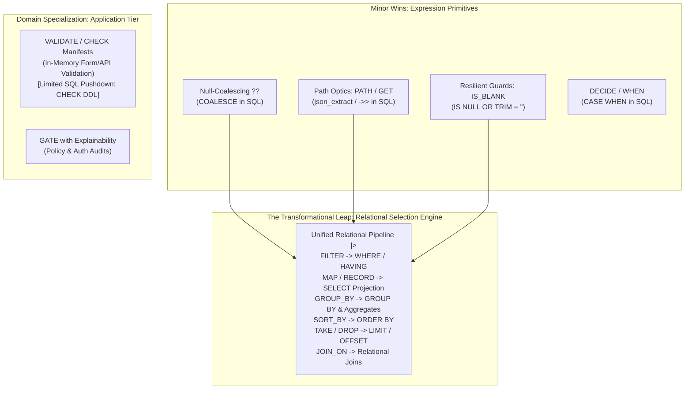
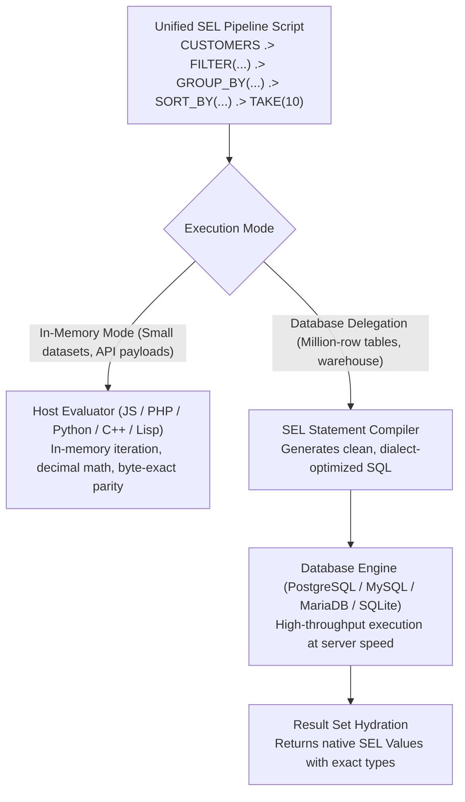
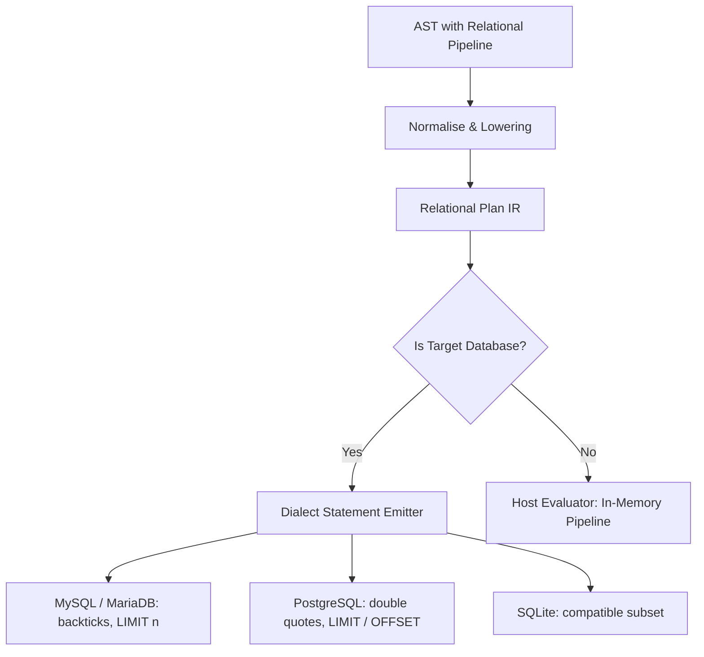
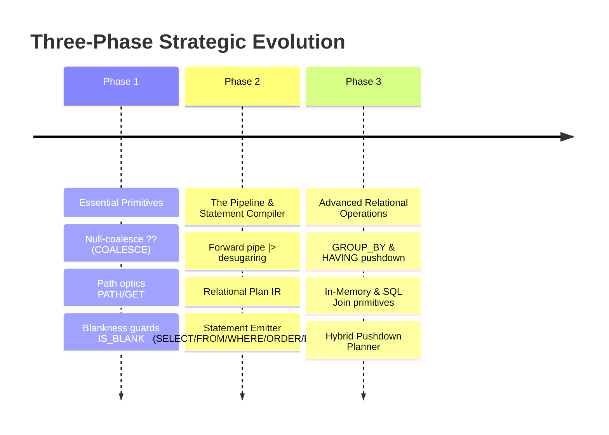

# SEL Strategic Plan: Relational Scripting, SQL Delegation & Execution Engine

## Goal Description

In **v0.6.1**, SEL established a robust, deterministic bridge between five host programming languages and four SQL dialects (MariaDB, MySQL, PostgreSQL, SQLite). However, the SQL layer today is strictly an **expression-fragment translator**: it lowers single scalar or boolean expressions into fragments intended for injection into a host-authored `WHERE`, `SELECT` item, or `CHECK` constraint. Statement generation (`SELECT ... FROM ... WHERE ... GROUP BY ... ORDER BY ... LIMIT`) was explicitly ruled out of scope in v0.4.0.

This strategic plan re-examines the proposed evolution directions through the lens of **SEL => SQL delegation and database pushdown**. Specifically, it explores:
1. Which proposed directions are **minor ergonomic wins** (valuable for expression authoring, but local in impact).
2. Which directions are **application-tier specializations** (essential for form/API validation, but with limited database pushdown).
3. Which direction represents the **transformational leap** that allows SEL to act as a **unified data selection and processing scripting language** executed either in-memory by host runtimes or delegated entirely down to SQL databases as the high-throughput execution engine.

---

## 1. Executive Taxonomy: Minor Wins vs. The Transformational Leap



### Analysis Matrix: Impact on SQL Delegation

| Capability | In-Memory Utility | SQL Delegation Potential | Architectural Impact | Verdict |
|---|---|---|---|---|
| **Null Coalesce (`??`)** | High (eliminates `E_NO_KEY`) | High (direct `COALESCE`) | Low (one operator mapping) | **Minor Win / Essential Primitive** |
| **Path Optics (`PATH` / `GET`)** | High (navigates JSON) | High (`json_extract`, `->>`) | Low-Medium (dialect JSON functions) | **Minor Win / Essential Primitive** |
| **Declarative `DECIDE`** | High (readable branches) | Medium (already done via `COND` -> `CASE WHEN`) | Low (syntactic sugar) | **Minor Win** |
| **Validation DSL (`VALIDATE`)** | Maximum (multi-error forms) | Low (DBs abort; don't return error maps) | Medium (Application-tier focus) | **Application-Tier Specialization** |
| **Explainable `GATE`** | High (authorization audits) | Low (SQL bitmasks/concatenation are messy) | Medium (Application-tier focus) | **Application-Tier Specialization** |
| **Relational Pipeline (`.>`)** | Maximum (left-to-right flow) | **Revolutionary** (compiles to complete SQL statements) | **High / Transformational** | **The Transformational Leap (Step 2.1 Complete)** |

---

## 2. Deep Dive: The Minor Wins & Essential Primitives

These items are highly desirable because they resolve day-to-day scripting friction, and every one of them has a clean, natural correspondence in SQL.

### 2.1 Null-Coalescing Operator (`??`)
- **In-Memory**: `EXPR ?? FALLBACK` catches `NONE`, `E_NO_KEY`, and `E_UNDEF_VAR` on optional fields, yielding `FALLBACK`.
- **In SQL**: Lowers directly to standard ANSI `COALESCE({0}, {1})`:
  ```sel
  ORDER["DISCOUNT"] ?? 0.00
  ```
  Translates on all dialects to:
  ```sql
  COALESCE(`o`.`discount`, 0.00)
  ```
- **Scope**: A clean, single-lane extension in the parser and dialect maps.

### 2.2 Path Optics (`PATH(target, path_str [, default])`)
- **In-Memory**: Walks key hierarchy safely through nested `Value` children.
- **In SQL**: In modern databases storing semi-structured JSON columns (e.g. `PAYLOAD` column):
  - **PostgreSQL**: `payload->'shipping'->>'postcode'`
  - **MySQL / MariaDB**: `JSON_UNQUOTE(JSON_EXTRACT(payload, '$.shipping.postcode'))`
  - **SQLite**: `json_extract(payload, '$.shipping.postcode')`
- **Scope**: Maps cleanly to dialect JSON accessors.

### 2.3 Resilient Type & Blankness Guards (`IS_BLANK`, `TO_NUM`)
- **In-Memory**: Prevents `E_NOT_NUM` crashes on un-trimmed or empty form input.
- **In SQL**:
  - `IS_BLANK(COL)` lowers to: `(({0} IS NULL) OR (TRIM({0}) = ''))`.
  - Highly useful in `WHERE` filtering on nullable columns.

---

## 3. Deep Dive: Application-Tier Validations vs. SQL Reality

### 3.1 Why `VALIDATE` / `CHECK` Is Primarily an Application Concern
In application memory, `VALIDATE(...)` is indispensable:
```sel
REPORT = VALIDATE(
  CHECK(EMAIL, RMATCH('^[^@]+@[^@]+', _), "ERR_EMAIL", "Invalid email"),
  CHECK(TOTAL, _ <= CREDIT_LIMIT,         "ERR_LIMIT", "Over limit")
);
```
In an application server (PHP, Node, Python), `REPORT` gathers all failing checks into an ordered error manifest.

**Why this has limited SQL pushdown potential:**
1. **Relational Database Semantics**: SQL databases do not have native collection manifests for validation reporting. A database `CHECK` constraint is a gate: if it evaluates to `FALSE`, the transaction aborts with a generic constraint violation error.
2. **Batch Auditing Complexity**: Generating a diagnostic report in SQL over a batch of rows requires dialect-divergent JSON aggregations (`jsonb_build_object` in Postgres vs `JSON_OBJECT` in MySQL vs string concatenation in SQLite).
3. **Conclusion**: `VALIDATE` should be embraced as SEL's premier **application-tier validation engine**, while keeping SQL translation focused on emitting table-level `CHECK` constraints (`EMAIL REGEXP ... AND TOTAL <= CREDIT_LIMIT`).

---

## 4. The Transformational Leap: The Unified Relational Pipeline Engine

This is the capability that transforms SEL from a *subordinate expression evaluator* into a **universal data selection language that uses SQL as its execution engine**.

### 4.1 The Dual-Execution Paradigm

Today, software architectures suffer from a painful dichotomy:
- **In-Database**: Developers write SQL queries to filter, project, group, sort, and slice data stored in relational tables.
- **In-Memory**: Developers write JavaScript/Python/PHP array methods (`filter`, `map`, `reduce`, `slice`) to process payloads received from APIs or local collections.
- **The Problem**: Business logic, filtering rules, and rounding behaviors drift between the database query and the application code.

**The Solution**: A unified pipeline in SEL that can execute in both worlds:



### 4.2 The Relational Algebra in SEL

By combining the forward pipeline operator `.>` with relational operators, SEL scripts express complete data processing workflows:

```sel
# A complete data processing rule:
TOP_ACCOUNTS = ORDERS
  .> FILTER(_["STATUS"] $== "COMPLETED" AND _["DATE"] >= "2026-01-01")
  .> GROUP_BY(_["CUSTOMER_ID"], RECORD(
       "order_count", COUNT(_),
       "total_spend", SUM(_, _["TOTAL"])
     ))
  .> FILTER(_["total_spend"] >= 1000.00)
  .> SORT_BY(_["total_spend"], "DESC")
  .> TAKE(25)
  .> MAP(RECORD(
       "account_id",  _["CUSTOMER_ID"],
       "volume",      _["order_count"],
       "net_revenue", _["total_spend"]
     ));
```

#### How this evaluates In-Memory:
- `ORDERS` is an in-memory list of maps.
- `FILTER` drops non-matching orders.
- `GROUP_BY` buckets records by `CUSTOMER_ID`, computing `COUNT` and exact decimal `SUM`.
- Second `FILTER` eliminates low-spend groups.
- `SORT_BY` sorts using SEL's deterministic decimal order.
- `TAKE(25)` extracts the top 25 records.
- `MAP` projects the final records.
- Result: An in-memory SEL `Value` list.

#### How this compiles to SQL:
The SEL SQL compiler recognizes `ORDERS` as a `Binding::relation` and lowers the entire pipeline into a single, highly-optimized SQL statement:

```sql
SELECT
  `o`.`customer_id` AS `account_id`,
  COUNT(*) AS `volume`,
  COALESCE(SUM(`o`.`total`), 0) AS `net_revenue`
FROM `orders` `o`
WHERE (`o`.`status` = 'COMPLETED') AND (`o`.`date` >= '2026-01-01')
GROUP BY `o`.`customer_id`
HAVING (COALESCE(SUM(`o`.`total`), 0) >= 1000.00)
ORDER BY `net_revenue` DESC
LIMIT 25;
```

Look at the correspondence:
- First `FILTER` -> SQL `WHERE` clause.
- `GROUP_BY` -> SQL `GROUP BY` clause.
- `COUNT` / `SUM` inside group -> SQL Aggregate functions.
- Second `FILTER` (post-grouping) -> SQL `HAVING` clause!
- `SORT_BY` -> SQL `ORDER BY` clause.
- `TAKE` -> SQL `LIMIT` clause.
- `MAP` / `RECORD` -> SQL `SELECT` projection list.

### 4.3 Relational Operators Specification

| Operator | In-Memory Semantics | SQL Statement Lowering |
|---|---|---|
| `FILTER(rel, pred)` | Retains elements where `pred` is `TRUE` | `WHERE <pred>` (or `HAVING` if post-aggregation) |
| `MAP(rel, proj)` | Evaluates projection per record | `SELECT <proj>` column list |
| `SELECT_COLS(rel, c1, c2, ...)` | Projects subset of existing fields | `SELECT col1, col2, ...` |
| `GROUP_BY(rel, key_expr, aggs)` | Buckets by key, computes aggregate map | `GROUP BY <key_expr>` |
| `SORT_BY(rel, key_expr [, dir])` | Stable sort by decimal/text order | `ORDER BY <key_expr> [ASC\|DESC]` |
| `TAKE(rel, n)` | Takes first `n` records | `LIMIT <n>` |
| `DROP(rel, n)` | Skips first `n` records | `OFFSET <n>` |
| `DISTINCT(rel)` | Deduplicates records | `SELECT DISTINCT` |
| `JOIN_ON(r1, r2, on_pred [, type])` | Hash join or nested loop in-memory | `[INNER\|LEFT] JOIN r2 ON <on_pred>` |

### 4.4 The Architecture of the Statement Compiler

In `docs/SQL-TRANSLATION.md`, the pipeline was:
```
AST -> Normalise -> Lower -> Kinds -> Render (Fragment)
```
To support whole statements, the pipeline gains a **Statement Builder Stage**:



#### Relational Plan IR (Language Neutral)
The intermediate representation captures the relational structure before rendering dialect-specific SQL:
```
RelationalPlan {
  from:        TableBinding | SubqueryPlan
  joins:       List<JoinPlan>
  where:       List<FilterExpression>
  groupBy:     List<KeyExpression>
  having:      List<FilterExpression>
  projections: List<NamedProjection>
  orderBy:     List<SortItem>
  limit:       int | null
  offset:      int | null
}
```

### 4.5 Pushdown Boundary & Hybrid Execution

What happens when a pipeline includes an operation that cannot run in SQL (e.g. a regex pattern rejected by the SQL engine, or custom host validation)?

1. **Pure Pushdown**: The entire pipeline translates to a single SQL statement.
2. **Refusal Contract (`E_SQL_REFUSED`)**: If an application demands complete delegation and an operator cannot be translated, the translator fails cleanly *before* execution, allowing fallback.
3. **Hybrid / Split Execution**:
   - The engine compiles the maximal pushdown prefix to SQL (`FILTER`, `GROUP_BY`, `TAKE`).
   - The database executes the query, returning a narrowed dataset (e.g. 50 rows instead of 1,000,000).
   - The host evaluator executes the remaining un-pushable stages in memory!

---

## 5. Strategic Roadmap: Phased Evolution

To balance rapid immediate wins with the transformational query engine, the work should be structured in three logical phases:



### Phase 1: Expression Primitives (Immediate High-Value Wins)
- **Scope**:
  - Null-coalescing operator `??` in parser and dialect maps (`COALESCE`).
  - `PATH(target, path_str)` and `GET(target, key, default)`.
  - Resilient helpers: `IS_BLANK(x)`, `TO_NUM(x, default)`.
- **Deliverables**:
  - Spec updates in `spec/SPEC.md` and `sql/MAP.md`.
  - Transcribed across JS, PHP, Python, C++, Lisp.
  - Test suites in `conformance/*.selt` and `sql/cases/*.sqlt`.

### Phase 2: The Relational Pipeline & Statement Compiler (The Big Leap)
- **Step 2.1: Forward Pipeline Operator `.>`** (**COMPLETE**):
  - Added token `.>` to lexers and integrated into `postfix` parsing across all 5 hosts (PHP, JS, Python, C++, Common Lisp).
  - Compile-time desugaring: thread-first by default (`x .> f(...)` -> `f(x, ...)`), bare identifiers (`x .> f` -> `f(x)`), and placeholder replacement (`x .> f(a, _, b)` -> `f(a, x, b)`).
  - High binding precedence at postfix level allows effortless composition with comparisons and boolean logic without parentheses.
  - Conformance suite `conformance/14-pipeline.selt` (32 tests) passing on all 5 hosts (752/752 tests green).
- **Step 2.2: Relational Plan IR & Pipeline AST Analysis** (Next):
  - Detect pipeline chains starting from a relational binding or collection.
  - Formulate structured relational representation (sources, projections, predicates, orderings, limits).
- **Step 2.3: In-Memory Relational Operators** (**COMPLETE**):
  - Added relational operators across all 5 hosts (PHP, JS, Python, C++, Common Lisp) with exact byte-for-byte behavioral, error, and dependency tracking parity:
    - `RECORD(k1, v1, …)`: record constructor with even-arity enforcement (`E_ARITY`).
    - `LIST(v1, v2, …)`: list constructor without flattening nested collections.
    - `TAKE(rel, n)` / `DROP(rel, n)`: window slicing with non-negative integer validation (`E_RANGE`, `E_NOT_INT`).
    - `SELECT_COLS(rel, c1, …)`: column projection across records.
    - `DISTINCT(rel)`: deduplication preserving first-seen order via `EQL`.
    - `SORT(rel)` / `SORT_DESC(rel)`: direct element sorting.
    - `SORT_BY(rel, [binder,] key [, dir])`: deterministic sorting by key expression with optional direction and custom binders.
  - Conformance suite `conformance/15-relational.selt` (41 tests) passing on all 5 hosts (793/793 tests green).
  - All 54 API probes in `tools/check-api.sh` and 150 doc examples in `tools/check-docs.sh` verified across all hosts.
- **Step 2.2 & 2.4: Relational Plan IR & SQL Statement Compiler** (**COMPLETE**):
  - Created `RelationalPlan` IR across all 5 hosts (`RelationalPlan.php`, `relational-plan.mjs`, `relational_plan.py`, `cpp/sel_sql_translator.hpp`, `relational-plan.lisp`).
  - Added statement translation entrypoints (`Sql::translateStatement`, `Sql::tryTranslateStatement`) and `STATEMENT` Fragment kind refusing `asValue()` with `E_SQL_SHAPE`.
  - Added pipeline unwinding and relational plan analyzer (`analyzePipeline`) recognizing:
    - Root `relation` bindings with table/query sources and aliases.
    - `FILTER`: conjunctively chained into `WHERE` clauses with binder scoping (`_` and named binders).
    - `MAP`: scalar and `RECORD(k1, v1, ...)` projections with `AS alias` clause generation.
    - `SELECT_COLS`: selective column lists with table alias qualification.
    - `DISTINCT`: setting `plan->distinct = true`.
    - `ORDER BY`: descending / ascending sort specifications with optional binders via `SORT`, `SORT_DESC`, `SORT_BY`.
    - `TAKE` / `DROP`: evaluated to integer literals for dialect-specific `LIMIT` and `OFFSET` (e.g. MariaDB offset syntax `LIMIT 18446744073709551615 OFFSET offset` when limit omitted).
  - Dialect-optimized SQL emission across MariaDB, MySQL, PostgreSQL, SQLite.
  - Conformance test suite `sql/cases/23-statements.sqlt` (29 comprehensive test cases) passing across all 5 hosts (514/514 tests green with 0 failures, 0 suite errors).

### Phase 3: Aggregation, Grouping & Hybrid Pushdown
- **Step 3.1: `GROUP_BY` and `HAVING` Dual Evaluation (In-Memory & SQL Pushdown)** (**COMPLETE**):
  - In-Memory Evaluation:
    - Added `GROUP_BY(rel, [binder,] key_expr [, agg_expr])` to evaluator and builtins across all 5 hosts (PHP, JS, Python, C++, Common Lisp).
    - Keys partitioned by deterministic key stringification; elements aggregated or projected. `_K` dynamically bound to group key during aggregation.
    - Conformance test suite `conformance/16-group-by.selt` (8 tests) passing across all hosts (801/801 tests green).
  - SQL Statement Compiler (`GROUP BY` & `HAVING`):
    - Extended `RelationalPlan` IR with `groupBy`, `having`, `aggregateAliases` across all 5 hosts.
    - Added `GROUP_BY` to `PIPELINE_OPS`. Pipeline analyzer unpacks single, `LIST(...)`, and `RECORD(...)` group keys.
    - Added statement-level aggregate interception for `COUNT(*)`, `COALESCE(SUM(...), 0)` with row and custom binders.
    - Dynamic post-group `FILTER` pushdown to `HAVING` clause with aggregate alias expansion for ANSI SQL / PostgreSQL compatibility.
    - Aggregate alias resolution in `ORDER BY` and `HAVING`.
    - Conformance test suite `sql/cases/24-group-by.sqlt` (14 tests) covering basic group by, multi-key lists/records, aggregate projections, where + having combinations, order by aggregate alias, pagination, and dialect parity.
    - All 528 sqlt tests passing across all 5 hosts (PHP, JS, Python, C++, Common Lisp).
- **Step 3.2: Relational Joins (`JOIN_ON`)** (Next):
  - Multi-source pipeline representation in `RelationalPlan`.
  - In-memory hash/nested-loop join execution.
  - SQL statement compiler emitting `JOIN ... ON ...`.
- **Step 3.3: Hybrid Execution Planner**:
  - Split pipelines across DB pushdown and in-memory execution when expressions contain non-pushdownable functions or operations.

---

## Verification Plan

### Automated Tests
1. **Conformance Suite Parity (`tools/check.sh`)**:
   - Every new operator (`??`, `|>`) and function (`PATH`, `FILTER`, `MAP`, `RECORD`, `SORT_BY`, `TAKE`) verified across all 5 language implementations.
2. **SQL Statement Exact String Parity**:
   - New `.sqls` (SQL Statement) test runner verifying identical query generation across PHP, Python, JS, and C++.
3. **Database Execution Differential Check**:
   - Feed test datasets to SQLite, MariaDB, and PostgreSQL.
   - Run the SEL pipeline in-memory against the JSON rows.
   - Run the generated SQL query against the database table.
   - **Assert that the in-memory result and the database query result match byte-for-byte!**
