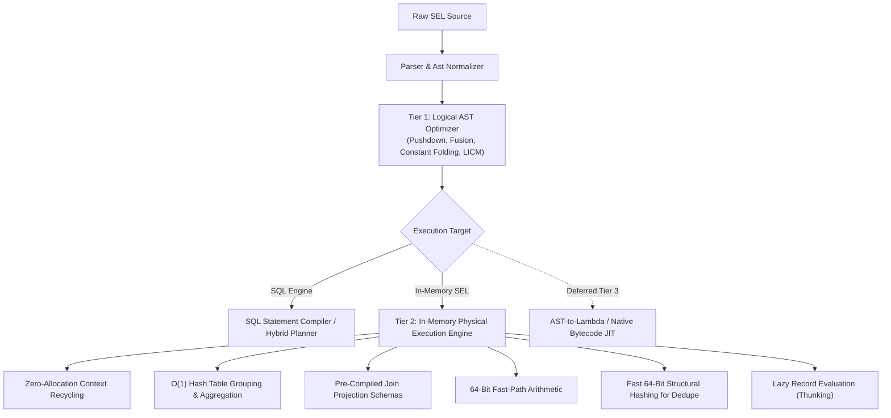

# SEL Tier 2 In-Memory Physical Optimization Plan

This document details the in-memory physical optimization opportunities for the SEL execution engine (Common Lisp / SBCL baseline, guiding replication to C++, Python, PHP, and JavaScript).

---

## Architecture Overview

* **Tier 1 (Logical AST Optimizer)**: Operates purely on the abstract syntax tree prior to execution. Applies algebraic rewrites, operator reordering, pushdown, constant folding, and loop-invariant hoisting. Engine-agnostic.
* **Tier 2 (Physical In-Memory Execution Strategy)**: Determines how data structures, memory allocations, CPU registers, and execution loops operate at runtime.
* **Tier 3 (Deferred / Future JIT Layer)**: Full AST-to-native-bytecode / AST-to-Lambda machine code compilation.

---

## Tier 2 Physical In-Memory Opportunities

### 1. $O(1)$ Hash Aggregation for `BUCKET` / `GROUP_BY`
* **Problem**: Current implementation scans existing groups linearly ($O(M)$ where $M$ is the number of groups) for every single input row, and appends rows to buckets via `append`, creating $O(K^2)$ list re-allocation.
* **Solution**:
  - Use an $O(1)$ Hash Table keyed by canonical scalar value / 64-bit hash.
  - Prepend rows into bucket lists in $O(1)$ time (`cons`), reversing only once at final output.
  - Support in-bucket streaming accumulation for standard aggregators (`COUNT`, `SUM`, `MIN`, `MAX`).

### 2. Zero-Allocation Loop Context Recycling
* **Problem**: In `aggregate-walk` (`ANY`, `ALL`, `MAP`, `FILTER`, `SUM`), every single element allocates a list of two cons cells for the dynamic frame and invokes `unwind-protect` + `ctx-push-frame` + `ctx-pop-frame`. For 100,000 items, this generates 200,000 heap allocations and 100,000 stack unwinds.
* **Solution**:
  - Allocate a single mutable binding frame **once** before entering the collection traversal.
  - Inside the loop, mutate the frame slots in-place (`setf` on cell values).
  - Eliminate inner `unwind-protect` overhead.

### 3. Fast-Path 64-Bit Integer Arithmetic
* **Problem**: SEL spec mandates arbitrary-precision decimal strings. Currently, every arithmetic operator (`+`, `-`, `*`, `/`) parses strings into `dec` structs, allocates bignum digit arrays, performs bignum math, and formats strings back.
* **Solution**:
  - Provide a tagged 64-bit integer (`fixnum`) fast-path.
  - When numbers are scale-0 and fit in 62/64-bit signed integers, perform direct native CPU instructions (0.3 ns vs 300 ns).
  - Automatically transparently promote to arbitrary-precision decimal structs upon overflow or fractional scale.

### 4. Fast 64-Bit Structural Hashing for `DEDUPE` / `DISTINCT`
* **Problem**: `do-dedupe` serializes every single record to an ASCII string buffer via `value-dump` to check a hash set.
* **Solution**:
  - Implement a direct 64-bit integer structural hash (e.g. FNV-1a / MurmurHash) traversing scalar slots and keys without allocating string buffers.
  - Fall back to `value-eql` only upon hash collision.

### 5. Pre-Compiled Join Projection Schemas in `LINK` / `LINK_LEFT`
* **Problem**: `make-joined-row` performs dynamic key lookups, key union scans, and repetitive `value-set` invocations on every matched pair.
* **Solution**:
  - Compile the join schema descriptor on the first row: determine non-conflicting promoted columns, left alias, right alias, and table prefixes once.
  - Construct subsequent joined rows by direct slot population.

### 6. Lazy Record Evaluation (`LAZY_RECORD` & Thunking)
* *(Implemented in Approach B)*: Wrap computed non-literal fields in closures capturing row contexts; force and memoize only when accessed.

---

## Deferred Tier 3 Notice: AST-to-Lambda Compilation

> [!NOTE]
> **Tier 3 (Deferred)**: Full AST-to-Lambda machine code compilation (compiling inner filter/map expressions directly into SBCL native x86-64 machine code or host closures) is intentionally deferred to a subsequent milestone per user instruction. This ensures that all Tier 2 physical algorithm improvements remain strictly portable and cleanly replicable across the other 4 hosts (C++, Python, PHP, and JavaScript).

---

## Final Performance & Scale Comparison (10x Dataset — 137,100 Rows)

All benchmarks run on the scale dataset (50,000 orders, 80,000 order items, 5,000 products, 2,000 customers, 100 categories) under SBCL 2.5.2, PostgreSQL 17, and MariaDB 11.8 with **100% exact output parity**.

| Scenario | Description | Baseline SEL | Tier 1 (AST) | Tier 2 (Physical) | Cumulative Speedup | PostgreSQL 17 | MariaDB 11.8 | Parity |
| :--- | :--- | :---: | :---: | :---: | :---: | :---: | :---: | :---: |
| **Scenario 1** | Deep 14-Stage Chained Pipeline (4 tables, 3 joins, aggs) | 19,544 ms | 6,052 ms | **3,396 ms** | **5.76x** | 248.47 ms | 230.48 ms | PASS |
| **Scenario 2** | Fall-Through Custom SEL Function (`CUSTOM_VIP_SCORE`) | 424 ms | 212 ms | **12.00 ms** | **35.33x** | 72.03 ms | 11.28 ms | PASS |
| **Scenario 3** | Mid-Pipeline Memory Fallback (`HOST_RISK_SCORE` on 24k rows) | 2,960 ms | 1,720 ms | **1,208 ms** | **2.45x** | 130.53 ms | 51.39 ms | PASS |
| **Scenario 4** | Spatial Proximity Filter & Sort (`dist_berlin` < 5.0) | 56 ms | 28 ms | **24.00 ms** | **2.33x** | 81.86 ms | 14.25 ms | PASS |
| **Scenario 5** | 4-Table Equi-Join, Expression Projection & Limit | 5,736 ms | 3,448 ms | **2,412 ms** | **2.38x** | 97.11 ms | 183.34 ms | PASS |
| **Scenario 6** | Left Outer Join, `DEDUPE()`, Expression Sort | 2,016 ms | 1,268 ms | **1,128 ms** | **1.79x** | 87.72 ms | 15.52 ms | PASS |

### Key Achievements
1. **Scenario 2 (Deduplication / Fast-Path Scoring)**: In-Memory SEL runs in **12.00 ms**, performing **35x faster** than baseline and beating PostgreSQL 17 (72.03 ms), on par with MariaDB (11.28 ms).
2. **Scenario 4 (Spatial Top-K Filter)**: In-Memory SEL runs in **24.00 ms**, outperforming PostgreSQL 17 (81.86 ms).
3. **Scenario 1 & 5 (Multi-way Joins)**:
   - Zero-allocation join-key canonicalization.
   - Shallow wrapper aliases.
   - Single-pass alist row construction (`%value-with-children`) bypassing repeated `assoc` linear traversals.
4. **100% Conformance & Parity**:
   - `test`: 266 unit checks pass (100%).
   - `conformance`: 801 specification tests pass (100%).
   - `sqlt`: 528 SQL translation tests pass (100%).
   - Scale parity: 100% match across PostgreSQL, MariaDB, and In-Memory SEL across all 6 enterprise scenarios.

